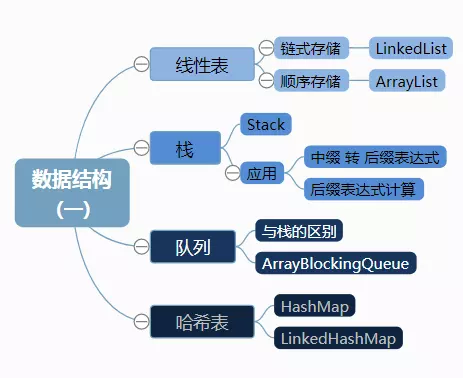
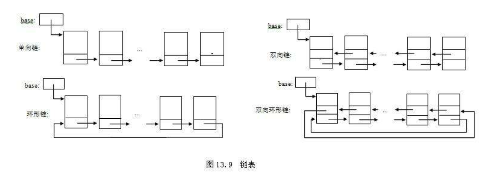
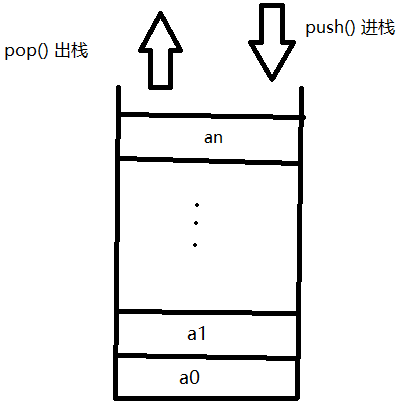
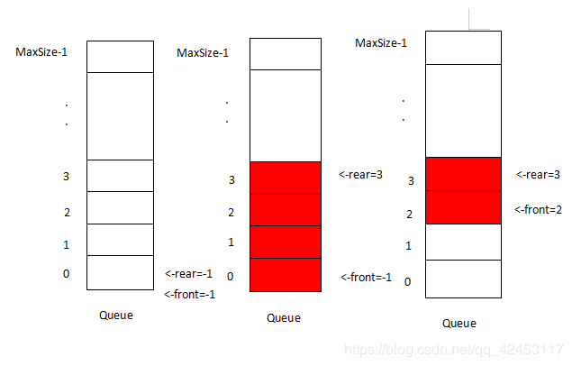
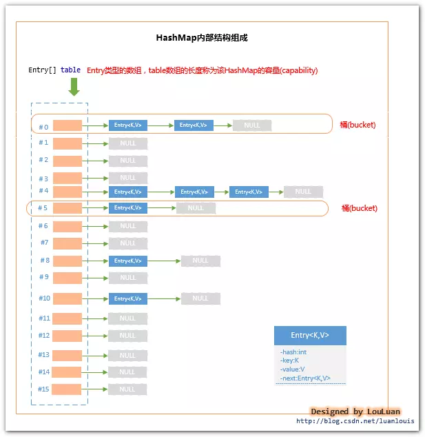
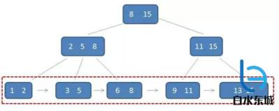

## 数据结构
1、顺序存储，Random Access（Direct Access）：

这种方式，相邻的数据元素存放于相邻的内存地址中，整块内存地址是连续的。可以根据元素的位置直接计算出内存地址，直接进行读取。读取一个特定位置元素的平均时间复杂度为O(1)。正常来说，只有基于数组实现的集合，才有这种特性。Java中以ArrayList为代表。
        
2、链式存储，Sequential Access：

这种方式，每一个数据元素，在内存中都不要求处于相邻的位置，每个数据元素包含它下一个元素的内存地址。不可以根据元素的位置直接计算出内存地址，只能按顺序读取元素。读取一个特定位置元素的平均时间复杂度为O(n)。主要以链表为代表。Java中以LinkedList为代表。



### 一: 线性表
#### 1.1 顺序存储 ArrayList

特点:
1. 插入快---直接在最后插入就可以
2. 查找和删除慢-- 查找慢,删除还需要改变数组中其他的位数 

底层: ArrayList的底层数据结构就是一个数组，数组元素的类型为Object类型，对ArrayList的所有操作底层都是基于数组的。
+ 遍历:推荐使用普通for循环
+ 性能测试:在遍历ArrayList时，普通for循环要比iterator快

https://blog.csdn.net/Jason_M_Ho/article/details/78725687

https://www.jb51.net/article/70272.html

#### 1.2 链式存储 LinkedList

1.2.1 数据结构图:

经典的双链表结构, 对插入和删除比较快,但是遍历的话,就会很慢


特点: 
+ 获取数据麻烦，需要遍历查找，比数组慢
+ 方便插入、删除

链表的实现原理
底层:用的是每一个元素都是一个结点(Node<E>),将多个结点链接到一起的话也就是链表结构
创建一个节点类，其中节点类包含两个部分，第一个是数据域（你到时候要往节点里面储存的信息），第二个是引用域（相当于指针，单向链表有一个指针，指向下一个节点；双向链表有两个指针，分别指向下一个和上一个节点）
创建一个链表类，其中链表类包含三个属性：头结点、尾节点和大小，方法包含添加、删除、插入等等方法。


代码实现:
单向链表:
```
public class Node {
    public Object data;
    public Node next;
    
    public Node(Object e){
        this.data = e;
    }
}
```
双向链表:
```
private static class Node<E> {
        E item;
        Node<E> next;
        Node<E> prev;
 
        Node(Node<E> prev, E element, Node<E> next) {
            this.item = element;
            this.next = next;
            this.prev = prev;
        }
    }
    
E item：E是泛型，item就是list.add()方法的参数，即集合中的每个元素，都保存在其Node结点的item参数中。
Node next：它指向当前结点的下一个结点。
Node prev：它指向当前结点的上一个结点。
```

+ 性能测试:https://cloud.tencent.com/developer/article/1468129
+ https://www.gcssloop.com/tips/arratlist-linkedlist-performance


#### 1.3 栈---- 栈的底层是数组
+ 数据图

+ 特点
+ 实现原理
栈的底层是数组 --- 同时可以用队列去实现
+ 代码实现
```
public class MyStack {
	//底层实现是一个数组
	private long[] arr;
	private int top;
	/**
	 * 默认的构造方法
	 */
	public MyStack() {
		arr = new long[10];
		top = -1;
	}
	/**
	 * 带参数构造方法，参数为数组初始化大小
	 */
	public MyStack(int maxsize) {
		arr = new long[maxsize];
		top = -1;
	}
	/**
	 * 添加数据
	 */
	public void push(int value) {
		arr[++top] = value;
	}
	/**
	 * 移除数据
	 */
	public long pop() {
		return arr[top--];
	}
	/**
	 * 查看数据
	 */
	public long peek() {
		return arr[top];
	}
	/**
	 * 判断是否为空
	 */
	public boolean isEmpty() {
		return top == -1;
	}
	/**
	 * 判断是否满了
	 */
	public boolean isFull() {
		return top == arr.length - 1;
	}
}
```

#### 队列
+ 数据图

+ 特点
+ 原理
+ 代码实现

```
/*
 * 列队类
 */
public class MyQueue {
	//底层使用数组
	private long[] arr;
	//有效数据的大小
	private int elements;
	//队头
	private int front;
	//队尾
	private int end;
	
	/**
	 * 默认构造方法
	 */
	public MyQueue() {
		arr = new long[10];
		elements = 0;
		front = 0;
		end = -1;
	}
	
	/**
	 * 带参数的构造方法，参数为数组的大小
	 */
	public MyQueue(int maxsize) {
		arr = new long[maxsize];
		elements = 0;
		front = 0;
		end = -1;
	}
	
	/**
	 * 添加数据,从队尾插入
	 */
	public void insert(long value) {
		arr[++end] = value;
		elements++;
	}
	
	/**
	 * 删除数据，从队头删除
	 */
	public long remove() {
		elements--;
		return arr[front++];
	}
	
	/**
	 * 查看数据，从队头查看
	 */
	public long peek() {
		return arr[front];
	}
	
	/**
	 * 判断是否为空
	 */
	public boolean isEmpty() {
		return elements == 0;
	}
	
	/**
	 * 判断是否满了
	 */
	public boolean isFull() {
		return elements == arr.length;
	}
}
```

#### 哈希表
+ 数据图

+ 特点
+ 原理
HashMap内部对键值对的存储结构使用的是数组+链表的形式
+ 代码实现
+ 性能


### 树结构

+ 普通二叉树、满二叉树、完全二叉树是带有一定基本限制条件的二叉树，更多作为定义存在，实际上直接使用这些树的应用场景较少。

+ 二叉查找树是一种最简单的能用于索引的树结构，但是性能不稳定。

+ 平衡二叉树跟红黑树是为了让二叉查找树的性能稳定而设计的树，其中，平衡二叉树限制较多，而红黑树在其基础上做了灵活的变通，使其旋转的代价较小，同时性能又比较稳定，在工程实践中更加适合。

+ 哈夫曼树是一种加权的二叉查找树，它的生成特点使其非常适合于对内容作编码优化。

B树, B树是为实现高效的磁盘存取而设计的多叉平衡搜索树
B+树 : 
特点: B+树的特征: 
+ 1.有k个子树的中间节点包含有k个元素（B树中是k-1个元素），每个元素不保存数据，只用来索引，所有数据都保存在叶子节点。
+ 2.所有的叶子结点中包含了全部元素的信息，及指向含这些元素记录的指针，且叶子结点本身依关键字的大小自小而大顺序链接
+ 3.所有的中间节点元素都同时存在于子节点，在子节点元素中是最大（或最小）元素。



B+树的优点:
+ 1.单一节点存储更多元素:每个非叶子节点可以包含更多的内容，同样大小的磁盘页可以容纳更多的节点元素。也就是说B+树会在相同数据量的情况下比B树更加“矮胖”，查询的IO次数更少。
+ 2.查询效率稳定  B+树的查询必须最终找到叶子节点，而B树如果在中间节点找到匹配的即可（最好情况是只查根节点，最差是查到叶子节点），而B+树每一次都是稳定的。B
+ 3.树的好处是，虽然查询性能不稳定，但平均的查询速度快一些。试想一个数据库的查询，有时候执行10毫秒，有时候执行100毫秒，肯定是不太合适的。还不如每次都执行30毫秒。
范围查询简便  B树的范围查询只能依靠繁琐的中序遍历，找到下限和上限。而B+树的范围查询很简单，只需要在叶子节点那一层的链表上做遍历就行。