### 数据
```aidl

CREATE TABLE `employees` (
	`id` INT ( 11 ) NOT NULL AUTO_INCREMENT,
	`name` VARCHAR ( 24 ) NOT NULL DEFAULT '' COMMENT '姓名',
	`age` INT ( 11 ) NOT NULL DEFAULT '0' COMMENT '年龄',
	`position` VARCHAR ( 20 ) NOT NULL DEFAULT '' COMMENT '职位',
	`hire_time` TIMESTAMP NOT NULL DEFAULT CURRENT_TIMESTAMP COMMENT '入职时间',
	PRIMARY KEY ( `id` ),
	KEY `idx_name_age_position` ( `name`, `age`, `position` ) USING BTREE 9 
) ENGINE = INNODB AUTO_INCREMENT = 1 DEFAULT CHARSET = utf8 COMMENT = '员工记录表';
INSERT INTO employees ( NAME, age, position, hire_time )
VALUES
	( 'LiLei', 22, 'manager', NOW( ) );
INSERT INTO employees ( NAME, age, position, hire_time )
VALUES
	( 'HanMeimei', 23, 'dev', NOW( ) );
INSERT INTO employees ( NAME, age, position, hire_time )
VALUES
	( 'Lucy', 23, 'dev', NOW( ) );
	
‐‐ 插入一些示例数据 
DROP PROCEDURE  IF EXISTS insert_emp; 
delimiter;;
CREATE PROCEDURE insert_emp ( ) 

BEGIN
	DECLARE i INT;
	SET i = 1;
	WHILE
			( i <= 100000 ) DO
			INSERT INTO employees ( NAME, age, position )
		VALUES
			( CONCAT( 'zhuge', i ), i, 'dev' );
		
		SET i = i + 1;
	END WHILE;
END;;
delimiter;
CALL insert_emp ( )
```

### 实战例子
1、联合索引第一个字段用范围不会走索引
```aidl
EXPLAIN SELECT * FROM employees WHERE name > 'LiLei' AND age = 22 AND position ='manager';
```

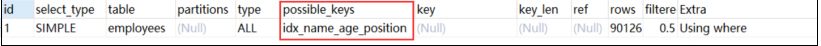

结论：联合索引第一个字段就用范围查找不会走索引，mysql内部可能觉得第一个字段就用范围，结果集应该很大，回表效率不高，还不 如就全表扫描

2、强制走索引 
```aidl
EXPLAIN SELECT * FROM employees force index(idx_name_age_position) WHERE name > 'LiLei' AND age = 22 A ND position ='manager'

```


结论：虽然使用了强制走索引让联合索引第一个字段范围查找也走索引，扫描的行rows看上去也少了点，但是最终查找效率不一定比全表 扫描高，因为回表效率不高
做了一个小实验：
```aidl
 ‐‐ 关闭查询缓存 
 set global query_cache_size=0; 
 set global query_cache_type=0; 
 ‐‐ 执行时间0.333s 
 SELECT * FROM employees WHERE name > 'LiLei'; 
 ‐‐ 执行时间0.444s
SELECT * FROM employees force index(idx_name_age_position) WHERE name > 'LiLei';
```

3、覆盖索引优化
```aidl
EXPLAIN SELECT name,age,position FROM employees WHERE name > 'LiLei' AND age = 22 AND position ='manag er';
```


4、in和or在表数据量比较大的情况会走索引，在表记录不多的情况下会选择全表扫描
```aidl
EXPLAIN SELECT * FROM employees WHERE name in ('LiLei','HanMeimei','Lucy') AND age = 22 AND position ='manager';
```


```aidl
EXPLAIN SELECT * FROM employees WHERE (name = 'LiLei' or name = 'HanMeimei') AND age = 22 AND position ='manager';
```
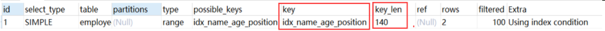

做一个小实验，将employees 表复制一张employees_copy的表，里面保留两三条记录
```aidl
EXPLAIN SELECT * FROM employees_copy WHERE name in ('LiLei','HanMeimei','Lucy') AND age = 22 AND posit ion ='manager';
```


```aidl
 EXPLAIN SELECT * FROM employees_copy WHERE (name = 'LiLei' or name = 'HanMeimei') AND age = 22 AND pos ition ='manager';

```

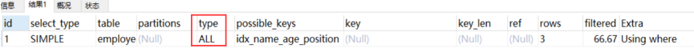

5、like KK% 一般情况都会走索引
```aidl
EXPLAIN SELECT * FROM employees WHERE name like 'LiLei%' AND age = 22 AND position ='manager';
```


EXPLAIN SELECT * FROM employees_copy WHERE name like 'LiLei%' AND age = 22 AND position ='manager';

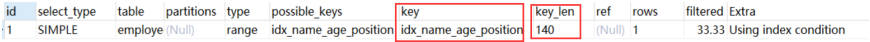

这里给大家补充一个概念，索引下推（Index Condition Pushdown，ICP）, like KK%其实就是用到了索引下推优化 什么是索引下推了？ 对于辅助的联合索引(name,age,position)，正常情况按照最左前缀原则，SELECT * FROM employees WHERE name like 'LiLei%' AND age = 22 AND position ='manager' 这种情况只会走name字段索引，因为根据name字段过滤完，得到的索引行里的age和 position是无序的，无法很好的利用索引。 在MySQL5.6之前的版本，这个查询只能在联合索引里匹配到名字是 'LiLei' 开头的索引，然后拿这些索引对应的主键逐个回表，到主键索 引上找出相应的记录，再比对age和position这两个字段的值是否符合。 MySQL 5.6引入了索引下推优化，可以在索引遍历过程中，对索引中包含的所有字段先做判断，过滤掉不符合条件的记录之后再回表，可 以有效的减少回表次数。使用了索引下推优化后，上面那个查询在联合索引里匹配到名字是 'LiLei' 开头的索引之后，同时还会在索引里过 滤age和position这两个字段，拿着过滤完剩下的索引对应的主键id再回表查整行数据。 索引下推会减少回表次数，对于innodb引擎的表索引下推只能用于二级索引，innodb的主键索引（聚簇索引）树叶子节点上保存的是全 行数据，所以这个时候索引下推并不会起到减少查询全行数据的效果。

为什么范围查找Mysql没有用索引下推优化？

估计应该是Mysql认为范围查找过滤的结果集过大，like KK% 在绝大多数情况来看，过滤后的结果集比较小，所以这里Mysql选择给 like KK% 用了索引下推优化，当然这也不是绝对的，有时like KK% 也不一定就会走索引下推。

Mysql如何选择合适的索引

> EXPLAIN select * from employees where name > 'a';


如果用name索引需要遍历name字段联合索引树，然后还需要根据遍历出来的主键值去主键索引树里再去查出最终数据，成本比全表扫描 还高，可以用覆盖索引优化，这样只需要遍历name字段的联合索引树就能拿到所有结果，如下：
 
>EXPLAIN select name,age,position from employees where name > 'a' ;
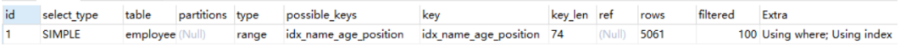

如果用name索引需要遍历name字段联合索引树，然后还需要根据遍历出来的主键值去主键索引树里再去查出最终数据，成本比全表扫描 还高，可以用覆盖索引优化，这样只需要遍历name字段的联合索引树就能拿到所有结果，如下：
>EXPLAIN select name,age,position from employees where name > 'a' ;
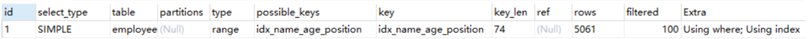
> EXPLAIN select * from employees where name > 'zzz'
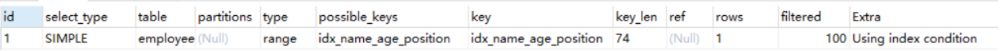

对于上面这两种 name>'a' 和 name>'zzz' 的执行结果，mysql最终是否选择走索引或者一张表涉及多个索引，mysql最 终如何选择索引，我们可以用trace工具来一查究竟，开启trace工具会影响mysql性能，所以只能临时分析sql使用，用 完之后立即关闭

trace工具用法：

```aidl
set session optimizer_trace="enabled=on",end_markers_in_json=on; ‐‐开启trace

 select * from employees where name > 'a' order by position;
 SELECT * FROM information_schema.OPTIMIZER_TRACE;
```

查看tracer字段
```
{
  "steps": [
    {
      "join_preparation": {  ‐‐第一阶段：SQL准备阶段，格式化sql
        "select#": 1,
        "steps": [
          {
            "expanded_query": "/* select#1 */ select `employees`.`id` AS `id`,`employees`.`name` AS `name`,`employees`.`age` AS `age`,`employees`.`position` AS `position`,`employees`.`hire_time` AS `hire_time` from `employees` where (`employees`.`name` > 'a') order by `employees`.`position`"
          }
        ] /* steps */
      } /* join_preparation */
    },
    {
      "join_optimization": {   ‐‐第二阶段：SQL优化阶段
        "select#": 1,
        "steps": [
          {
            "condition_processing": {  ‐‐条件处理 
              "condition": "WHERE",
              "original_condition": "(`employees`.`name` > 'a')",
              "steps": [
                {
                  "transformation": "equality_propagation",
                  "resulting_condition": "(`employees`.`name` > 'a')"
                },
                {
                  "transformation": "constant_propagation",
                  "resulting_condition": "(`employees`.`name` > 'a')"
                },
                {
                  "transformation": "trivial_condition_removal",
                  "resulting_condition": "(`employees`.`name` > 'a')"
                }
              ] /* steps */
            } /* condition_processing */
          },
          {
            "substitute_generated_columns": {
            } /* substitute_generated_columns */
          },
          {
            "table_dependencies": [ ‐‐表依赖详情
              {
                "table": "`employees`",
                "row_may_be_null": false,
                "map_bit": 0,
                "depends_on_map_bits": [
                ] /* depends_on_map_bits */
              }
            ] /* table_dependencies */
          },
          {
            "ref_optimizer_key_uses": [
            ] /* ref_optimizer_key_uses */
          },
          {
            "rows_estimation": [  ‐‐预估表的访问成本
              {
                "table": "`employees`",
                "range_analysis": {
                  "table_scan": {
                    "rows": 85066,
                    "cost": 17304
                  } /* table_scan */,
                  "potential_range_indexes": [  ‐‐查询可能使用的索引
                    {
                      "index": "PRIMARY",
                      "usable": false,
                      "cause": "not_applicable"
                    },
                    {
                      "index": "idx_name_age_position",  ‐‐辅助索引
                      "usable": true,
                      "key_parts": [
                        "name",
                        "age",
                        "position",
                        "id"
                      ] /* key_parts */
                    }
                  ] /* potential_range_indexes */,
                  "setup_range_conditions": [
                  ] /* setup_range_conditions */,
                  "group_index_range": {
                    "chosen": false,
                    "cause": "not_group_by_or_distinct"
                  } /* group_index_range */,
                  "analyzing_range_alternatives": {  ‐‐分析各个索引使用成本
                    "range_scan_alternatives": [
                      {
                        "index": "idx_name_age_position",
                        "ranges": [
                          "a < name"   ‐‐索引使用范围
                        ] /* ranges */,
                        "index_dives_for_eq_ranges": true,
                        "rowid_ordered": false,  ‐‐使用该索引获取的记录是否按照主键排序
                        "using_mrr": false,
                        "index_only": false,   ‐‐是否使用覆盖索引
                        "rows": 42533,  ‐‐索引扫描行数
                        "cost": 51041,  ‐‐索引使用成本
                        "chosen": false,  ‐‐是否选择该索引
                        "cause": "cost"
                      }
                    ] /* range_scan_alternatives */,
                    "analyzing_roworder_intersect": {
                      "usable": false,
                      "cause": "too_few_roworder_scans"
                    } /* analyzing_roworder_intersect */
                  } /* analyzing_range_alternatives */
                } /* range_analysis */
              }
            ] /* rows_estimation */
          },
          {
            "considered_execution_plans": [
              {
                "plan_prefix": [
                ] /* plan_prefix */,
                "table": "`employees`",
                "best_access_path": {  ‐‐最优访问路径
                  "considered_access_paths": [  ‐‐最终选择的访问路径
                    {
                      "rows_to_scan": 85066,
                      "access_type": "scan",  ‐‐访问类型：为scan，全表扫描
                      "resulting_rows": 85066,
                      "cost": 17302,
                      "chosen": true, ‐‐确定选择
                      "use_tmp_table": true
                    }
                  ] /* considered_access_paths */
                } /* best_access_path */,
                "condition_filtering_pct": 100,
                "rows_for_plan": 85066,
                "cost_for_plan": 17302,
                "sort_cost": 85066,
                "new_cost_for_plan": 102368,
                "chosen": true
              }
            ] /* considered_execution_plans */
          },
          {
            "attaching_conditions_to_tables": {
              "original_condition": "(`employees`.`name` > 'a')",
              "attached_conditions_computation": [
              ] /* attached_conditions_computation */,
              "attached_conditions_summary": [
                {
                  "table": "`employees`",
                  "attached": "(`employees`.`name` > 'a')"
                }
              ] /* attached_conditions_summary */
            } /* attaching_conditions_to_tables */
          },
          {
            "clause_processing": {
              "clause": "ORDER BY",
              "original_clause": "`employees`.`position`",
              "items": [
                {
                  "item": "`employees`.`position`"
                }
              ] /* items */,
              "resulting_clause_is_simple": true,
              "resulting_clause": "`employees`.`position`"
            } /* clause_processing */
          },
          {
            "reconsidering_access_paths_for_index_ordering": {
              "clause": "ORDER BY",
              "steps": [
              ] /* steps */,
              "index_order_summary": {
                "table": "`employees`",
                "index_provides_order": false,
                "order_direction": "undefined",
                "index": "unknown",
                "plan_changed": false
              } /* index_order_summary */
            } /* reconsidering_access_paths_for_index_ordering */
          },
          {
            "refine_plan": [
              {
                "table": "`employees`"
              }
            ] /* refine_plan */
          }
        ] /* steps */
      } /* join_optimization */
    },
    {
      "join_execution": {   ‐‐第三阶段：SQL执行阶段
        "select#": 1,
        "steps": [
          {
            "filesort_information": [
              {
                "direction": "asc",
                "table": "`employees`",
                "field": "position"
              }
            ] /* filesort_information */,
            "filesort_priority_queue_optimization": {
              "usable": false,
              "cause": "not applicable (no LIMIT)"
            } /* filesort_priority_queue_optimization */,
            "filesort_execution": [
            ] /* filesort_execution */,
            "filesort_summary": {
              "rows": 84958,
              "examined_rows": 84958,
              "number_of_tmp_files": 25,
              "sort_buffer_size": 262056,
              "sort_mode": "<sort_key, packed_additional_fields>"
            } /* filesort_summary */
          }
        ] /* steps */
      } /* join_execution */
    }
  ] /* steps */
}
```
> 结论：全表扫描的成本低于索引扫描，所以mysql最终选择全表扫描

> 最后关闭trace , 影响mysql性能  set session optimizer_trace="enabled=off"; ‐‐关闭trace

常见sql深入优化 
Order by与Group by优化 
Case1：
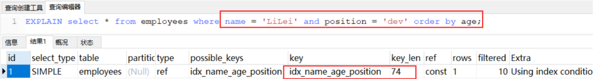

分析： 利用最左前缀法则：中间字段不能断，因此查询用到了name索引，从key_len=74也能看出，age索引列用 在排序过程中，因为Extra字段里没有using filesort

Case 2：

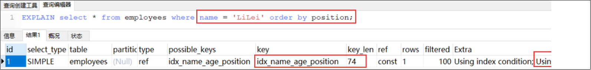

分析： 从explain的执行结果来看：key_len=74，查询使用了name索引，由于用了position进行排序，跳过了 age，出现了Using filesort。

Case 3：

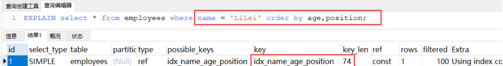

分析： 查找只用到索引name，age和position用于排序，无Using filesort。

Case 4：

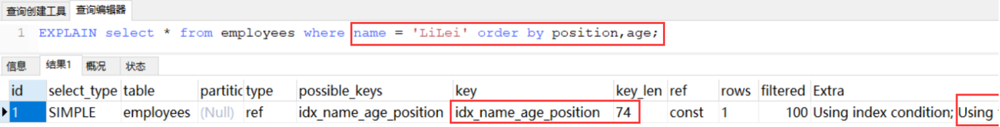

分析： 和Case 3中explain的执行结果一样，但是出现了Using filesort，因为索引的创建顺序为 name,age,position，但是排序的时候age和position颠倒位置了。


Case 5：

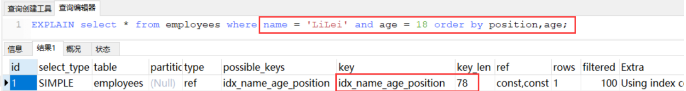

分析： 与Case 4对比，在Extra中并未出现Using filesort，因为age为常量，在排序中被优化，所以索引未颠倒， 不会出现Using filesort。


Case 6：

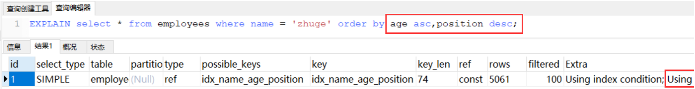

分析： 虽然排序的字段列与索引顺序一样，且order by默认升序，这里position desc变成了降序，导致与索引的 排序方式不同，从而产生Using filesort。Mysql8以上版本有降序索引可以支持该种查询方式。


Case 7：

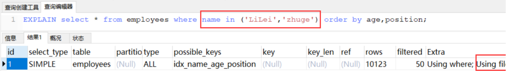

分析： 对于排序来说，多个相等条件也是范围查询


Case 8：

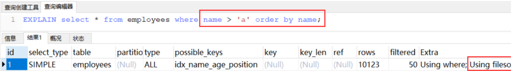

可以用覆盖索引优化

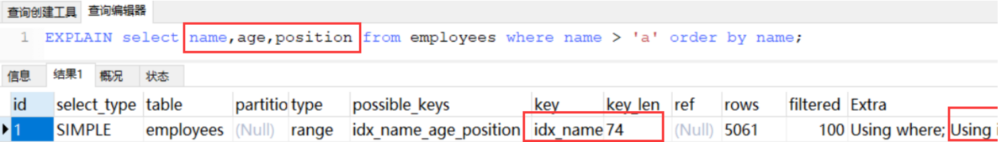

优化总结： 

1、MySQL支持两种方式的排序filesort和index，Using index是指MySQL扫描索引本身完成排序。index 效率高，filesort效率低。

2、order by满足两种情况会使用Using index。 1) order by语句使用索引最左前列。 2) 使用where子句与order by子句条件列组合满足索引最左前列。

3、尽量在索引列上完成排序，遵循索引建立（索引创建的顺序）时的最左前缀法则。 

4、如果order by的条件不在索引列上，就会产生Using filesort。 

5、能用覆盖索引尽量用覆盖索引 

6、group by与order by很类似，其实质是先排序后分组，遵照索引创建顺序的最左前缀法则。对于group by的优化如果不需要排序的可以加上order by null禁止排序。注意，where高于having，能写在where中 的限定条件就不要去having限定了。


> Using filesort文件排序原理详解 

    filesort文件排序方式 
    
    单路排序：是一次性取出满足条件行的所有字段，然后在sort buffer中进行排序；用trace工具可 以看到sort_mode信息里显示< sort_key, additional_fields >或者< sort_key, packed_additional_fields > 
    
    双路排序（又叫回表排序模式）：是首先根据相应的条件取出相应的排序字段和可以直接定位行 数据的行 ID，然后在 sort buffer 中进行排序，排序完后需要再次取回其它需要的字段；用trace工具 可以看到sort_mode信息里显示< sort_key, rowid >
    
    
>MySQL 通过比较系统变量 max_length_for_sort_data(默认1024字节) 的大小和需要查询的字段总大小来 判断使用哪种排序模式。
  + 如果 字段的总长度小于max_length_for_sort_data ，那么使用 单路排序模式； 
  + 如果 字段的总长度大于max_length_for_sort_data ，那么使用 双路排序模∙式。


查看下这条sql对应trace结果如下(只展示排序部分)：

```
mysql> set session optimizer_trace="enabled=on",end_markers_in_json=on;  --开启trace
mysql> select * from employees where name = 'zhuge' order by position;
mysql> select * from information_schema.OPTIMIZER_TRACE;

trace排序部分结果：
"join_execution": {    --Sql执行阶段
        "select#": 1,
        "steps": [
          {
            "filesort_information": [
              {
                "direction": "asc",
                "table": "`employees`",
                "field": "position"
              }
            ] /* filesort_information */,
            "filesort_priority_queue_optimization": {
              "usable": false,
              "cause": "not applicable (no LIMIT)"
            } /* filesort_priority_queue_optimization */,
            "filesort_execution": [
            ] /* filesort_execution */,
            "filesort_summary": {                      --文件排序信息
              "rows": 10000,                           --预计扫描行数
              "examined_rows": 10000,                  --参与排序的行
              "number_of_tmp_files": 3,                --使用临时文件的个数，这个值如果为0代表全部使用的sort_buffer内存排序，否则使用的磁盘文件排序
              "sort_buffer_size": 262056,              --排序缓存的大小，单位Byte
              "sort_mode": "<sort_key, packed_additional_fields>"       --排序方式，这里用的单路排序
            } /* filesort_summary */
          }
        ] /* steps */
      } /* join_execution */
      
      
mysql> set max_length_for_sort_data = 10;    --employees表所有字段长度总和肯定大于10字节
mysql> select * from employees where name = 'zhuge' order by position;
mysql> select * from information_schema.OPTIMIZER_TRACE;

trace排序部分结果：
"join_execution": {
        "select#": 1,
        "steps": [
          {
            "filesort_information": [
              {
                "direction": "asc",
                "table": "`employees`",
                "field": "position"
              }
            ] /* filesort_information */,
            "filesort_priority_queue_optimization": {
              "usable": false,
              "cause": "not applicable (no LIMIT)"
            } /* filesort_priority_queue_optimization */,
            "filesort_execution": [
            ] /* filesort_execution */,
            "filesort_summary": {
              "rows": 10000,
              "examined_rows": 10000,
              "number_of_tmp_files": 2,
              "sort_buffer_size": 262136,   
              "sort_mode": "<sort_key, rowid>"         --排序方式，这里用的双路排序
            } /* filesort_summary */
          }
        ] /* steps */
      } /* join_execution */


mysql> set session optimizer_trace="enabled=off";    --关闭trace

```


我们先看单路排序的详细过程：

1.从索引name找到第一个满足 name = ‘zhuge’ 条件的主键 id

2.根据主键 id 取出整行，取出所有字段的值，存入 sort_buffer 中

3.从索引name找到下一个满足 name = ‘zhuge’ 条件的主键 id

4.重复步骤 2、3 直到不满足 name = ‘zhuge’ 

5.对 sort_buffer 中的数据按照字段 position 进行排序

6.返回结果给客户端


我们再看下双路排序的详细过程：

1.从索引 name 找到第一个满足 name = ‘zhuge’  的主键id

2.根据主键 id 取出整行，把排序字段 position 和主键 id 这两个字段放到 sort buffer 中

3.从索引 name 取下一个满足 name = ‘zhuge’  记录的主键 id

4.重复 3、4 直到不满足 name = ‘zhuge’ 

5.对 sort_buffer 中的字段 position 和主键 id 按照字段 position 进行排序

6.遍历排序好的 id 和字段 position，按照 id 的值回到原表中取出 所有字段的值返回给客户端


其实对比两个排序模式，单路排序会把所有需要查询的字段都放到 sort buffer 中，而双路排序只会把主键和需要排序的字段放到 sort buffer 中进行排序，然后再通过主键回到原表查询需要的字段。
如果 MySQL 排序内存 sort_buffer 配置的比较小并且没有条件继续增加了，可以适当把 max_length_for_sort_data 配置小点，让优化器选择使用双路排序算法，可以在sort_buffer 中一次排序更多的行，只是需要再根据主键回到原表取数据。
如果 MySQL 排序内存有条件可以配置比较大，可以适当增大 max_length_for_sort_data 的值，让优化器优先选择全字段排序(单路排序)，把需要的字段放到 sort_buffer 中，这样排序后就会直接从内存里返回查询结果了。
所以，MySQL通过 max_length_for_sort_data 这个参数来控制排序，在不同场景使用不同的排序模式，从而提升排序效率。

注意，如果全部使用sort_buffer内存排序一般情况下效率会高于磁盘文件排序，但不能因为这个就随便增大sort_buffer(默认1M)，mysql很多参数设置都是做过优化的，不要轻易调整。

> 索引设计原则

1、代码先行，索引后上
不知大家一般是怎么给数据表建立索引的，是建完表马上就建立索引吗？
这其实是不对的，一般应该等到主体业务功能开发完毕，把涉及到该表相关sql都要拿出来分析之后再建立索引。

2、联合索引尽量覆盖条件
比如可以设计一个或者两三个联合索引(尽量少建单值索引)，让每一个联合索引都尽量去包含sql语句里的where、order by、group by的字段，还要确保这些联合索引的字段顺序尽量满足sql查询的最左前缀原则。


3、不要在小基数字段上建立索引
索引基数是指这个字段在表里总共有多少个不同的值，比如一张表总共100万行记录，其中有个性别字段，其值不是男就是女，那么该字段的基数就是2。
如果对这种小基数字段建立索引的话，还不如全表扫描了，因为你的索引树里就包含男和女两种值，根本没法进行快速的二分查找，那用索引就没有太大的意义了。
一般建立索引，尽量使用那些基数比较大的字段，就是值比较多的字段，那么才能发挥出B+树快速二分查找的优势来。

4、长字符串我们可以采用前缀索引
尽量对字段类型较小的列设计索引，比如说什么tinyint之类的，因为字段类型较小的话，占用磁盘空间也会比较小，此时你在搜索的时候性能也会比较好一点。
当然，这个所谓的字段类型小一点的列，也不是绝对的，很多时候你就是要针对varchar(255)这种字段建立索引，哪怕多占用一些磁盘空间也是有必要的。
对于这种varchar(255)的大字段可能会比较占用磁盘空间，可以稍微优化下，比如针对这个字段的前20个字符建立索引，就是说，对这个字段里的每个值的前20个字符放在索引树里，类似于 KEY index(name(20),age,position)。
此时你在where条件里搜索的时候，如果是根据name字段来搜索，那么此时就会先到索引树里根据name字段的前20个字符去搜索，定位到之后前20个字符的前缀匹配的部分数据之后，再回到聚簇索引提取出来完整的name字段值进行比对。
但是假如你要是order by name，那么此时你的name因为在索引树里仅仅包含了前20个字符，所以这个排序是没法用上索引的， group by也是同理。所以这里大家要对前缀索引有一个了解。

5、where与order by冲突时优先where
在where和order by出现索引设计冲突时，到底是针对where去设计索引，还是针对order by设计索引？到底是让where去用上索引，还是让order by用上索引?
一般这种时候往往都是让where条件去使用索引来快速筛选出来一部分指定的数据，接着再进行排序。
因为大多数情况基于索引进行where筛选往往可以最快速度筛选出你要的少部分数据，然后做排序的成本可能会小很多。

6、基于慢sql查询做优化
可以根据监控后台的一些慢sql，针对这些慢sql查询做特定的索引优化。

[关于慢sql查询不清楚的可以参考这篇文章](../zh-database/199_mysql慢查询.md)


索引设计实战


以社交场景APP来举例，我们一般会去搜索一些好友，这里面就涉及到对用户信息的筛选，这里肯定就是对用户user表搜索了，这个表一般来说数据量会
比较大，我们先不考虑分库分表的情况，比如，我们一般会筛选地区(省市)，性别，年龄，身高，爱好之类的，有的APP可能用户还有评分，比如用户的

受欢迎程度评分，我们可能还会根据评分来排序等等。

对于后台程序来说除了过滤用户的各种条件，还需要分页之类的处理，可能会生成类似sql语句执行：

select xx from user where xx=xx and xx=xx order by xx limit xx,xx


对于这种情况如何合理设计索引了，比如用户可能经常会根据省市优先筛选同城的用户，还有根据性别去筛选，那我们是否应该设计一个联合索引 

(province,city,sex) 了？这些字段好像基数都不大，其实是应该的，因为这些字段查询太频繁了。

假设又有用户根据年龄范围去筛选了，比如 where  province=xx and city=xx and age>=xx and age<=xx，我们尝试着把age字段加入联合索引 

(province,city,sex,age)，注意，一般这种范围查找的条件都要放在最后，之前讲过联合索引范围之后条件的是不能用索引的，但是对于当前这种情况依然用不到age这个索引字段，因为用户没有筛选sex字段，那怎么优化了？其实我们可以这么来优化下sql的写法：where  province=xx and city=xx and sex in ('female','male') and age>=xx and age<=xx
对于爱好之类的字段也可以类似sex字段处理，所以可以把爱好字段也加入索引 (province,city,sex,hobby,age) 
假设可能还有一个筛选条件，比如要筛选最近一周登录过的用户，一般大家肯定希望跟活跃用户交友了，这样能尽快收到反馈，对应后台sql可能是这样：
where  province=xx and city=xx and sex in ('female','male') and age>=xx and age<=xx and latest_login_time>= xx

那我们是否能把 latest_login_time 字段也加入索引了？比如  (province,city,sex,hobby,age,latest_login_time) ，显然是不行的，那怎么来优化这种情况了？其实我们可以试着再设计一个字段is_login_in_latest_7_days，用户如果一周内有登录值就为1，否则为0，那么我们就可以把索引设计成 (province,city,sex,hobby,is_login_in_latest_7_days,age)  来满足上面那种场景了！
一般来说，通过这么一个多字段的索引是能够过滤掉绝大部分数据的，就保留小部分数据下来基于磁盘文件进行order by语句的排序，最后基于limit进行分页，那么一般性能还是比较高的。

不过有时可能用户会这么来查询，就查下受欢迎度较高的女性，比如sql：where  sex = 'female'  order by score limit xx,xx，那么上面那个索引是很难用上的，不能把太多的字段以及太多的值都用 in 语句拼接到sql里的，那怎么办了？其实我们可以再设计一个辅助的联合索引，比如 (sex,score)，这样就能满足查询要求了。
以上就是给大家讲的一些索引设计的思路了，核心思想就是，尽量利用一两个复杂的多字段联合索引，抗下你80%以上的查询，然后用一两个辅助索引尽量抗下剩余的一些非典型查询，保证这种大数据量表的查询尽可能多的都能充分利用索引，这样就能保证你的查询速度和性能了


 
