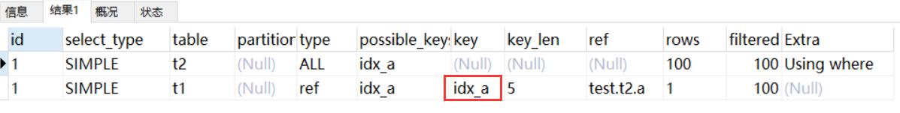
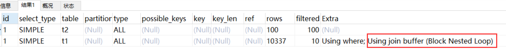
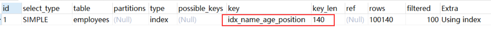
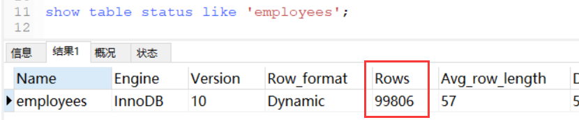

## 分页查询优化

1.根据非主键字段排序的分页查询

看一个根据非主键字段排序的分页查询，SQL 如下：

mysql>  select * from employees ORDER BY name limit 90000,5;


mysql> EXPLAIN select * from employees ORDER BY name limit 90000,5;


发现并没有使用 name 字段的索引（key 字段对应的值为 null），具体原因上节课讲过：扫描整个索引并查找到没索引的行(可能要遍历多个索引树)的成本比扫描全表的成本更高，所以优化器放弃使用索引。
知道不走索引的原因，那么怎么优化呢？
其实关键是让排序时返回的字段尽可能少，所以可以让排序和分页操作先查出主键，然后根据主键查到对应的记录，SQL改写如下

> mysql> select * from employees e inner join (select id from employees order by name limit 90000,5) ed on e.id = ed.id;


需要的结果与原 SQL 一致，执行时间减少了一半以上，我们再对比优化前后sql的执行计划：


原 SQL 使用的是 filesort 排序，而优化后的 SQL 使用的是索引排序。

## Join关联查询优化

>mysql的表关联常见有两种算法
+ Nested-Loop Join 算法
+ Block Nested-Loop Join 算法

### 1、 嵌套循环连接 Nested-Loop Join(NLJ) 算法

一次一行循环地从第一张表（称为驱动表）中读取行，在这行数据中取到关联字段，根据关联字段在另一张表（被驱动表）里取出满足条件的行，然后取出两张表的结果合集。

```mysql
 EXPLAIN select * from t1 inner join t2 on t1.a= t2.a;
```


从执行计划中可以看到这些信息：
+ 驱动表是 t2，被驱动表是 t1。先执行的就是驱动表(执行计划结果的id如果一样则按从上到下顺序执行sql)；优化器一般会优先选择小表做驱动表，用where条件过滤完驱动表，然后再跟被驱动表做关联查询。所以使用 inner join 时，排在前面的表并不一定就是驱动表。
+ 当使用left join时，左表是驱动表，右表是被驱动表，当使用right join时，右表时驱动表，左表是被驱动表，当使用join时，mysql会选择数据量比较小的表作为驱动表，大表作为被驱动表。
+ 使用了 NLJ算法。一般 join 语句中，如果执行计划 Extra 中未出现 Using join buffer 则表示使用的 join 算法是 NLJ。

> 上面的sql的大致流程如下 :

1.从表 t2 中读取一行数据（如果t2表有查询过滤条件的，用先用条件过滤完，再从过滤结果里取出一行数据）；
 
2.从第 1 步的数据中，取出关联字段 a，到表 t1 中查找；

3.取出表 t1 中满足条件的行，跟 t2 中获取到的结果合并，作为结果返回给客户端；

4.重复上面 3 步。


整个过程会读取 t2 表的所有数据(扫描100行)，然后遍历这每行数据中字段 a 的值，根据 t2 表中 a 的值索引扫描 t1 表中的对应行(扫描100次 t1 表的索引，1次扫描可以认为最终只扫描 t1 表一行完整数据，也就是总共 t1 表也扫描了100行)。因此整个过程扫描了 200 行。

如果被驱动表的关联字段没索引，使用NLJ算法性能会比较低(下面有详细解释)，mysql会选择Block Nested-Loop Join算法。

### 2、 基于块的嵌套循环连接 Block Nested-Loop Join(BNL)算法

把驱动表的数据读入到 join_buffer 中，然后扫描被驱动表，把被驱动表每一行取出来跟 join_buffer 中的数据做对比。

```mysql
EXPLAIN select * from t1 inner join t2 on t1.b= t2.b;

```



Extra 中 的Using join buffer (Block Nested Loop)说明该关联查询使用的是 BNL 算法。

上面sql的大致流程如下：
+ 把 t2 的所有数据放入到 join_buffer 中
+ 把表 t1 中每一行取出来，跟 join_buffer 中的数据做对比
+ 返回满足 join 条件的数据

整个过程对表 t1 和 t2 都做了一次全表扫描，因此扫描的总行数为10000(表 t1 的数据总量) + 100(表 t2 的数据总量) = 10100。并且 join_buffer 里的数据是无序的，因此对表 t1 中的每一行，都要做 100 次判断，所以内存中的判断次数是 100 * 10000= 100 万次。

这个例子里表 t2 才 100 行，要是表 t2 是一个大表，join_buffer 放不下怎么办呢？·

join_buffer 的大小是由参数 join_buffer_size 设定的，默认值是 256k。如果放不下表 t2 的所有数据话，策略很简单，就是分段放。

比如 t2 表有1000行记录， join_buffer 一次只能放800行数据，那么执行过程就是先往 join_buffer 里放800行记录，然后从 t1 表里取数据跟 join_buffer 中数据对比得到部分结果，然后清空  join_buffer ，再放入 t2 表剩余200行记录，再次从 t1 表里取数据跟 join_buffer 中数据对比。所以就多扫了一次 t1 表。

被驱动表的关联字段没索引为什么要选择使用 BNL 算法而不使用 Nested-Loop Join 呢？
如果上面第二条sql使用 Nested-Loop Join，那么扫描行数为 100 * 10000 = 100万次，这个是磁盘扫描。
很显然，用BNL磁盘扫描次数少很多，相比于磁盘扫描，BNL的内存计算会快得多。
因此MySQL对于被驱动表的关联字段没索引的关联查询，一般都会使用 BNL 算法。如果有索引一般选择 NLJ 算法，有索引的情况下 NLJ 算法比 BNL算法性能更高

对于关联sql的优化
+ 关联字段加索引，让mysql做join操作时尽量选择NLJ算法，驱动表因为需要全部查询出来，所以过滤的条件也尽量要走索引，避免全表扫描，总之，能走索引的过滤条件尽量都走索引
+ 小表驱动大表，写多表连接sql时如果明确知道哪张表是小表可以用straight_join写法固定连接驱动方式，省去mysql优化器自己判断的时间

## in和exsits优化

**原则是小表驱动大表** , 

in : 当B表的数据集小于小于A表的数据集时，in优于exists

```aidl
select * from A where id in (select id from B)  
#等价于：
　　for(select id from B){
      select * from A where A.id = B.id
    }
```
exists：当A表的数据集小于B表的数据集时，exists优于in
　　将主查询A的数据，放到子查询B中做条件验证，根据验证结果（true或false）来决定主查询的数据是否保留

```aidl
select * from A where exists (select 1 from B where B.id = A.id)
#等价于:
    for(select * from A){
      select * from B where B.id = A.id
    }
    
#A表与B表的ID字段应建立索引
```

1、EXISTS (subquery)只返回TRUE或FALSE,因此子查询中的SELECT * 也可以用SELECT 1替换,官方说法是实际执行时会忽略SELECT清单,因此没有区别

2、EXISTS子查询的实际执行过程可能经过了优化而不是我们理解上的逐条对比


3、EXISTS子查询往往也可以用JOIN来代替，何种最优需要具体问题具体分析

### count(*)查询优化
```aidl
-- 临时关闭mysql查询缓存，为了查看sql多次执行的真实时间
mysql> set global query_cache_size=0;
mysql> set global query_cache_type=0;

mysql> EXPLAIN select count(1) from employees;
mysql> EXPLAIN select count(id) from employees;
mysql> EXPLAIN select count(name) from employees;
mysql> EXPLAIN select count(*) from employees;
```

注意：以上4条sql只有根据某个字段count不会统计字段为null值的数据行




四个sql的执行计划一样，说明这四个sql执行效率应该差不多
字段有索引：count(*)≈count(1)>count(字段)>count(主键id)    //字段有索引，count(字段)统计走二级索引，二级索引存储数据比主键索引少，所以count(字段)>count(主键 id)
字段无索引：count(*)≈count(1)>count(主键id)>count(字段)    //字段没有索引count(字段)统计走不了索引，count(主键 id)还可以走主键索引，所以count(主键 id)>count(字段)
count(1)跟count(字段)执行过程类似，不过count(1)不需要取出字段统计，就用常量1做统计，count(字段)还需要取出字段，所以理论上count(1)比count(字段)会快一点。
count(*) 是例外，mysql并不会把全部字段取出来，而是专门做了优化，不取值，按行累加，效率很高，所以不需要用count(列名)或count(常量)来替代 count(*)。
为什么对于count(id)，mysql最终选择辅助索引而不是主键聚集索引？因为二级索引相对主键索引存储数据更少，检索性能应该更高，mysql内部做了点优化(应该是在5.7版本才优化)。

### 提示 :如果只需要知道表总行数的估计值可以用如下sql查询，性能很高




