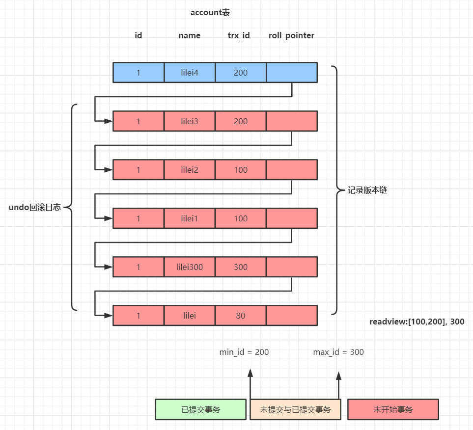
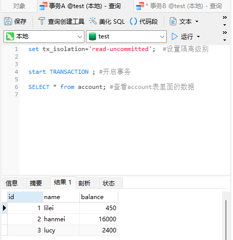

## 概述
我们的数据库一般都会并发执行多个事务，多个事务可能会并发的对相同的一批数据进行增删改查操作，可能就会导致我们说的脏写、脏读、不可重复读、幻读这些问题。
这些问题的本质都是数据库的多事务并发问题，为了解决多事务并发问题，数据库设计了事务隔离机制、锁机制、MVCC多版本并发控制隔离机制，用一整套机制来解决多事务并发问题。接下来，我们会深入讲解这些机制，让大家彻底理解数据库内部的执行原理。

## 事务及其ACID属性

事务是由一组SQL语句组成的逻辑处理单元,事务具有以下4个属性,通常简称为事务的ACID属性。
+ 原子性(Atomicity) ：事务是一个原子操作单元,其对数据的修改,要么全都执行,要么全都不执行。
+ 一致性(Consistent) ：在事务开始和完成时,数据都必须保持一致状态。这意味着所有相关的数据规则都必须应用于事务的修改,以保持数据的完整性。
+ 隔离性(Isolation) ：数据库系统提供一定的隔离机制,保证事务在不受外部并发操作影响的“独立”环境执行。这意味着事务处理过程中的中间状态对外部是不可见的,反之亦然。
+ 持久性(Durable) ：事务完成之后,它对于数据的修改是永久性的,即使出现系统故障也能够保持。

### 并发事务处理带来的问题
更新丢失(Lost Update)或脏写
　　当两个或多个事务选择同一行，然后基于最初选定的值更新该行时，由于每个事务都不知道其他事务的存在，就会发生丢失更新问题–**最后的更新覆盖了由其他事务所做的更新。**

脏读（Dirty Reads）
事务A读取到了事务B已经修改但尚未提交的数据

不可重读（Non-Repeatable Reads）
事务A内部的相同查询语句在不同时刻读出的结果不一致，不符合隔离性

幻读(Phantom Reads)
事务A读取到了事务B提交的新增数据，不符合隔离性

## 事务隔离级别

| 隔离级别                   | 脏读 | 不可重复读 | 幻读  | 和锁的关系|
|------------------------|----|-----|-----| ----|
| 读未提交(read uncommitted) | 可能 | 可能  | 可能  | A事务锁释放在提交命令哪行|
| 读已提交 (read committed)  | 不可能 | 可能  | 可能  | 锁释放在数据库commit的时候|
| 可重复读 (repeatable read) |不可能| 不可能 | 可能  | 写锁的时候,A事务读取的是数据的快照版本 |
| 可串行化  (serializable)   |不可能 | 不可能 | 不可能 | 读写锁分离 | 

数据库的事务隔离越严格,并发副作用越小,但付出的代价也就越大,因为事务隔离实质上就是使事务在一定程度上“串行化”进行,这显然与“并发”是矛盾的。

同时,不同的应用对读一致性和事务隔离程度的要求也是不同的,比如许多应用对“不可重复读"和“幻读”并不敏感,可能更关心数据并发访问的能力。

常看当前数据库的事务隔离级别: show variables like 'tx_isolation';

设置事务隔离级别：set tx_isolation='REPEATABLE-READ';

Mysql默认的事务隔离级别是可重复读，用Spring开发程序时，如果不设置隔离级别默认用Mysql设置的隔离级别，如果Spring设置了就用已经设置的隔离级别


## 锁分类
+ 从性能上分为乐观锁(用版本对比来实现)和悲观锁
+ 从对数据操作的粒度分，分为表锁和行锁
+ 从对数据库操作的类型分，分为读锁和写锁(都属于悲观锁)，还有意向锁

**读锁**（共享锁，S锁(Shared)）：针对同一份数据，多个读操作可以同时进行而不会互相影响，比如：select * from T where id=1 lock in share mode

**写锁**（排它锁，X锁(eXclusive)）：当前写操作没有完成前，它会阻断其他写锁和读锁，数据修改操作都会加写锁，查询也可以通过for update加写锁，比如：select * from T where id=1 for update

**意向锁**（Intention Lock）：又称I锁，针对表锁，主要是为了提高加表锁的效率，是mysql数据库自己加的。当有事务给表的数据行加了共享锁或排他锁，同时会给表设置一个标识，代表已经有行锁了，其他事务要想对表加表锁时，就不必逐行判断有没有行锁可能跟表锁冲突了，直接读这个标识就可以确定自己该不该加表锁。特别是表中的记录很多时，逐行判断加表锁的方式效率很低。而这个标识就是意向锁。

### 总结：
+ MyISAM在执行查询语句SELECT前，会自动给涉及的所有表加读锁,在执行update、insert、delete操作会自动给涉及的表加写锁。
+ InnoDB在执行查询语句SELECT时(非串行隔离级别)，不会加锁。但是update、insert、delete操作会加行锁。

+ 简而言之，就是读锁会阻塞写，但是不会阻塞读。而写锁则会把读和写都阻塞。

## 行锁与事务隔离级别模拟
```aidl
CREATE TABLE `account` (
  `id` int(11) NOT NULL AUTO_INCREMENT,
  `name` varchar(255) DEFAULT NULL,
  `balance` int(11) DEFAULT NULL,
  PRIMARY KEY (`id`)
) ENGINE=InnoDB DEFAULT CHARSET=utf8;
INSERT INTO `test`.`account` (`name`, `balance`) VALUES ('lilei', '450');
INSERT INTO `test`.`account` (`name`, `balance`) VALUES ('hanmei', '16000');
INSERT INTO `test`.`account` (`name`, `balance`) VALUES ('lucy', '2400');
```


### 读未提交：

（1）打开一个客户端A，并设置当前事务模式为read uncommitted（未提交读），查询表account的初始值：

>set tx_isolation='read-uncommitted';

开启事务 ,查看account表里面的数据 , 





（2）在客户端A的事务提交之前，打开另一个客户端B，更新表account：


（3）这时，虽然客户端B的事务还没提交，但是客户端A就可以查询到B已经更新的数据：


（4）一旦客户端B的事务因为某种原因回滚，所有的操作都将会被撤销，那客户端A查询到的数据其实就是脏数据：

（5）在客户端A执行更新语句update account set balance = balance - 50 where id =1，lilei的balance没有变成350，居然是400，是不是很奇怪，数据不一致啊，**如果你这么想就太天真 了，在应用程序中，我们会用400-50=350，并不知道其他会话回滚了，要想解决这个问题可以采用读已提交的隔离级别**
### 读已提交
（1）打开一个客户端A，并设置当前事务模式为read committed（未提交读），查询表account的所有记录：
>set tx_isolation='read-committed';


（2）在客户端A的事务提交之前，打开另一个客户端B，更新表account：


（3）这时，客户端B的事务还没提交，客户端A不能查询到B已经更新的数据，解决了脏读问题：


（4）客户端B的事务提交
对于事务A
一个时间段里面 第一次查询是 

第二次查询是


（5）客户端A执行与上一步相同的查询，结果 与上一步不一致，即产生了不可重复读的问题

###  可重复读

（1）打开一个客户端A，并设置当前事务模式为repeatable read，查询表account的所有记录
>set tx_isolation='repeatable-read';


（2）在客户端A的事务提交之前，打开另一个客户端B，更新表account并提交


（3）在客户端A查询表account的所有记录，与步骤（1）查询结果一致，没有出现不可重复读的问题

即使事务B已经提交了, 事务A在本事务commit之前查询到的依旧是一样的数据


（4）**在客户端A，接着执行update account set balance = balance - 50 where id = 1，balance没有变成400-50=350，lilei的balance值用的是步骤2中的350来算的，所以是300，数据的一致性倒是没有被破坏。可重复读的隔离级别下使用了MVCC(multi-version concurrency control)机制，select操作不会更新版本号，是快照读（历史版本）；insert、update和delete会更新版本号，是当前读（当前版本）。**

（5）重新打开客户端B，插入一条新数据后提交

（6）在客户端A查询表account的所有记录，没有查出新增数据，所以没有出现幻读

（7)验证幻读
在客户端A执行update account set balance=888 where id = 4;能更新成功，再次查询能查到客户端B新增的数据


### 串行化

（1）打开一个客户端A，并设置当前事务模式为serializable，查询表account的初始值：
>set tx_isolation='serializable';


2）打开一个客户端B，并设置当前事务模式为serializable，更新相同的id为1的记录会被阻塞等待，更新id为2的记录可以成功，说明在串行模式下innodb的查询也会被加上行锁。
如果客户端A执行的是一个范围查询，那么该范围内的所有行包括每行记录所在的间隙区间范围(就算该行数据还未被插入也会加锁，这种是间隙锁)都会被加锁。此时如果客户端B在该范围内插入数据都会被阻塞，所以就避免了幻读。
>这种隔离级别并发性极低，开发中很少会用到。 


无索引行锁会升级为表锁(RR级别会升级为表锁，RC级别不会升级为表锁)
锁主要是加在索引上，如果对非索引字段更新，行锁可能会变表锁
session1 执行：update account set balance = 800 where name = 'lilei';
session2 对该表任一行操作都会阻塞住
InnoDB的行锁是针对索引加的锁，不是针对记录加的锁。并且该索引不能失效，否则都会从行锁升级为表锁。


### 结论
Innodb存储引擎由于实现了行级锁定，虽然在锁定机制的实现方面所带来的性能损耗可能比表级锁定会要更高一下，但是在整体并发处理能力方面要远远优于MYISAM的表级锁定的。当系统并发量高的时候，Innodb的整体性能和MYISAM相比就会有比较明显的优势了。
但是，Innodb的行级锁定同样也有其脆弱的一面，当我们使用不当的时候，可能会让Innodb的整体性能表现不仅不能比MYISAM高，甚至可能会更差。

## 行锁分析
通过检查InnoDB_row_lock状态变量来分析系统上的行锁的争夺情况

show status like 'innodb_row_lock%';


对各个状态量的说明如下：
Innodb_row_lock_current_waits: 当前正在等待锁定的数量
Innodb_row_lock_time: 从系统启动到现在锁定总时间长度
Innodb_row_lock_time_avg: 每次等待所花平均时间
Innodb_row_lock_time_max：从系统启动到现在等待最长的一次所花时间
Innodb_row_lock_waits: 系统启动后到现在总共等待的次数

对于这5个状态变量，比较重要的主要是：
Innodb_row_lock_time_avg （等待平均时长）
Innodb_row_lock_waits （等待总次数）
Innodb_row_lock_time（等待总时长）


尤其是当等待次数很高，而且每次等待时长也不小的时候，我们就需要分析系统中为什么会有如此多的等待，然后根据分析结果着手制定优化计划。

