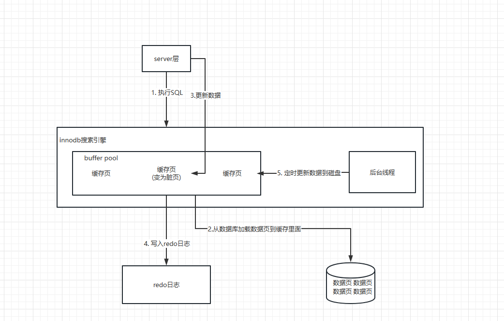
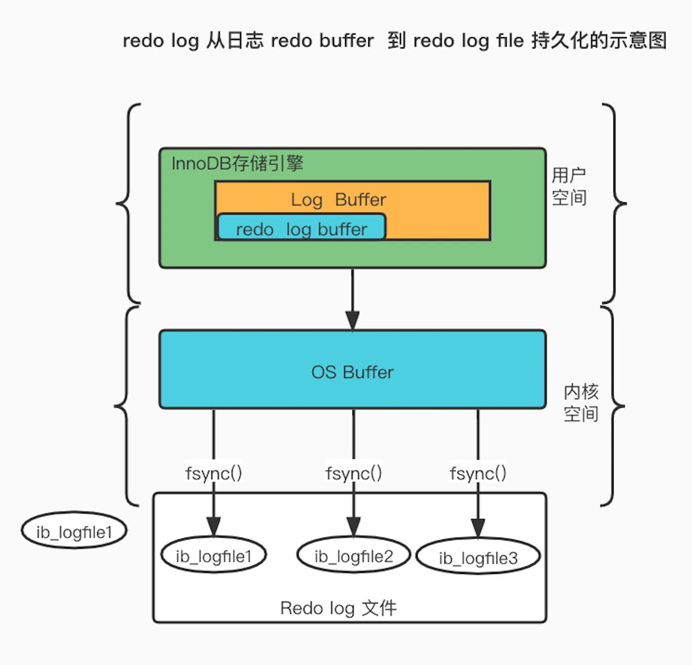

## mysql的七个日志

MySQL日志（log_error、general_log、slow_query_log、log_bin、relay log)
InnoDB 事务日志（redo log和undo log））

+ 1. mysql的错误日志 : log_error, MySQL的错误日志主要记录MySQL服务实例每次启动、停止的详细信息，以及MySQL实例运行过程中产生的警告或者错误信息
+ 2. MySQL普通查询日志(general_log)  MySQL普通查询日志记录MySQL服务实例所有的操作，如select、update、insert、delete等操作，无论该操作是否成功执行。
+ 3. 慢查询日志（slow_query_log） 使用MySQL慢查询日志可以有效的跟踪 执行时间过长 或者 没有使用索引的查询语句。
+ 4. 中继日志（relay log） MySQL 中继日志（relay log）只存在于主从复制结构中的从节点上，用于保存主节点传输过来的数据变更事件，
+ 5. 二进制日志(binlog) 用于复制，在主从复制中，从库利用主库上的binlog进行重播，实现主从同步。
+ 6. 回滚日志(undo log) 主要用于事务回滚和MVCC
+ 7. 重做日志(redo log) 主要用于掉电等故障恢复

undo log（回滚日志）：是 Innodb 存储引擎层生成的日志，实现了事务中的原子性，主要用于事务回滚和 MVCC。
redo log（重做日志）：是 Innodb 存储引擎层生成的日志，实现了事务中的持久性，主要用于掉电等故障恢复；
binlog （归档日志）：是 Server 层生成的日志，主要用于数据备份和主从复制；

## binlog日志
MySQL 的主从复制依赖于 binlog ，也就是记录 MySQL 上的所有变化并以二进制形式保存在磁盘上。复制的过程就是将 binlog 中的数据从主库传输到从库上。

binlog 日志有三种格式，分别为 STATMENT、ROW 和 MIXED
1. STATEMENT：每一条修改数据的 SQL 都会被记录到 binlog 中（相当于记录了逻辑操作，所以针对这种格式， binlog 可以称为逻辑日志），主从复制中 slave 端再根据 SQL 语句重现。但 STATEMENT 有动态函数的问题，比如你用了 uuid 或者 now 这些函数，你在主库上执行的结果并不是你在从库执行的结果，这种随时在变的函数会导致复制的数据不一致；
2. ROW：记录行数据最终被修改成什么样了（这种格式的日志，就不能称为逻辑日志了），不会出现 STATEMENT 下动态函数的问题。但 ROW 的缺点是每行数据的变化结果都会被记录，比如执行批量 update 语句，更新多少行数据就会产生多少条记录，使 binlog 文件过大，而在 STATEMENT 格式下只会记录一个 update 语句而已；
3. MIXED：包含了 STATEMENT 和 ROW 模式，它会根据不同的情况自动使用 ROW 模式和 STATEMENT 模式；

## undo log日志 回滚日志

undo log为了解决原子性

undo log 是一种用于撤销回退的日志。在事务没提交之前，MySQL 会先记录更新前的数据到 undo log 日志文件里面，当事务回滚时，可以利用 undo log 来进行回滚。

## redo log日志 

redo log为了解决持久性

mysql在刷盘的时候是通过buffer pool来实现的. 同时如果断电导致buffer pool里面的数据没有及时刷入到磁盘里面 ,那么就会丢失.

为了防止断电导致数据丢失的问题，当有一条记录需要更新的时候，InnoDB 引擎就会先更新内存（同时标记为脏页），然后将本次对这个页的修改以 redo log 的形式记录下来，这个时候更新就算完成了。

后续，InnoDB 引擎会在适当的时候，由后台线程将缓存在 Buffer Pool 的脏页刷新到磁盘里，这就是 WAL （Write-Ahead Logging）技术。

脏页产生和数据刷盘的流程如下 : 

写入 redo log 的方式使用了追加操作， 所以磁盘操作是顺序写，而写入数据需要先找到写入位置，然后才写到磁盘，所以磁盘操作是随机写。

磁盘的「顺序写 」比「随机写」 高效的多，因此 redo log 写入磁盘的开销更小。

redo log 也有自己的缓存—— redo log buffer，每当产生一条 redo log 时，会先写入到 redo log buffer，后续在持久化到磁盘如下图：

## Innodb引擎SQL执行的BufferPool缓存机制

**为什么Mysql不能直接更新磁盘上的数据而且设置这么一套复杂的机制来执行SQL了？**
因为来一个请求就直接对磁盘文件进行随机读写，然后更新磁盘文件里的数据性能可能相当差。
因为磁盘随机读写的性能是非常差的，所以直接更新磁盘文件是不能让数据库抗住很高并发的。
Mysql这套机制看起来复杂，但它可以保证每个更新请求都是**更新内存BufferPool**，然后**顺序写日志文件**，同时还能保证各种异常情况下的数据一致性。
更新内存的性能是极高的，然后顺序写磁盘上的日志文件的性能也是非常高的，要远高于随机读写磁盘文件。
正是通过这套机制，才能让我们的MySQL数据库在较高配置的机器上每秒可以抗下几干甚至上万的读写请求。

