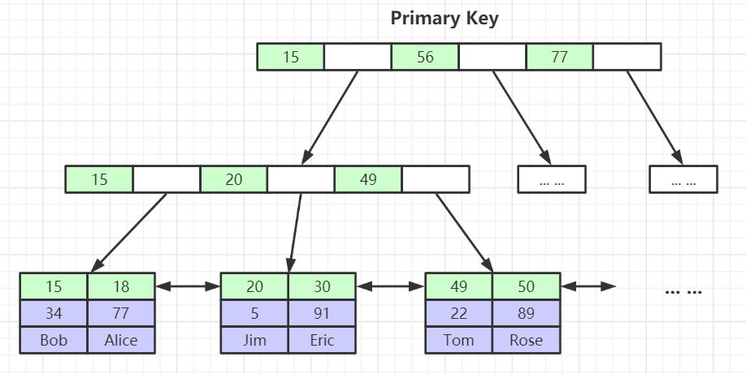
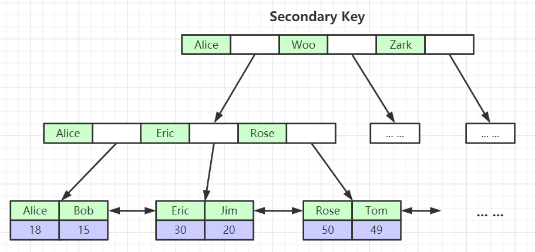
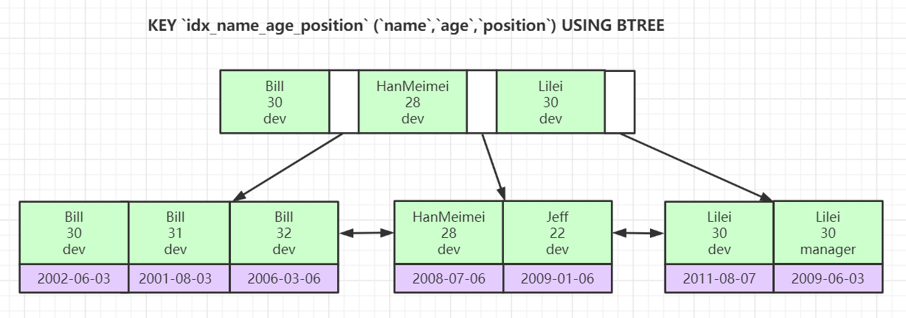

## mysql底层数据结构

### 索引的数据结构
- 二叉树
- 红黑树
- Hash表
- B-Tree

B-Tree树的特点 : 
+ 叶节点具有相同的深度, 叶节点的指针为空
+ 所有索引元素不重复
+ 节点中的数据从左到右递增排列

B+Tree树的特点 : 
+ 非叶子结点不存储data,只存储索引(冗余),可以放更多的索引
+ 叶子节点包括所有索引字段
+ 叶子节点用指针连接,提高区间访问的性能 

Hash特点

+ 对索引的key进行一次hash计算就可以定位出来数据存储的位置
+ 很多时候hash索引要比B+树索引更高效
+ 但是只满足于 = 或者 in的搜索, 不支持范围查找
+ hash冲突问题

### 聚集索引和非聚集索引
MyISAM存储引擎： *.frm 表结构定义文件*.MYD 表数据文件*.MYI 表索引文件
innodb存储引擎 : .frm文件来存储表结构, .ibd文件产生的存放该表的数据和索引的文件。

MyISAM存储引擎索引实现
MyISAM索引文件和数据文件是分离的(非聚集)

InnoDB存储引擎索引实现(聚集)

InnoDB索引实现(聚集)
表数据文件本身就是按B+Tree组织的一个索引结构文件
聚集索引-叶节点包含了完整的数据记录
为什么建议InnoDB表必须建主键，并且推荐使用整型的自增主键？
为什么非主键索引结构叶子节点存储的是主键值？(一致性和节省存储空间)
主键索引 : 

非主键索引 : 

索引最左前缀原理 --(底层原理是联合索引)

联合索引的底层存储结构长什么样 

所以我们建立联合索引的时候, 考虑是否使用索引的几种情况 ( 需要结合联合索引树的底层结构去考虑索引是否会走 ) 

| | sql语句 | 是否走索引  | 描述 | 
|-----|-----|-----|----|
| |select * from table where a = '1' and b = ‘2’  and c='3' | Y | a,b,c都会用上 |
| |select * from table where a = '1' and c= ‘2’ | Y | 只会用上a | 
| | select * from table where b = '1' and c= ‘2’ | N | 都用不上 | 

