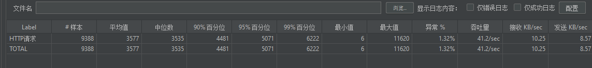
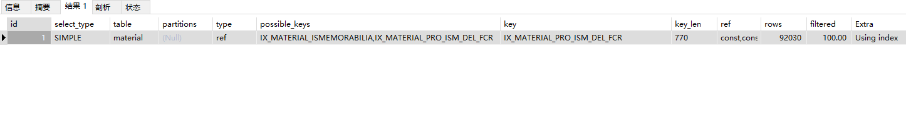

##  索引没加好,导致的接口请求慢

### 现象
有一天测试同学反馈有一个接口单独请求正常时间, , 压测测试没有通过, 去排查问题

压测过程 : 对接口进行压测, 压测为单个服务, 每秒300个请求,压测时间15分钟.

查看了一下数据库的慢查询语句 发现了 select count(*) from table在多线程下时间会暴涨

单次查询时间为 0.154s


在300QPS的压测情况下  为5秒 


在本地模拟了一份实验数据来排查问题.

### 模拟数据

因数据涉及业务, 所以这里造一份假数据来模拟一下现象
```aidl
SET NAMES utf8mb4;
SET FOREIGN_KEY_CHECKS = 0;

-- ----------------------------
-- Table structure for material
-- ----------------------------
DROP TABLE IF EXISTS `material`;
CREATE TABLE `material`  (
  `id` varchar(254) CHARACTER SET utf8 COLLATE utf8_general_ci NOT NULL COMMENT '主键',
  `version` int(11) NULL DEFAULT NULL COMMENT '版本锁',
  `time` datetime NULL DEFAULT NULL COMMENT '最后修改时间',
  `name` varchar(254) CHARACTER SET utf8 COLLATE utf8_general_ci NULL DEFAULT NULL COMMENT '最后修改人',
  `modifier` varchar(254) CHARACTER SET utf8 COLLATE utf8_general_ci NULL DEFAULT NULL COMMENT '最后修改人编号',
  `createTime` datetime NULL DEFAULT NULL COMMENT '创建时间',
  `creatorName` varchar(254) CHARACTER SET utf8 COLLATE utf8_general_ci NULL DEFAULT NULL COMMENT '创建人名字',
  `creator` varchar(254) CHARACTER SET utf8 COLLATE utf8_general_ci NULL DEFAULT NULL COMMENT '创建人编号',
  `imagecategory` varchar(254) CHARACTER SET utf8 COLLATE utf8_general_ci NULL DEFAULT NULL COMMENT '影像类别',
  `imagecategorycode` varchar(254) CHARACTER SET utf8 COLLATE utf8_general_ci NULL DEFAULT NULL COMMENT '影像类别编号',
  `mediapositiontime` datetime NULL DEFAULT NULL COMMENT '拍摄时间',
  `mediaposition` varchar(254) CHARACTER SET utf8 COLLATE utf8_general_ci NULL DEFAULT NULL COMMENT '拍摄位置',
  `mediapositioncode` varchar(254) CHARACTER SET utf8 COLLATE utf8_general_ci NULL DEFAULT NULL COMMENT '拍摄位置编号',
  `work` varchar(254) CHARACTER SET utf8 COLLATE utf8_general_ci NULL DEFAULT NULL COMMENT '拍摄工作',
  `cameracontent` mediumtext CHARACTER SET utf8 COLLATE utf8_general_ci NULL COMMENT '拍摄内容',
  `attachment` mediumtext CHARACTER SET utf8 COLLATE utf8_general_ci NULL COMMENT '附件',
  `managementsubclass` varchar(254) CHARACTER SET utf8 COLLATE utf8_general_ci NULL DEFAULT NULL COMMENT '管理子类',
  `managementsubclasscode` varchar(254) CHARACTER SET utf8 COLLATE utf8_general_ci NULL DEFAULT NULL COMMENT '管理子类编码',
  `mediasourcetype` int(11) NULL DEFAULT NULL COMMENT '附件来源类型',
  `mediasource` int(11) NULL DEFAULT NULL COMMENT '附件来源',
  `mediasourceid` varchar(254) CHARACTER SET utf8 COLLATE utf8_general_ci NULL DEFAULT NULL COMMENT '附件来源业务id',
  `mediasourcename` varchar(254) CHARACTER SET utf8 COLLATE utf8_general_ci NULL DEFAULT NULL COMMENT '附件来源业务名称',
  `mediadomain` varchar(254) CHARACTER SET utf8 COLLATE utf8_general_ci NULL DEFAULT NULL COMMENT '附件域名',
  `mediaappname` varchar(254) CHARACTER SET utf8 COLLATE utf8_general_ci NULL DEFAULT NULL COMMENT '附件来源应用名称',
  `projectstatus` varchar(254) CHARACTER SET utf8 COLLATE utf8_general_ci NULL DEFAULT NULL COMMENT '项目状态',
  `projectstatuscode` varchar(254) CHARACTER SET utf8 COLLATE utf8_general_ci NULL DEFAULT NULL COMMENT '项目状态编码',
  `ismemorabilia` int(11) NULL DEFAULT NULL COMMENT '是否工程',
  `businesssubclass` varchar(254) CHARACTER SET utf8 COLLATE utf8_general_ci NULL DEFAULT NULL COMMENT '业务子类',
  `businesssubclasscode` varchar(254) CHARACTER SET utf8 COLLATE utf8_general_ci NULL DEFAULT NULL COMMENT '业务子类编码',
  `opeterminal` varchar(254) CHARACTER SET utf8 COLLATE utf8_general_ci NULL DEFAULT NULL COMMENT '操作终端',
  `projectid` varchar(254) CHARACTER SET utf8 COLLATE utf8_general_ci NULL DEFAULT NULL COMMENT '项目id',
  `projectname` varchar(254) CHARACTER SET utf8 COLLATE utf8_general_ci NULL DEFAULT NULL COMMENT '项目名称',
  `projectcode` varchar(254) CHARACTER SET utf8 COLLATE utf8_general_ci NULL DEFAULT NULL COMMENT '项目code',
  `deletestatus` int(11) NULL DEFAULT NULL COMMENT '删除状态',
  PRIMARY KEY (`id`) USING BTREE,
  INDEX `IMATERIAl_UNIQUE_ID`(`id`) USING BTREE,
) ENGINE = InnoDB CHARACTER SET = utf8 COLLATE = utf8_general_ci COMMENT = '资料' ROW_FORMAT = Dynamic;

SET FOREIGN_KEY_CHECKS = 1;

```

模拟数据==使用mysql的存储过程伪造100万条数据

```aidl
-- 存储过程
DROP PROCEDURE if exists insert_code;
 
DELIMITER ;;
CREATE PROCEDURE `insert_code`()
BEGIN
 
DECLARE i int;
SET i = 2;
 
WHILE  i <= 1000000 DO
      INSERT INTO `db_zgw`.`material` (`id`, `version`, `time`, `name`, `modifier`, `createTime`, `creatorName`, `creator`, `imagecategory`, `imagecategorycode`, `mediapositiontime`, `mediaposition`, `mediapositioncode`, `work`, `cameracontent`, `attachment`, `managementsubclass`, `managementsubclasscode`, `mediasourcetype`, `mediasource`, `mediasourceid`, `mediasourcename`, `mediadomain`, `mediaappname`, `projectstatus`, `projectstatuscode`, `ismemorabilia`, `businesssubclass`, `businesssubclasscode`, `opeterminal`, `projectid`, `projectname`, `projectcode`, `deletestatus`) VALUES (i, 762, '2020-03-12 09:09:08', 'Ng Wai Yee', 'I5Yu2ZFu1h', '2014-03-05 14:03:36', '阎詩涵', 'I93ZL8aUe7', 'jnR6klqKvG', 'OxACRdDaa9', '2021-07-05 06:50:04', 'G5AG2crKEW', 'jGrqXl0Er1', 'KrV3vYrAh8', '123', '456', '2jKUtpO7Dd', '8fCkV8wYMd', 4, 131, 'BYJKC7o37t', 'Ng Wai Yee', 'image.waiyeeng57.jp', 'Ng Wai Yee', 'B0eyeRHUj9', 'IzXSDmaDtG', 764, 'ruqcTyJtxr', 'JnSjgCQnDR', 'xQ96W8j6pc', 'WT39vJpolZ', 'Ng Wai Yee', 'G0brT0b3l9', 1);
    SET i = i + 1;
END WHILE;
 
END;;
DELIMITER ;

-- 

call insert_code();

---
```

### 原因
使用EXPLAIN命令排查mysql的索引执行过程:


可以看到type是index ,可以分析出来是遍历了整个索引树, 

key 是IMATERIAl_UNIQUE_ID , 走的这个索引

key_len 是 764 , 这里看了一下索引的数据类型 是varchar(254)

这里明显发现问题了. 一个主键居然用了varchar(254)的长度, 导致key_len计算的时候这么长, 是有问题, 那么怎么优化, 
优化这个key , 再找一个long类型的字段, 增加一个索引, 看一下是否命中新建的索引

```aidl
ALTER TABLE `material` ADD INDEX IX_MATERIAL_ISMEMORABILIA (`ismemorabilia`);
```

再执行一下EXPLAIN


可以看到现在的key_len已经是5了, 优化了不少再次测试一下性能



但是性能还是很差

那么尝试一下能不能优化到range或者ref上

查看一下业务逻辑,看到有一些条件可以加上, 减少数据量的总量, 然后通过联合索引来实现走索引的的select count(1)

```aidl
ALTER TABLE `material` ADD INDEX IX_MATERIAL_PRO_ISM_DEL_FCR (`projectid`,`ismemorabilia`,`deletestatus`,`createTime`);
```

那么修改sql为

```aidl
select count(1) from material where projectid = '74b4bd0a-4878-fdeb-fbb6-2826a5c0565b' and ismemorabilia =100 ;
```
这时候我们看一下执行计划可以看出来 



现在的type 已经是ref级别的了.

拿每秒300qps的并发去看一下现在的相应时间是多少, 可以看出现在的响应时间已经缩短了一半多:


### 解决办法
1. 优化索引，让type和key_len 尽量能优化到极致。
2. 如果索引已经不能优化，那么是否可以从业务角度去减少数据量来实现优化。
3. 如果上面都不满足，那么可以考虑使用缓存等技术来提升性能。


