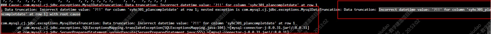

## sharding sphere加了useServerPrepStmts=true的参数导致的

### 1.现象
  生产环境的数据库采用的是主从框架的mysql , 数据库代理层使用的是 ShardingSphere Proxy ,
  
  问题是直连单数据库的可以插入数据, 通过sharding sphere代理的IP和端口插入数据会失败

错误信息如下 : 



### 2.原因
sharding sphere加了useServerPrepStmts=true的参数导致的

验证思路 :
'jdbc:mysql://ip:port/db?serverTimezone=Asia/Shanghai&useUnicode=true&characterEncoding=UTF-8&characterSetResults=UTF-8&useServerPrepStmts=true'
'jdbc:mysql://ip:port/db?serverTimezone=Asia/Shanghai&useUnicode=true&characterEncoding=UTF-8&characterSetResults=UTF-8&useServerPrepStmts=false'

修改项目的连接数据库URL, 
分别插入语句

发现&useServerPrepStmts=true会插入失败 , 发现&useServerPrepStmts=false 可以正常插入数据


### 3.解决办法

追加在连接数据库的URL后面&useServerPrepStmts=false


### 4. 扩展资料

```
https://juejin.cn/post/6999992099978346527
```