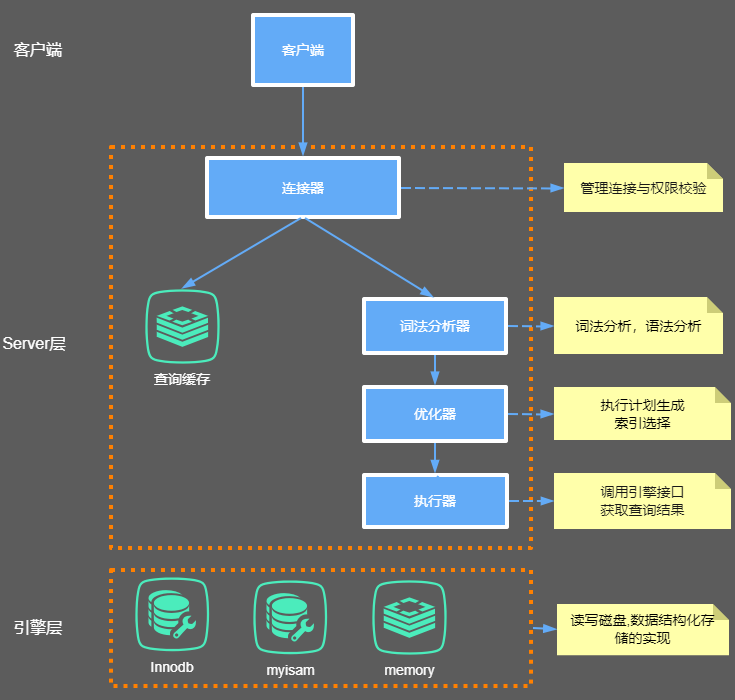
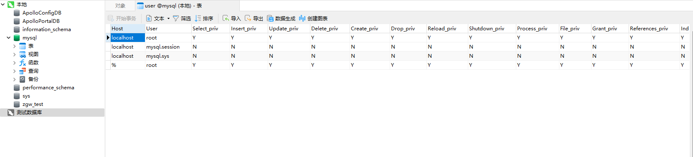
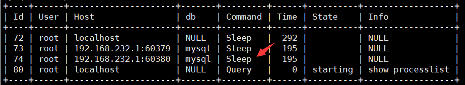
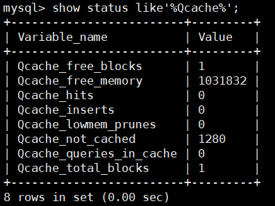
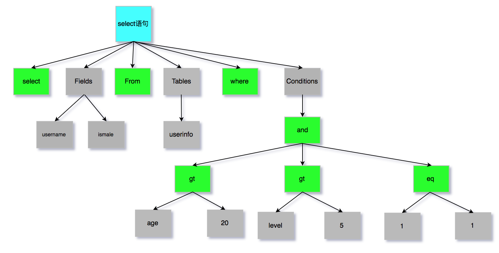
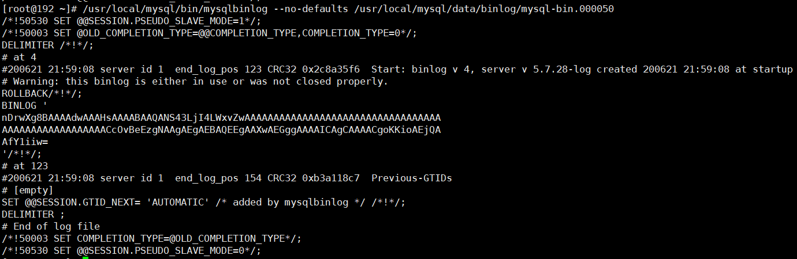

## 内部组件


大体来说，MySQL 可以分为 Server 层和存储引擎层两部分.

## Server层
主要包括连接器、查询缓存、分析器、优化器、执行器等，涵盖 MySQL 的大多数核心服务功能，以及所有的内置函数（如日期、时间、数学和加密函数等），所有跨存储引擎的功能都在这一层实现，比如存储过程、触发器、视图等。

## Store层
存储引擎层负责数据的存储和提取。其架构模式是插件式的，支持 InnoDB、MyISAM、Memory 等多个存储引擎。现在最常用的存储引擎是 InnoDB，它从 MySQL 5.5.5 版本开始成为了默认存储引擎。也就是说如果我们在create table时不指定表的存储引擎类型,默认会给你设置存储引擎为InnoDB。

>数据
```mysql
CREATE TABLE `test` (
  `id` int(11) NOT NULL AUTO_INCREMENT,
  `name` varchar(255) DEFAULT NULL,
  PRIMARY KEY (`id`)
) ENGINE=InnoDB AUTO_INCREMENT=9 DEFAULT CHARSET=utf8;
```

重点来分析连接器、查询缓存、分析器、优化器、执行器分别主要干了哪些事情。

### 连接器

我们知道由于MySQL是开源的，他有非常多种类的客户端：navicat,mysql front,jdbc,SQLyog等非常丰富的客户端,这些客户端要向mysql发起通信都必须先跟Server端建立通信连接，而建立连接的工作就是有连接器完成的。
第一步，你会先连接到这个数据库上，这时候接待你的就是连接器。连接器负责跟客户端建立连接、获取权限、维持和管理连接。连接命令一般是这么写的：

```aidl
mysql -h host[数据库地址] -u root[用户] -p root[密码] -P 3306
```

连接命令中的 mysql 是客户端工具，用来跟服务端建立连接。在完成经典的 TCP 握手后，连接器就要开始认证你的身份，这个时候用的就是你输入的用户名和密码。

1、如果用户名或密码不对，你就会收到一个"Access denied for user"的错误，然后客户端程序结束执行。

2、如果用户名密码认证通过，连接器会到权限表里面查出你拥有的权限。之后，这个连接里面的权限判断逻辑，都将依赖于此时读到的权限。

这就意味着，一个用户成功建立连接后，即使你用管理员账号对这个用户的权限做了修改，也不会影响已经存在连接的权限。修改完成后，只有再新建的连接才会使用新的权限设置。用户的权限表在系统表空间的mysql的user表中。



#### 修改user密码

```aidl
mysql> CREATE USER 'username'@'host' IDENTIFIED BY 'password'; //创建新用户
mysql> grant all privileges on *.* to 'username'@'%'; //赋权限,%表示所有(host)
mysql> flush privileges //刷新数据库
mysql> update user set password=password(”123456″) where user=’root’;(设置用户名密码)
mysql> show grants for root@"%"; 查看当前用户的权限
```

连接完成后，如果你没有后续的动作，这个连接就处于空闲状态，你可以在 show processlist 命令中看到它。文本中这个
图是 show processlist 的结果，其中的 Command 列显示为“Sleep”的这一行，就表示现在系统里面有一个空闲连接。




客户端如果长时间不发送command到Server端，连接器就会自动将它断开。这个时间是由参数 wait_timeout 控制的，默认值是 8 小时。
查看wait_timeout

```aidl
mysql> show global variables like "wait_timeout";
mysql>set global wait_timeout=28800; 设置全局服务器关闭非交互连接之前等待活动的秒数
```

## 查询缓存

连接建立完成后，你就可以执行 select 语句了。执行逻辑就会来到第二步：查询缓存。

MySQL 拿到一个查询请求后，会先到查询缓存看看，之前是不是执行过这条语句。之前执行过的语句及其结果可能会以 key-value 对的形式，被直接缓存在内存中。key 是查询的语句，value 是查询的结果。如果你的查询能够直接在这个缓存中找到 key，那么这个 value 就会被直接返回给客户端。

如果语句不在查询缓存中，就会继续后面的执行阶段。执行完成后，执行结果会被存入查询缓存中。你可以看到，如果查询命中缓存，MySQL 不需要执行后面的复杂操作，就可以直接返回结果，这个效率会很高。

> 大多数情况查询缓存就是个鸡肋，为什么呢？

因为查询缓存往往弊大于利。查询缓存的失效非常频繁，只要有对一个表的更新，这个表上所有的查询缓存都会被清空。因此很可能你费劲地把结果存起来，还没使用呢，就被一个更新全清空了。对于更新压力大的数据库来说，查询缓存的命中率会非常低。

一般建议大家在静态表里使用查询缓存，什么叫静态表呢？就是一般我们极少更新的表。比如，一个系统配置表、字典表，那这张表上的查询才适合使用查询缓存。好在 MySQL 也提供了这种“按需使用”的方式。你可以将my.cnf参数 query_cache_type 设置成 DEMAND。


my.cnf
#query_cache_type有3个值 0代表关闭查询缓存OFF，1代表开启ON，2（DEMAND）代表当sql语句中有SQL_CACHE关键词时才缓存
query_cache_type=2

这样对于默认的 SQL 语句都不使用查询缓存。而对于你确定要使用查询缓存的语句，可以用 SQL_CACHE 显式指定，像下面这个语句一样：

```aidl
mysql> select SQL_CACHE * from test where ID=5；
```

查看当前mysql实例是否开启缓存机制

```aidl
mysql> show global variables like "%query_cache_type%";
```

监控查询缓存的命中率:

```aidl
mysql> show status like'%Qcache%'; //查看运行的缓存信息

```



+ Qcache_free_blocks:表示查询缓存中目前还有多少剩余的blocks，如果该值显示较大，则说明查询缓存中的内存碎片过多了，可能在一定的时间进行整理。
+ Qcache_free_memory:查询缓存的内存大小，通过这个参数可以很清晰的知道当前系统的查询内存是否够用，是多了，还是不够用，DBA可以根据实际情况做出调整。
+ Qcache_hits:表示有多少次命中缓存。我们主要可以通过该值来验证我们的查询缓存的效果。数字越大，缓存效果越理想。
+ Qcache_inserts: 表示多少次未命中然后插入，意思是新来的SQL请求在缓存中未找到，不得不执行查询处理，执行查询处理后把结果insert到查询缓存中。这样的情况的次数，次数越多，表示查询缓存应用到的比较少，效果也就不理想。当然系统刚启动后，查询缓存是空的，这很正常。
+ Qcache_lowmem_prunes:该参数记录有多少条查询因为内存不足而被移除出查询缓存。通过这个值，用户可以适当的调整缓存大小。
+ Qcache_not_cached: 表示因为query_cache_type的设置而没有被缓存的查询数量。
+ Qcache_queries_in_cache:当前缓存中缓存的查询数量。
+ Qcache_total_blocks:当前缓存的block数量。
mysql8.0已经移除了查询缓存功能

## 分析器
如果没有命中查询缓存，就要开始真正执行语句了。首先，MySQL 需要知道你要做什么，因此需要对 SQL 语句做解析。
分析器先会做“词法分析”。你输入的是由多个字符串和空格组成的一条 SQL 语句，MySQL 需要识别出里面的字符串分别是什么，代表什么。
MySQL 从你输入的"select"这个关键字识别出来，这是一个查询语句。它也要把字符串“T”识别成“表名 T”，把字符串“ID”识别成“列 ID”。
做完了这些识别以后，就要做“语法分析”。根据词法分析的结果，语法分析器会根据语法规则，判断你输入的这个 SQL 语句是否满足 MySQL 语法。
如果你的语句不对，就会收到“You have an error in your SQL syntax”的错误提醒，比如下面这个语句 from 写成了 "rom"。

### 词法分析器原理
词法分析器分成6个主要步骤完成对sql语句的分析
1、词法分析
2、语法分析
3、语义分析
4、构造执行树
5、生成执行计划
6、计划的执行

SQL语句的分析分为词法分析与语法分析，mysql的词法分析由MySQLLex[MySQL自己实现的]完成，语法分析由Bison生成。关于语法树大家如果想要深入研究可以参考这篇wiki文章：https://en.wikipedia.org/wiki/LR_parser。那么除了Bison外，Java当中也有开源的词法结构分析工具例如Antlr4，ANTLR从语法生成一个解析器，可以构建和遍历解析树，可以在IDEA工具当中安装插件：antlr v4 grammar plugin。插件使用详见课程
经过bison语法分析之后，会生成一个这样的语法树



至此我们分析器的工作任务也基本圆满了。接下来进入到优化器

## 优化器

经过了分析器，MySQL 就知道你要做什么了。在开始执行之前，还要先经过优化器的处理。
优化器是在表里面有多个索引的时候，决定使用哪个索引；或者在一个语句有多表关联（join）的时候，决定各个表的连接顺序。比如你执行下面这样的语句，这个语句是执行两个表的 join：

```aidl
mysql> select * from test1 join test2 using(ID) where test1.name=yangguo and test2.name=xiaolongnv;
```

既可以先从表 test1 里面取出 name=yangguo的记录的 ID 值，再根据 ID 值关联到表 test2，再判断 test2 里面 name的值是否等于 yangguo。
也可以先从表 test2 里面取出 name=xiaolongnv 的记录的 ID 值，再根据 ID 值关联到 test1，再判断 test1 里面 name 的值是否等于 yangguo。
这两种执行方法的逻辑结果是一样的，但是执行的效率会有不同，而优化器的作用就是决定选择使用哪一个方案。优化器阶段完成后，这个语句的执行方案就确定下来了，然后进入执行器阶段。如果你还有一些疑问，比如优化器是怎么选择索引的，有没有可能选择错等等。

## 执行器

开始执行的时候，要先判断一下你对这个表 T 有没有执行查询的权限，如果没有，就会返回没有权限的错误，如下所示 (在工程实现上，如果命中查询缓存，会在查询缓存返回结果的时候，做权限验证。查询也会在优化器之前调用 precheck 验证权限)。
```aidl
mysql> select * from test where id=1;

```

如果有权限，就打开表继续执行。打开表的时候，执行器就会根据表的引擎定义，去使用这个引擎提供的接口。
比如我们这个例子中的表 test 中，ID 字段没有索引，那么执行器的执行流程是这样的：
>1.调用 InnoDB 引擎接口取这个表的第一行，判断 ID 值是不是 10，如果不是则跳过，如果是则将这行存在结果集中；

>2.调用引擎接口取“下一行”，重复相同的判断逻辑，直到取到这个表的最后一行。

>3.执行器将上述遍历过程中所有满足条件的行组成的记录集作为结果集返回给客户端。


## bin-log归档

删库是不需要跑路的，因为我们的SQL执行时，会将sql语句的执行逻辑记录在我们的bin-log当中，什么是bin-log呢？

binlog是Server层实现的二进制日志,他会记录我们的cud操作。Binlog有以下几个特点：

```aidl
1、Binlog在MySQL的Server层实现（引擎共用）
2、Binlog为逻辑日志,记录的是一条语句的原始逻辑
3、Binlog不限大小,追加写入,不会覆盖以前的日志	
```
如果，我们误删了数据库,可以使用binlog进行归档!要使用binlog归档，首先我们得记录binlog，因此需要先开启MySQL的binlog功能。
配置my.cnf


```aidl
配置开启binlog
log-bin=/usr/local/mysql/data/binlog/mysql-bin
注意5.7以及更高版本需要配置本项：server-id=123454（自定义,保证唯一性）;
#binlog格式，有3种statement,row,mixed
binlog-format=ROW
#表示每1次执行写入就与硬盘同步，会影响性能，为0时表示，事务提交时mysql不做刷盘操作，由系统决定
sync-binlog=1
```
binlog命令

```aidl
mysql> show variables like '%log_bin%'; 查看bin-log是否开启
mysql> flush logs; 会多一个最新的bin-log日志
mysql> show master status; 查看最后一个bin-log日志的相关信息
mysql> reset master; 清空所有的bin-log日志
```

查看binlog内容

```aidl
mysql> /usr/local/mysql/bin/mysqlbinlog --no-defaults /usr/local/mysql/data/binlog/mysql-bin.000001 查看binlog内容
```

binlog里的内容不具备可读性，所以需要我们自己去判断恢复的逻辑点位，怎么观察呢？看重点信息，比如begin,commit这种关键词信息，只要在binlog当中看到了，你就可以理解为begin-commit之间的信息是一个完整的事务逻辑,然后再根据位置position判断恢复即可。binlog内容如下：



数据归档操作

```aidl
从bin-log恢复数据
恢复全部数据
/usr/local/mysql/bin/mysqlbinlog --no-defaults /usr/local/mysql/data/binlog/mysql-bin.000001 |mysql -uroot -p tuling(数据库名)
恢复指定位置数据
/usr/local/mysql/bin/mysqlbinlog --no-defaults --start-position="408" --stop-position="731"  /usr/local/mysql/data/binlog/mysql-bin.000001 |mysql -uroot -p tuling(数据库)
恢复指定时间段数据
/usr/local/mysql/bin/mysqlbinlog --no-defaults /usr/local/mysql/data/binlog/mysql-bin.000001 --stop-date= "2018-03-02 12:00:00"  --start-date= "2019-03-02 11:55:00"|mysql -uroot -p test(数据库)
```

### 归档测试准

1、定义一个存储过程，写入数据

```mysql
drop procedure if exists tproc;
delimiter $$
create procedure tproc(i int)
begin
                declare s int default 1;
                declare c char(50) default repeat('a',50);
                while s<=i do
                                start transaction;
                                insert into test values(null,c);
                                commit;
                                set s=s+1;
                end while;
end$$
delimiter ;
```

2、删除数据

mysql> truncate test;


3、利用binlog归档

mysql> /usr/local/mysql/bin/mysqlbinlog --no-defaults /usr/local/mysql/data/binlog/mysql-bin.000001 |mysql -uroot -p tuling(数据库名)


