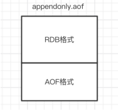
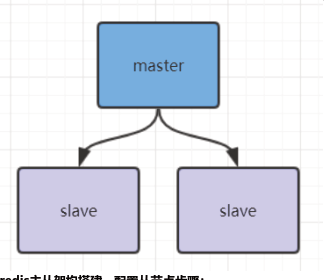
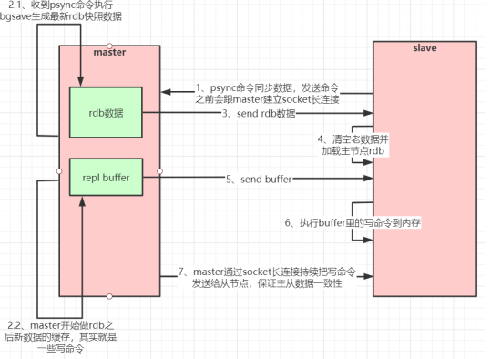
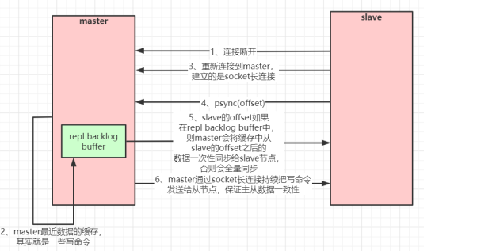
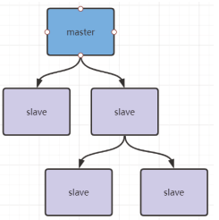
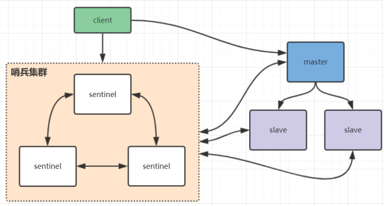
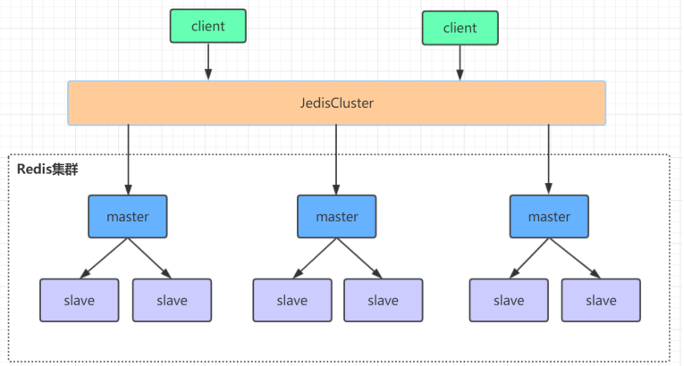

## 什么样的数据需要放进redis里面

+ 访问很频繁的数据,改动不是很大
+ 热点数据

## 用那种数据结构
Redis提供了五种主要的数据类型，它提供了强大且实用的功能，然而实际开发中，有大多数的开发者仅仅只会使用简单的 Redis String的 Get和Set，下面将回顾Redis五大对象，以便能够在实战中游刃有余。

+ String（终究是我扛下来所有）
+ Hash（存储对象我也行）
+ List（栈和队列我都行）
+ Set（标签系统我在行）
+ Sort Set（排起名来我最棒）

### String
+ ID自增
+ 点击量
+ session的一致性

### List(特性:左进左出,右进左出,左进右出,右进右出)
+ 左进右出: 队列结构 可以用作消息队列
+ 左进左出: 栈结构 可以用作评论列表,最后评论的在最上面

## Hash
+ 保存数据库里面的表
+ xml等结构化数据值

## sort set 
+ 做排行榜  ; 还有(昨天,今天,明天)三日热点数据

## redis底层原理
+ 使用内存作为存储介质
+ 底层数据结构采用hash的原理,有很多桶
+ 线程方面采用的是单线程,为了减少多线程切换的时间消耗
+ I/O方面采用的是NIO的多路复用

## 数据量越来越大,单个redis已经不能满足了, 怎么样选择redis集群

### reids的持久化

RDB快照（snapshot）

在默认情况下， Redis 将内存数据库快照保存在名字为 dump.rdb 的二进制文件中。

以手动执行命令生成RDB快照，进入redis客户端执行命令save或bgsave可以生成dump.rdb文件

bgsave的写时复制(COW)机制
>Redis 借助操作系统提供的写时复制技术（Copy-On-Write, COW），在生成快照的同时，依然可以正常
处理写命令。简单来说，bgsave 子进程是由主线程 fork 生成的，可以共享主线程的所有内存数据。
bgsave 子进程运行后，开始读取主线程的内存数据，并把它们写入 RDB 文件。此时，如果主线程对这些
数据也都是读操作，那么，主线程和 bgsave 子进程相互不影响。但是，如果主线程要修改一块数据，那
么，这块数据就会被复制一份，生成该数据的副本。然后，bgsave 子进程会把这个副本数据写入 RDB 文
件，而在这个过程中，主线程仍然可以直接修改原来的数据。


### AOF（append-only file）
快照功能并不是非常耐久（durable）： 如果 Redis 因为某些原因而造成故障停机， 那么服务器将丢失
最近写入、且仍未保存到快照中的那些数据。从 1.1 版本开始， Redis 增加了一种完全耐久的持久化方
式： AOF 持久化，将修改的每一条指令记录进文件appendonly.aof中(先写入os cache，每隔一段时间
fsync到磁盘)

```aidl
# 命令
set gaowang 666

*3
$3
set
$5
gaowang
$3
666
```

这是一种resp协议格式数据，星号后面的数字代表命令有多少个参数，$号后面的数字代表这个参数有几
个字符

你可以通过修改配置文件来打开 AOF 功能：
```aidl
# appendonly yes
```
从现在开始， 每当 Redis 执行一个改变数据集的命令时（比如 SET）， 这个命令就会被追加到 AOF 文
件的末尾。
这样的话， 当 Redis 重新启动时， 程序就可以通过重新执行 AOF 文件中的命令来达到重建数据集的目
的。
你可以配置 Redis 多久才将数据 fsync 到磁盘一次。

```aidl
appendfsync always：每次有新命令追加到 AOF 文件时就执行一次 fsync ，非常慢，也非常安全。
appendfsync everysec：每秒 fsync 一次，足够快，并且在故障时只会丢失 1 秒钟的数据。
appendfsync no：从不 fsync ，将数据交给操作系统来处理。更快，也更不安全的选择。
```

### AOF重写
AOF文件里可能有太多没用指令，所以AOF会定期根据内存的最新数据生成aof文件


### Redis 4.0 混合持久化
重启 Redis 时，我们很少使用 RDB来恢复内存状态，因为会丢失大量数据。我们通常使用 AOF 日志重
放，但是重放 AOF 日志性能相对 RDB来说要慢很多，这样在 Redis 实例很大的情况下，启动需要花费很
长的时间。 Redis 4.0 为了解决这个问题，带来了一个新的持久化选项——混合持久化。
通过如下配置可以开启混合持久化(必须先开启aof)：

```aidl
1 # aof‐use‐rdb‐preamble yes
```
如果开启了混合持久化，AOF在重写时，不再是单纯将内存数据转换为RESP命令写入AOF文件，而是将
重写这一刻之前的内存做RDB快照处理，并且将RDB快照内容和增量的AOF修改内存数据的命令存在一
起，都写入新的AOF文件，新的文件一开始不叫appendonly.aof，等到重写完新的AOF文件才会进行改
名，覆盖原有的AOF文件，完成新旧两个AOF文件的替换。
于是在 Redis 重启的时候，可以先加载 RDB 的内容，然后再重放增量 AOF 日志就可以完全替代之前的
AOF 全量文件重放，因此重启效率大幅得到提升。

混合持久化AOF文件结构如下



Redis数据备份策略：
1. 写crontab定时调度脚本，每小时都copy一份rdb或aof的备份到一个目录中去，仅仅保留最近48
   小时的备份
2. 每天都保留一份当日的数据备份到一个目录中去，可以保留最近1个月的备份
3. 每次copy备份的时候，都把太旧的备份给删了
4. 每天晚上将当前机器上的备份复制一份到其他机器上，以防机器损坏


## Redis主从架构



### Redis主从工作原理

如果你为master配置了一个slave，不管这个slave是否是第一次连接上Master，它都会发送一个PSYNC
命令给master请求复制数据。
master收到PSYNC命令后，会在后台进行数据持久化通过bgsave生成最新的rdb快照文件，持久化期
间，master会继续接收客户端的请求，它会把这些可能修改数据集的请求缓存在内存中。当持久化进行完
毕以后，master会把这份rdb文件数据集发送给slave，slave会把接收到的数据进行持久化生成rdb，然后
再加载到内存中。然后，master再将之前缓存在内存中的命令发送给slave。
当master与slave之间的连接由于某些原因而断开时，slave能够自动重连Master，如果master收到了多
个slave并发连接请求，它只会进行一次持久化，而不是一个连接一次，然后再把这一份持久化的数据发送
给多个并发连接的slave。

### 主从复制(全量复制)流程图：


### 数据部分复制
当master和slave断开重连后，一般都会对整份数据进行复制。但从redis2.8版本开始，redis改用可以支
持部分数据复制的命令PSYNC去master同步数据，slave与master能够在网络连接断开重连后只进行部分
数据复制(断点续传)。
master会在其内存中创建一个复制数据用的缓存队列，缓存最近一段时间的数据，master和它所有的
slave都维护了复制的数据下标offset和master的进程id，因此，当网络连接断开后，slave会请求master
继续进行未完成的复制，从所记录的数据下标开始。如果master进程id变化了，或者从节点数据下标
offset太旧，已经不在master的缓存队列里了，那么将会进行一次全量数据的复制。
主从复制(部分复制，断点续传)流程图：



如果有很多从节点，为了缓解主从复制风暴(多个从节点同时复制主节点导致主节点压力过大)，可以做如
下架构，让部分从节点与从节点(与主节点同步)同步数据



### Redis哨兵高可用架构

sentinel哨兵是特殊的redis服务，不提供读写服务，主要用来监控redis实例节点。
哨兵架构下client端第一次从哨兵找出redis的主节点，后续就直接访问redis的主节点，不会每次都通过
sentinel代理访问redis的主节点，当redis的主节点发生变化，哨兵会第一时间感知到，并且将新的redis
主节点通知给client端(这里面redis的client端一般都实现了订阅功能，订阅sentinel发布的节点变动消息)


### 哨兵集群的问题
在redis3.0以前的版本要实现集群一般是借助哨兵sentinel工具来监控master节点的状态，如果master节点异
常，则会做主从切换，将某一台slave作为master，哨兵的配置略微复杂，并且性能和高可用性等各方面表现
一般，特别是在主从切换的瞬间存在访问瞬断的情况，而且哨兵模式只有一个主节点对外提供服务，没法支持
很高的并发，且单个主节点内存也不宜设置得过大，否则会导致持久化文件过大，影响数据恢复或主从同步的
效率

## 高可用集群模式


redis集群是一个由多个主从节点群组成的分布式服务器群，它具有复制、高可用和分片特性。Redis集群不需
要sentinel哨兵∙也能完成节点移除和故障转移的功能。需要将每个节点设置成集群模式，这种集群模式没有中
心节点，可水平扩展，据官方文档称可以线性扩展到上万个节点(官方推荐不超过1000个节点)。redis集群的
性能和高可用性均优于之前版本的哨兵模式，且集群配置非常简单

### Redis集群原理分析
Redis Cluster 将所有数据划分为 16384 个 slots(槽位)，每个节点负责其中一部分槽位。槽位的信息存储于每
个节点中。
当 Redis Cluster 的客户端来连接集群时，它也会得到一份集群的槽位配置信息并将其缓存在客户端本地。这
样当客户端要查找某个 key 时，可以直接定位到目标节点。同时因为槽位的信息可能会存在客户端与服务器不
一致的情况，还需要纠正机制来实现槽位信息的校验调整。

槽位定位算法

Cluster 默认会对 key 值使用 crc16 算法进行 hash 得到一个整数值，然后用这个整数值对 16384 进行取模
来得到具体槽位。

HASH_SLOT = CRC16(key) mod 16384

跳转重定位

当客户端向一个错误的节点发出了指令，该节点会发现指令的 key 所在的槽位并不归自己管理，这时它会向客
户端发送一个特殊的跳转指令携带目标操作的节点地址，告诉客户端去连这个节点去获取数据。客户端收到指
令后除了跳转到正确的节点上去操作，还会同步更新纠正本地的槽位映射表缓存，后续所有 key 将使用新的槽
位映射表。

Redis集群节点间的通信机制

redis cluster节点间采取gossip协议进行通信 
维护集群的元数据(集群节点信息，主从角色，节点数量，各节点共享的数据等)有两种方式：集中
式和gossip 

Redis集群选举原理分析
当slave发现自己的master变为FAIL状态时，便尝试进行Failover，以期成为新的master。由于挂掉的master
可能会有多个slave，从而存在多个slave竞争成为master节点的过程， 其过程如下：
1.slave发现自己的master变为FAIL
2.将自己记录的集群currentEpoch加1，并广播FAILOVER_AUTH_REQUEST 信息


3.其他节点收到该信息，只有master响应，判断请求者的合法性，并发送FAILOVER_AUTH_ACK，对每一个
epoch只发送一次ack
4.尝试failover的slave收集master返回的FAILOVER_AUTH_ACK
5.slave收到超过半数master的ack后变成新Master(这里解释了集群为什么至少需要三个主节点，如果只有两
个，当其中一个挂了，只剩一个主节点是不能选举成功的)
6.slave广播Pong消息通知其他集群节点。

从节点并不是在主节点一进入 FAIL 状态就马上尝试发起选举，而是有一定延迟，一定的延迟确保我们等待
FAIL状态在集群中传播，slave如果立即尝试选举，其它masters或许尚未意识到FAIL状态，可能会拒绝投票
•延迟计算公式：
 DELAY = 500ms + random(0 ~ 500ms) + SLAVE_RANK * 1000ms
•SLAVE_RANK表示此slave已经从master复制数据的总量的rank。Rank越小代表已复制的数据越新。这种方
式下，持有最新数据的slave将会首先发起选举（理论上）。

集群脑裂数据丢失问题

redis集群没有过半机制会有脑裂问题，网络分区导致脑裂后多个主节点对外提供写服务，一旦网络分区恢复，
会将其中一个主节点变为从节点，这时会有大量数据丢失。
规避方法可以在redis配置里加上参数(这种方法不可能百分百避免数据丢失，参考集群leader选举机制)：
1 min‐replicas‐to‐write 1 //写数据成功最少同步的slave数量，这个数量可以模仿大于半数机制配置，比如
集群总共三个节点可以配置1，加上leader就是2，超过了半数
注意：这个配置在一定程度上会影响集群的可用性，比如slave要是少于1个，这个集群就算leader正常也不能
提供服务了，需要具体场景权衡选择。

集群是否完整才能对外提供服务

当redis.conf的配置cluster-require-full-coverage为no时，表示当负责一个插槽的主库下线且没有相应的从
库进行故障恢复时，集群仍然可用，如果为yes则集群不可用。

Redis集群为什么至少需要三个master节点，并且推荐节点数为奇数？
因为新master的选举需要大于半数的集群master节点同意才能选举成功，如果只有两个master节点，当其中
一个挂了，是达不到选举新master的条件的。
 奇数个master节点可以在满足选举该条件的基础上节省一个节点，比如三个master节点和四个master节点的
集群相比，大家如果都挂了一个master节点都能选举新master节点，如果都挂了两个master节点都没法选举
新master节点了，所以奇数的master节点更多的是从节省机器资源角度出发说的。

Redis集群对批量操作命令的支持

对于类似mset，mget这样的多个key的原生批量操作命令，redis集群只支持所有key落在同一slot的情况，如
果有多个key一定要用mset命令在redis集群上操作，则可以在key的前面加上{XX}，这样参数数据分片hash计
算的只会是大括号里的值，这样能确保不同的key能落到同一slot里去，示例如下：
1 mset {user1}:1:name zhuge {user1}:1:age 18
假设name和age计算的hash slot值不一样，但是这条命令在集群下执行，redis只会用大括号里的 user1 做
hash slot计算，所以算出来的slot值肯定相同，最后都能落在同一slot。


哨兵leader选举流程

当一个master服务器被某sentinel视为下线状态后，该sentinel会与其他sentinel协商选出sentinel的leader进
行故障转移工作。每个发现master服务器进入下线的sentinel都可以要求其他sentinel选自己为sentinel的
leader，选举是先到先得。同时每个sentinel每次选举都会自增配置纪元(选举周期)，每个纪元中只会选择一
个sentinel的leader。如果所有超过一半的sentinel选举某sentinel作为leader。之后该sentinel进行故障转移
操作，从存活的slave中选举出新的master，这个选举过程跟集群的master选举很类似。
哨兵集群只有一个哨兵节点，redis的主从也能正常运行以及选举master，如果master挂了，那唯一的那个哨
兵节点就是哨兵leader了，可以正常选举新master。
不过为了高可用一般都推荐至少部署三个哨兵节点。为什么推荐奇数个哨兵节点原理跟集群奇数个master节点
类似。

## 用了redis压力测试
benchmark工具,redis自己带的


## bigKey优化
### value设计

### 怎么算bigKey
在Redis中，一个字符串最大512MB，一个二级数据结构（例如hash、list、set、zset）可以存
储大约40亿个(2^32-1)个元素，但实际中如果下面两种情况，我就会认为它是bigkey。
1. 字符串类型：它的big体现在单个value值很大，一般认为超过10KB就是bigkey。
2. 非字符串类型：哈希、列表、集合、有序集合，它们的big体现在元素个数太多。
一般来说，string类型控制在10KB以内，hash、list、set、zset元素个数不要超过5000。
反例：一个包含200万个元素的list。
非字符串的bigkey，不要使用del删除，使用hscan、sscan、zscan方式渐进式删除，同时要注
意防止bigkey过期时间自动删除问题(例如一个200万的zset设置1小时过期，会触发del操作，造
成阻塞）

### bigkey的危害：
1.导致redis阻塞
2.网络拥塞
bigkey也就意味着每次获取要产生的网络流量较大，假设一个bigkey为1MB，客户端每秒访问
量为1000，那么每秒产生1000MB的流量，对于普通的千兆网卡(按照字节算是128MB/s)的服务
器来说简直是灭顶之灾，而且一般服务器会采用单机多实例的方式来部署，也就是说一个bigkey
可能会对其他实例也造成影响，其后果不堪设想。
3. 过期删除
有个bigkey，它安分守己（只执行简单的命令，例如hget、lpop、zscore等），但它设置了过
期时间，当它过期后，会被删除，如果没有使用Redis 4.0的过期异步删除(lazyfree-lazy-
expire yes)，就会存在阻塞Redis的可能性。

### bigkey的产生：
一般来说，bigkey的产生都是由于程序设计不当，或者对于数据规模预料不清楚造成的，来看几
个例子：
(1) 社交类：粉丝列表，如果某些明星或者大v不精心设计下，必是bigkey。
(2) 统计类：例如按天存储某项功能或者网站的用户集合，除非没几个人用，否则必是bigkey。
(3) 缓存类：将数据从数据库load出来序列化放到Redis里，这个方式非常常用，但有两个地方需
要注意，第一，是不是有必要把所有字段都缓存；第二，有没有相关关联的数据，有的同学为了
图方便把相关数据都存一个key下，产生bigkey。

### 如何优化bigkey
1. 拆
big list： list1、list2、...listN
big hash：可以讲数据分段存储，比如一个大的key，假设存了1百万的用户数据，可以拆分成
200个key，每个key下面存放5000个用户数据
2. 如果bigkey不可避免，也要思考一下要不要每次把所有元素都取出来(例如有时候仅仅需要
hmget，而不是hgetall)，删除也是一样，尽量使用优雅的方式来处理。
