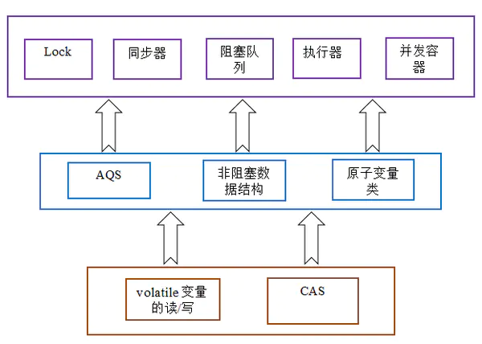

### AQS底层原理 
从整体来看，concurrent包的实现示意图如下：AQS是AbstractQueuedSynchronizer抽象队列同步器



> AbstractQueuedSynchronizer抽象队列同步器，简称为AQS，可用于构建阻塞锁或者其他相关同步器的基础框，是Java并发包的基础工具类。通过AQS这个框架可以对同步状态原子性管理、线程的阻塞和解除阻塞、队列的管理进行统一管理。
  AQS是抽象类，并不能直接实例化，当需要使用AQS的时候需要继承AQS抽象类并且重写指定的方法，这些重写方法包括线程获取资源和释放资源的方式(如ReentractLock通过分别重写线程获取和释放资源的方式实现了公平锁和非公平锁)，同时子类还需要负责共享变量state的维护，如当state为0时表示该锁没有被占，大于0时候代表该锁被一个或多个线程占领(重入锁)，而队列的维护(获取资源失败入队、线程唤醒、线程的状态等)不需要我们考虑，AQS已经帮我们实现好了。AQS的这种设计模式采用的正是模板方法模式。
  总结起来子类的任务有：
>1. 通过CAS操作维护共享变量state。
    2. 重写资源的获取方式。
    3. 重写资源释放的方式。

#### AQS的成员变量

先看AQS有哪些重要的成员变量。
```java
// 头结点，你直接把它当做 当前持有锁的线程 可能是最好理解的
private transient volatile Node head;

// 阻塞的尾节点，每个新的节点进来，都插入到最后，也就形成了一个链表
private transient volatile Node tail;

// 这个是最重要的，不过也是最简单的，代表当前锁的状态，0代表没有被占用，大于0代表有线程持有当前锁
// 之所以说大于0，而不是等于1，是因为锁可以重入嘛，每次重入都加上1
private volatile int state;

// 代表当前持有独占锁的线程，举个最重要的使用例子，因为锁可以重入
// reentrantLock.lock()可以嵌套调用多次，所以每次用这个来判断当前线程是否已经拥有了锁
// if (currentThread == getExclusiveOwnerThread()) {state++}
private transient Thread exclusiveOwnerThread; //继承自AbstractOwnableSynchronizer
```

其中核心变量 state
AQS的基本原理就是当一个线程请求共享资源的时候会判断是否能够成功操作这个共享资源，如果可以就会把这个共享资源设置为锁定状态，如果当前共享资源已经被锁定了，那就把这个请求的线程阻塞住，也就是放到队列中等待。

state变量：

AQS中有一个被volatile声明的变量用来表示同步状态
提供了getState()、setState()和compareAndSetState()方法来修改state状态的值


```java
// 返回同步状态的当前值
protected final int getState() {  
  return state;
}

// 设置同步状态的值
protected final void setState(int newState) { 
  state = newState;
}

// CAS操作修改state的值
protected final boolean compareAndSetState(int expect, int update) {
  return unsafe.compareAndSwapInt(this, stateOffset, expect, update);
}


```


### 同步队列
同步队列 : 

AQS提供了两种方式去获取资源，分别是共享模式和独占模式，但是一般锁只会去继承其中一种模式，不会在一个锁里同时存在共享模式和独占模式两种模式。

>当一个线程以共享模式或独占模式去获取资源的时候，如果获取失败则将该线程封装成Node节点(同时将该节点标识为共享模式或独占模式)加入到同步队列的尾部，AQS实时维护着这个同步队列，这个队列以FIFO(先进先出)来管理节点的排队，即资源的转移(获取再释放)的顺序是从头结点开始到尾节点。
 image
 
 共享模式和独占模式去获取、释放资源都分别对应着一套API，以下分别分析这两套API
 
 独占模式即获取资源的排他锁，共享模式及获取资源的共享锁。
 
#### 独占模式
独占模式即一个线程获取到资源后，其他线程不能再对资源进行任何操作，只能阻塞获得资源。

获取资源
线程调用子类重写的tryAcquire方法获取资源，如果获取成功，则流程结束，否则继续往下执行。
调用addWaiter方法(详细过程看下面的源码解析)，将该线程封装成Node节点，并添加到队列队尾。
调用acquireQueued方法让节点以”死循环”方式进行获取资源，为什么死循环加了双引号呢？因为循环并不是一直让节点无间断的去获取资源，节点会经历 获取资源->失败->线程进入等待状态->唤醒->获取资源……，线程在死循环的过程会不断等待和唤醒，节点进入到自旋状态(详细过程看下面的源码解析)，再循环过程中还会将标识为取消的前驱节点移除队列，同时标识前驱节点状态为SIGNAL。
线程的等待状态是通过调用LockSupport.lock()方法实现的，这个方法会响应Thread.interrupt，但是不会抛出InterruptedException异常，这点与Thread.sleep、Thread.wait不一样。


释放资源
线程调用子类重写的tryRelease方法进行释放资源，如果释放成功则继续检查线程(节点)的是否有后继节点，有后继几点则去唤醒。
调用unparkSuccessor方法进行后继节点的唤醒，如果后继节点为取消状态，则从队列的队尾往前遍历，找到一个离节点最近且不为取消状态的节点进行唤醒，如果后继节点不为取消状态则直接唤醒。


#### 共享模式

共享模式下，线程无论是获取资源还是释放资源，都可能会唤醒后继节点。

>获取资源
 调用子类重写的tryAcquireShared方法进行资源获取，获取失败则调用doAcquireShared将线程封装Node节点加入到同步队列队尾。
 调用doAcquireShared方法让节点以”死循环”方式进行获取资源，为什么死循环加了双引号呢？因为循环并不是一直让节点无间断的去获取资源，节点会经历获取资源->失败->线程进入等待状态->唤醒->获取资源……，线程在死循环的过程会不断等待和唤醒，节点进入到自旋状态(详细过程看下面的源码解析)。如果线程节点被唤醒后，且获取资源成功，且后继节点为共享模式，那么会唤醒后继节点……唤醒会一直传递下去，直到后继节点不是共享模式，唤醒的节点同样会去获取资源，这点和独占模式不一样。
>


释放资源
调用子类重写的tryReleaseShared方法释放资源，释放成功则调用doReleaseShared方法进行后继节点的唤醒。
如果后继节点为共享模式，则持续唤醒。


#### 


然后再看看AQS的内部结构，AQS内部数据结构为一个双向链表和一个单向链表，双链表为同步队列，队列中的每个节点对应一个Node内部类，AQS通过控制链表的节点而达到阻塞、同步的目的，单链表为条件队列，可以把同步队列和条件队列理解成储存等待状态的线程的队列，但是条件队列中的线程并不能直接去获取资源，而要先从条件队列转到同步队列中排队获取，同步队列的唤醒结果是线程去尝试获取锁，而条件队列的唤醒结果是把线程从条件队列移到同步队列中，一个线程要么是在同步队列中，要么是在条件队列中，不可能同时存在这两个队列里面。


等待
调用condition的await方法，将会使当前线程进入等待队列并释放锁(先加入等待队列再释放锁)，同时线程状态转为等待状态。

从同步队列和阻塞队列的角度看，调用await方法时，相当于同步队列的首节点移到condition的等待队列中


通知
调用condition的signal方法时，将会把等待队列的首节点移到等待队列的尾部，然后唤醒该节点。
被唤醒，并不代表就会从await方法返回，也不代表该节点的线程能获取到锁，它一样需要加入到锁的竞争acquireQueued方法中去，只有成功竞争到锁，才能从await方法返回。


—

# Condition变量
Condition 将 Object 监视器方法（wait、notify 和 notifyAll）分解成截然不同的对象，以便通过将这些对象与任意 Lock 实现组合使用，为每个对象提供多个等待 set（wait-set）。其中，Lock 替代了 synchronized 方法和语句的使用，Condition 替代了 Object 监视器方法的使用。

在Condition中，用await()替换wait()，用signal()替换notify()，用signalAll()替换notifyAll()，传统线程的通信方式，Condition都可以实现。

条件队列又称等待队列、条件队列等，条件队列的实现是通过ConditionObject的内之类来完成的，，一开始就介绍了同步队列条件队列的去，不过这里再啰嗦一下，可以把同步队和条件队列理解成储存等待状态的线程的队列，条件队列中的线程并不能直接去获取资源，而要先从条件队列转到同步队列中排队获取，一个线程要么是在同步队列中，要么是在条件队列中，不可能同时存在这两个队列里面。


```java
/* 
 * 使当前线程进入等待状态，直到以下4种情况任意一个发生：
 * 1.另一个线程调用该对象的signal()，当前线程恰好是被选中的唤醒线程
 * 2.另一个线程调用该对象的signalAll()
 * 3.另一个线程interrupt当前线程（此时会抛出InterruptedException）
 * 4.虚假唤醒（源自操作系统，发生概率低）
 * ConditionObject要求调用时该线程已经拿到了其外部AQS类的排它锁（acquire成功）
 */
void await() throws InterruptedException;
/* 
 * 与await()相同，但是不会被interrupt唤醒
 */
void awaitUninterruptibly();
/* 
 * 与await()相同，增加了超时时间，超过超时时间也会停止等待
 * 三个方法功能相似，其返回值代表剩余的超时时间，或是否超时
 */
long awaitNanos(long nanosTimeout) throws InterruptedException;
boolean await(long time, TimeUnit unit) throws InterruptedException;
boolean awaitUntil(Date deadline) throws InterruptedException;
/* 
 * 唤醒一个正在等待该条件变量对象的线程
 * ConditionObject会选择等待时间最长的线程来唤醒
 * ConditionObject要求调用时该线程已经拿到了其外部AQS类的排它锁（acquire成功）
 */
void signal();
/* 
 * 唤醒所有正在等待该条件变量对象的线程
 * ConditionObject要求调用时该线程已经拿到了其外部AQS类的排它锁（acquire成功）
 */
void signalAll();

```


参考文章 : https://ddnd.cn/2019/03/15/java-abstractqueuedsynchronizer/