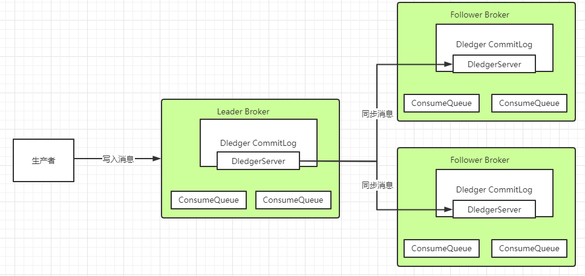

## 技术选型
常用的MQ产品包括Kafka、RabbitMQ和RocketMQ。我们对这三个产品做下简单的比较，重点需要
理解他们的适用场景。


## 原理篇

### 消息存储
分布式队列因为有高可靠性的要求，所以数据要进行持久化存储。

1. MQ收到一条消息后，需要向生产者返回一个ACK响应，并将消息存储起来。

2. MQ Push一条消息给消费者后，等待消费者的ACK响应，需要将消息标记为已消费。如果没有标
   记为消费，MQ会不断的尝试往消费者推送这条消息。

3. MQ需要定期删除一些过期的消息，这样才能保证服务一直可用。

### 消息存储介质
RocketMQ采用的是类似于Kafka的文件存储机制，即直接用磁盘文件来保存消息，而不需要借助
MySQL这一类索引工具。

### 磁盘保存文件
磁盘如果使用得当，磁盘的速度完全可以匹配上网络 的数据传输速度。目前的高性能磁盘，顺序写速度
可以达到600MB/s， 超过了一般网卡的传输速度。但是磁盘随机写的速度只有大概100KB/s，和顺序写
的性能相差6000倍！因为有如此巨大的速度差别，好的消息队列系统会比普通的消息队列系统速度快多
个数量级。RocketMQ的消息用顺序写,保证了消息存储的速度。


### 零拷贝技术
Linux操作系统分为【用户态】和【内核态】，文件操作、网络操作需要涉及这两种形态的切换，免不
了进行数据复制。
一台服务器 把本机磁盘文件的内容发送到客户端，一般分为两个步骤：
1）read；读取本地文件内容；
2）write；将读取的内容通过网络发送出去。
这两个看似简单的操作，实际进行了4 次数据复制，分别是：
1. 从磁盘复制数据到内核态内存；
2. 从内核态内存复 制到用户态内存；
3. 然后从用户态 内存复制到网络驱动的内核态内存；
4. 最后是从网络驱动的内核态内存复 制到网卡中进行传输。
   而通过使用mmap的方式，可以省去向用户态的内存复制，提高速度。这种机制在Java中是通过NIO包
   中的MappedByteBuffer实现的。RocketMQ充分利用了上述特性，也就是所谓的“零拷贝”技术，提高
   消息存盘和网络发送的速度。

### 刷盘机制
RocketMQ需要将消息存储到磁盘上，这样才能保证断电后消息不会丢失。同时这样才可以让存储的消
息量可以超出内存的限制。RocketMQ为了提高性能，会尽量保证磁盘的顺序写。消息在写入磁盘时，
有两种写磁盘的方式，同步刷盘和异步刷盘


+ 同步刷盘：
  在返回写成功状态时，消息已经被写入磁盘。具体流程是，消息写入内存的PAGECACHE后，立刻
  通知刷盘线程刷盘， 然后等待刷盘完成，刷盘线程执行完成后唤醒等待的线程，返回消息写 成功
  的状态。
+ 异步刷盘：
  在返回写成功状态时，消息可能只是被写入了内存的PAGECACHE，写操作的返回快，吞吐量大；
  当内存里的消息量积累到一定程度时，统一触发写磁盘动作，快速写入。
  配置方式：
+ 刷盘方式是通过Broker配置文件里的flushDiskType 参数设置的，这个参数被配置成
  SYNC_FLUSH、ASYNC_FLUSH中的 一个。

### 消息幂等

在MQ系统中，对于消息幂等有三种实现语义：
at most once 最多一次：每条消息最多只会被消费一次
at least once 至少一次：每条消息至少会被消费一次
exactly once 刚刚好一次：每条消息都只会确定的消费一次

而这个exactly once是MQ中最理想也是最难保证的一种语义，需要有非常精细的设计才行。RocketMQ
只能保证at least once，保证不了exactly once。所以，使用RocketMQ时，需要由业务系统自行保证
消息的幂等性。

我们知道，在RocketMQ中，是无法保证每个消息只被投递一次的，所以要在业务上
自行来保证消息消费的幂等性。
而要处理这个问题，RocketMQ的每条消息都有一个唯一的MessageId，这个参数在多次投递的过程中
是不会改变的，所以业务上可以用这个MessageId来作为判断幂等的关键依据。
但是，这个MessageId是无法保证全局唯一的，也会有冲突的情况。所以在一些对幂等性要求严格的场
景，最好是使用业务上唯一的一个标识比较靠谱。例如订单ID。而这个业务标识可以使用Message的
Key来进行传递。

## 实战篇

### 使用RocketMQ如何保证消息不丢失？

#### 1、哪些环节会有丢消息的可能？


其中，1，2，4三个场景都是跨网络的，而跨网络就肯定会有丢消息的可能。

然后关于3这个环节，通常MQ存盘时都会先写入操作系统的缓存page cache中，然后再由操作系统异步的将消息写入硬盘。这个中间有个时间差，就可能会造成消息丢失。如果服务挂了，缓存中还没有来得及写入硬盘的消息就会丢失。

这个是MQ场景都会面对的通用的丢消息问题。那我们看看用Rocket时要如何解决这个问题

#### 2、RocketMQ消息零丢失方案
这个结论比较容易理解，因为RocketMQ的事务消息机制就是为了保证零丢失来设计的，并且经过阿里的验证，肯定是非常靠谱的。

但是如果深入一点的话，我们还是要理解下这个事务消息到底是不是靠谱。我们以最常见的电商订单场景为例，来简单分析下事务消息机制如何保证消息不丢失。我们看下下面这个流程图：


1、为什么要发送个half消息？有什么用？

这个half消息是在订单系统进行下单操作前发送，并且对下游服务的消费者是不可见的。那这个消息的作用更多的体现在确认RocketMQ的服务是否正常。相当于嗅探下RocketMQ服务是否正常，并且通知RocketMQ，我马上就要发一个很重要的消息了，你做好准备。

2.half消息如果写入失败了怎么办？

如果没有half消息这个流程，那我们通常是会在订单系统中先完成下单，再发送消息给MQ。这时候写入消息到MQ如果失败就会非常尴尬了。而half消息如果写入失败，我们就可以认为MQ的服务是有问题的，这时，就不能通知下游服务了。我们可以在下单时给订单一个状态标记，然后等待MQ服务正常后再进行补偿操作，等MQ服务正常后重新下单通知下游服务。

3.订单系统写数据库失败了怎么办？

这个问题我们同样比较下没有使用事务消息机制时会怎么办？如果没有使用事务消息，我们只能判断下单失败，抛出了异常，那就不往MQ发消息了，这样至少保证不会对下游服务进行错误的通知。但是这样的话，如果过一段时间数据库恢复过来了，这个消息就无法再次发送了。当然，也可以设计另外的补偿机制，例如将订单数据缓存起来，再启动一个线程定时尝试往数据库写。而如果使用事务消息机制，就可以有一种更优雅的方案。

如果下单时，写数据库失败(可能是数据库崩了，需要等一段时间才能恢复)。那我们可以另外找个地方把订单消息先缓存起来(Redis、文本或者其他方式)，然后给RocketMQ返回一个UNKNOWN状态。这样RocketMQ就会过一段时间来回查事务状态。我们就可以在回查事务状态时再尝试把订单数据写入数据库，如果数据库这时候已经恢复了，那就能完整正常的下单，再继续后面的业务。这样这个订单的消息就不会因为数据库临时崩了而丢失。

4.half消息写入成功后RocketMQ挂了怎么办？

我们需要注意下，在事务消息的处理机制中，未知状态的事务状态回查是由RocketMQ的Broker主动发起的。也就是说如果出现了这种情况，那RocketMQ就不会回调到事务消息中回查事务状态的服务。这时，我们就可以将订单一直标记为"新下单"的状态。而等RocketMQ恢复后，只要存储的消息没有丢失，RocketMQ就会再次继续状态回查的流程。

5.下单成功后如何优雅的等待支付成功？

在订单场景下，通常会要求下单完成后，客户在一定时间内，例如10分钟，内完成订单支付，支付完成后才会通知下游服务进行进一步的营销补偿。

如果不用事务消息，那通常会怎么办？

最简单的方式是启动一个定时任务，每隔一段时间扫描订单表，比对未支付的订单的下单时间，将超过时间的订单回收。这种方式显然是有很大问题的，需要定时扫描很庞大的一个订单信息，这对系统是个不小的压力。

那更进一步的方案是什么呢？是不是就可以使用RocketMQ提供的延迟消息机制。往MQ发一个延迟1分钟的消息，消费到这个消息后去检查订单的支付状态，如果订单已经支付，就往下游发送下单的通知。而如果没有支付，就再发一个延迟1分钟的消息。最终在第十个消息时把订单回收。这个方案就不用对全部的订单表进行扫描，而只需要每次处理一个单独的订单消息。

那如果使用上了事务消息呢？我们就可以用事务消息的状态回查机制来替代定时的任务。在下单时，给Broker返回一个UNKNOWN的未知状态。而在状态回查的方法中去查询订单的支付状态。这样整个业务逻辑就会简单很多。我们只需要配置RocketMQ中的事务消息回查次数(默认15次)和事务回查间隔时间(messageDelayLevel)，就可以更优雅的完成这个支付状态检查的需求。

6、事务消息机制的作用

整体来说，在订单这个场景下，消息不丢失的问题实际上就还是转化成了下单这个业务与下游服务的业务的分布式事务一致性问题。而事务一致性问题一直以来都是一个非常复杂的问题。而RocketMQ的事务消息机制，实际上只保证了整个事务消息的一半，他保证的是订单系统下单和发消息这两个事件的事务一致性，而对下游服务的事务并没有保证。但是即便如此，也是分布式事务的一个很好的降级方案。目前来看，也是业内最好的降级方案。

#### RocketMQ配置同步刷盘+Dledger主从架构保证MQ自身不会丢消息
1、同步刷盘

这个从我们之前的分析，就很好理解了。我们可以简单的把RocketMQ的刷盘方式 flushDiskType配置成同步刷盘就可以保证消息在刷盘过程中不会丢失了。

2、Dledger的文件同步


在使用Dledger技术搭建的RocketMQ集群中，Dledger会通过两阶段提交的方式保证文件在主从之间成功同步。

简单来说，数据同步会通过两个阶段，一个是uncommitted阶段，一个是commited阶段。

Leader Broker上的Dledger收到一条数据后，会标记为uncommitted状态，然后他通过自己的DledgerServer组件把这个uncommitted数据发给Follower Broker的DledgerServer组件。

接着Follower Broker的DledgerServer收到uncommitted消息之后，必须返回一个ack给Leader Broker的Dledger。然后如果Leader Broker收到超过半数的Follower Broker返回的ack之后，就会把消息标记为committed状态。

再接下来， Leader Broker上的DledgerServer就会发送committed消息给Follower Broker上的DledgerServer，让他们把消息也标记为committed状态。这样，就基于Raft协议完成了两阶段的数据同步。

#### 消费者端不要使用异步消费机制

正常情况下，消费者端都是需要先处理本地事务，然后再给MQ一个ACK响应，这时MQ就会修改Offset，将消息标记为已消费，从而不再往其他消费者推送消息。所以在Broker的这种重新推送机制下，消息是不会在传输过程中丢失的。但是也会有下面这种情况会造成服务端消息丢失：

#### RocketMQ特有的问题，NameServer挂了如何保证消息不丢失？
NameServer在RocketMQ中，是扮演的一个路由中心的角色，提供到Broker的路由功能。但是其实路由中心这样的功能，在所有的MQ中都是需要的。kafka是用zookeeper和一个作为Controller的Broker一起来提供路由服务，整个功能是相当复杂纠结的。而RabbitMQ是由每一个Broker来提供路由服务。而只有RocketMQ把这个路由中心单独抽取了出来，并独立部署。

这个NameServer之前都了解过，集群中任意多的节点挂掉，都不会影响他提供的路由功能。那如果集群中所有的NameServer节点都挂了呢？

有很多人就会认为在生产者和消费者中都会有全部路由信息的缓存副本，那整个服务可以正常工作一段时间。其实这个问题大家可以做一下实验，当NameServer全部挂了后，生产者和消费者是立即就无法工作了的。

**那再回到我们的消息不丢失的问题**，在这种情况下，RocketMQ相当于整个服务都不可用了，那他本身肯定无法给我们保证消息不丢失了。我们只能自己设计一个降级方案来处理这个问题了。例如在订单系统中，如果多次尝试发送RocketMQ不成功，那就只能另外找给地方(Redis、文件或者内存等)把订单消息缓存下来，然后起一个线程定时的扫描这些失败的订单消息，尝试往RocketMQ发送。这样等RocketMQ的服务恢复过来后，就能第一时间把这些消息重新发送出去。整个这套降级的机制，在大型互联网项目中，都是必须要有的。

#### RocketMQ消息零丢失方案总结
完整分析过后，整个RocketMQ消息零丢失的方案其实挺简单

生产者使用事务消息机制。
Broker配置同步刷盘+Dledger主从架构
消费者不要使用异步消费。
整个MQ挂了之后准备降级方案
那这套方案是不是就很完美呢？其实很明显，这整套的消息零丢失方案，在各个环节都大量的降低了系统的处理性能以及吞吐量。在很多场景下，这套方案带来的性能损失的代价可能远远大于部分消息丢失的代价。所以，我们在设计RocketMQ使用方案时，要根据实际的业务情况来考虑。例如，如果针对所有服务器都在同一个机房的场景，完全可以把Broker配置成异步刷盘来提升吞吐量。而在有些对消息可靠性要求没有那么高的场景，在生产者端就可以采用其他一些更简单的方案来提升吞吐，而采用定时对账、补偿的机制来提高消息的可靠性。而如果消费者不需要进行消息存盘，那使用异步消费的机制带来的性能提升也是非常显著的。

总之，这套消息零丢失方案的总结是为了在设计RocketMQ使用方案时的一个很好的参考。


### 使用RocketMQ如何保证消息顺序

MQ的顺序问题分为全局有序和局部有序。

全局有序：整个MQ系统的所有消息严格按照队列先入先出顺序进行消费。
局部有序：只保证一部分关键消息的消费顺序。
首先 我们需要分析下这个问题，在通常的业务场景中，全局有序和局部有序哪个更重要？其实在大部分的MQ业务场景，我们只需要能够保证局部有序就可以了。例如我们用QQ聊天，只需要保证一个聊天窗口里的消息有序就可以了。而对于电商订单场景，也只要保证一个订单的所有消息是有序的就可以了。至于全局消息的顺序，并不会太关心。而通常意义下，全局有序都可以压缩成局部有序的问题。例如以前我们常用的聊天室，就是个典型的需要保证消息全局有序的场景。但是这种场景，通常可以压缩成只有一个聊天窗口的QQ来理解。即整个系统只有一个聊天通道，这样就可以用QQ那种保证一个聊天窗口消息有序的方式来保证整个系统的全局消息有序。

然后 落地到RocketMQ。通常情况下，发送者发送消息时，会通过MessageQueue轮询的方式保证消息尽量均匀的分布到所有的MessageQueue上，而消费者也就同样需要从多个MessageQueue上消费消息。而MessageQueue是RocketMQ存储消息的最小单元，他们之间的消息都是互相隔离的，在这种情况下，是无法保证消息全局有序的。

而对于局部有序的要求，只需要将有序的一组消息都存入同一个MessageQueue里，这样MessageQueue的FIFO设计天生就可以保证这一组消息的有序。RocketMQ中，可以在发送者发送消息时指定一个MessageSelector对象，让这个对象来决定消息发入哪一个MessageQueue。这样就可以保证一组有序的消息能够发到同一个MessageQueue里。

另外，通常所谓的保证Topic全局消息有序的方式，就是将Topic配置成只有一个MessageQueue队列(默认是4个)。这样天生就能保证消息全局有序了。这个说法其实就是我们将聊天室场景压缩成只有一个聊天窗口的QQ一样的理解方式。而这种方式对整个Topic的消息吞吐影响是非常大的，如果这样用，基本上就没有用MQ的必要了。

### 使用RocketMQ如何快速处理积压消息？

#### 1、如何确定RocketMQ有大量的消息积压？
在正常情况下，使用MQ都会要尽量保证他的消息生产速度和消费速度整体上是平衡的，但是如果部分消费者系统出现故障，就会造成大量的消息积累。这类问题通常在实际工作中会出现得比较隐蔽。例如某一天一个数据库突然挂了，大家大概率就会集中处理数据库的问题。等好不容易把数据库恢复过来了，这时基于这个数据库服务的消费者程序就会积累大量的消息。或者网络波动等情况，也会导致消息大量的积累。这在一些大型的互联网项目中，消息积压的速度是相当恐怖的。所以消息积压是个需要时时关注的问题。

对于消息积压，如果是RocketMQ或者kafka还好，他们的消息积压不会对性能造成很大的影响。而如果是RabbitMQ的话，那就惨了，大量的消息积压可以瞬间造成性能直线下滑。

对于RocketMQ来说，有个最简单的方式来确定消息是否有积压。那就是使用web控制台，就能直接看到消息的积压情况。

在Web控制台的主题页面，可以通过 Consumer管理 按钮实时看到消息的积压情况。


另外，也可以通过mqadmin指令在后台检查各个Topic的消息延迟情况。

还有RocketMQ也会在他的 ${storePathRootDir}/config 目录下落地一系列的json文件，也可以用来跟踪消息积压情况。

#### 2、如何处理大量积压的消息？

其实我们回顾下RocketMQ的负载均衡的内容就不难想到解决方案。

如果Topic下的MessageQueue配置得是足够多的，那每个Consumer实际上会分配多个MessageQueue来进行消费。这个时候，就可以简单的通过增加Consumer的服务节点数量来加快消息的消费，等积压消息消费完了，再恢复成正常情况。最极限的情况是把Consumer的节点个数设置成跟MessageQueue的个数相同。但是如果此时再继续增加Consumer的服务节点就没有用了。

而如果Topic下的MessageQueue配置得不够多的话，那就不能用上面这种增加Consumer节点个数的方法了。这时怎么办呢？ 这时如果要快速处理积压的消息，可以创建一个新的Topic，配置足够多的MessageQueue。然后把所有消费者节点的目标Topic转向新的Topic，并紧急上线一组新的消费者，只负责消费旧Topic中的消息，并转储到新的Topic中，这个速度是可以很快的。然后在新的Topic上，就可以通过增加消费者个数来提高消费速度了。之后再根据情况恢复成正常情况。

>在官网中，还分析了一个特殊的情况。就是如果RocketMQ原本是采用的普通方式搭建主从架构，而现在想要中途改为使用Dledger高可用集群，这时候如果不想历史消息丢失，就需要先将消息进行对齐，也就是要消费者把所有的消息都消费完，再来切换主从架构。因为Dledger集群会接管RocketMQ原有的CommitLog日志，所以切换主从架构时，如果有消息没有消费完，这些消息是存在旧的CommitLog中的，就无法再进行消费了。这个场景下也是需要尽快的处理掉积压的消息。
>

### RocketMQ的消息轨迹
RocketMQ默认提供了消息轨迹的功能：

#### 消息轨迹配置
打开消息轨迹功能，需要在broker.conf中打开一个关键配置：

```
traceTopicEnable=true
```
这个配置的默认值是false。也就是说默认是关闭的。
####  消息轨迹数据存储
默认情况下，消息轨迹数据是存于一个系统级别的Topic ,RMQ_SYS_TRACE_TOPIC。这个Topic在Broker节点启动时，会自动创建出来。


另外，也支持客户端自定义轨迹数据存储的Topic。
在客户端的两个核心对象 DefaultMQProducer和DefaultMQPushConsumer，他们的构造函数中，都有两个可选的参数来打开消息轨迹存储

enableMsgTrace：是否打开消息轨迹。默认是false。
customizedTraceTopic：配置将消息轨迹数据存储到用户指定的Topic 。

