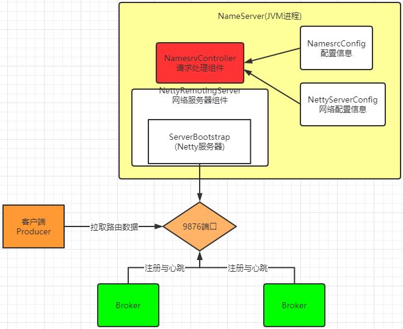

## 源码环境搭建
#### 1、源码拉取：
RocketMQ的官方Git仓库地址：https://github.com/apache/rocketmq 可以用git把项目clone下来或者直接下载代码包。
也可以到RocketMQ的官方网站上下载指定版本的源码： http://rocketmq.apache.org/dowloading/releases/ 

源码下很多的功能模块，很容易让人迷失方向，我们只关注下几个最为重要的模块：
broker: broker 模块（broke 启动进程）
client ：消息客户端，包含消息生产者、消息消费者相关类
example: RocketMQ 例代码
namesrv：NameServer实现相关类（NameServer启动进程）
store：消息存储实现相关类
各个模块的功能大都从名字上就能看懂。我们可以在有需要的时候再进去看源码。
但是这些模块有些东西还是要关注的。例如docs文件夹下的文档，以及各个模块下都有非常丰富的junit测试代码，这些都是非常有用的。

#### 2 、源码调试
将源码导入IDEA后，需要先对源码进行编译。编译指令 clean install -Dmaven.test.skip=true


编译完成后就可以开始调试代码了。调试时需要按照以下步骤：
调试时，先在项目目录下创建一个conf目录，并从distribution拷贝
broker.conf和logback_broker.xml和logback_namesrv.xml


####  启动nameServer
展开namesrv模块，运行NamesrvStartup类即可启动NameServer
启动时，会报错，提示需要配置一个ROCKETMQ_HOME环境变量。这个环境变量我们可以在机器上配置，跟配置JAVA_HOME环境变量一样。也可以在IDEA的运行环境中配置。目录指向源码目录即可


配置完成后，再次执行，看到以下日志内容，表示NameServer启动成功
The Name Server boot success. serializeType=JSON

#### 启动Broker
启动Broker之前，我们需要先修改之前复制的broker.conf文件
```aidl
 brokerClusterName = DefaultCluster
 brokerName = broker-a
 brokerId = 0
 deleteWhen = 04
 fileReservedTime = 48
 brokerRole = ASYNC_MASTER
 flushDiskType = ASYNC_FLUSH
  
 # 自动创建Topic
 autoCreateTopicEnable=true
 # nameServ地址
 namesrvAddr=127.0.0.1:9876
 # 存储路径
 storePathRootDir=E:\\RocketMQ\\data\\rocketmq\\dataDir
 # commitLog路径
 storePathCommitLog=E:\\RocketMQ\\data\\rocketmq\\dataDir\\commitlog
 # 消息队列存储路径
 storePathConsumeQueue=E:\\RocketMQ\\data\\rocketmq\\dataDir\\consumequeue
 # 消息索引存储路径
 storePathIndex=E:\\RocketMQ\\data\\rocketmq\\dataDir\\index
 # checkpoint文件路径
 storeCheckpoint=E:\\RocketMQ\\data\\rocketmq\\dataDir\\checkpoint
 # abort文件存储路径
 abortFile=E:\\RocketMQ\\data\\rocketmq\\dataDir\\abort
```
然后Broker的启动类是broker模块下的BrokerStartup。
启动Broker时，同样需要ROCETMQ_HOME环境变量，并且还需要配置一个-c 参数，指向broker.conf配置文件。
然后重新启动，即可启动Broker。


#### 发送消息

在源码的example模块下，提供了非常详细的测试代码。例如我们启动example模块下的org.apache.rocketmq.example.quickstart.Producer类即可发送消息。
但是在测试源码中，需要指定NameServer地址。这个NameServer地址有两种指定方式，一种是配置一个NAMESRV_ADDR的环境变量。另一种是在源码中指定。我们可以在源码中加一行代码指定NameServer
producer.setNamesrvAddr("127.0.0.1:9876");
然后就可以发送消息了。

#### 消费消息
我们可以使用同一模块下的org.apache.rocketmq.example.quickstart.Consumer类来消费消息。运行时同样需要指定NameServer地址
consumer.setNamesrvAddr("192.168.232.128:9876");
这样整个调试环境就搭建好了。

#### 如何看源码
我们在看源码的时候，要注意，不要一看源码就一行行代码都逐步看，更不要期望一遍就把代码给看明白。这样会陷入到代码的复杂细节中，瞬间打击到放弃。
看源码时，需要用层层深入的方法。每一次阅读源码时，先了解程序执行的流程性代码，略过服务实现的细节性代码，形成大概的概念框架。然后再回头按同样的方法，逐步深入到之前略过的代码。这样才能从源码中看出一点门道来。

### NameServer启动
我们已经了解到，在RocketMQ中，实际进行消息存储、推送等核心功能的是Broker。那NameServer具体做什么用呢？NameServer的核心作用其实就只有两个，一是维护Broker的服务地址并进行及时的更新。二是给Producer和Consumer提供服务获取Broker列表。
整体的流程：


#### 源码重点
整个NameServer的核心就是一个NamesrvController对象。这个controller对象就跟java Web开发中的Controller功能类似，都是响应客户端请求的。
在创建NamesrvController对象时，有两个关键的配置文件NamesrvConfig这个是NameServer自己运行需要的配置信息，还一个NettyServerConfig包含Netty服务端的配置参数，固定的占用了9876端口。
比较有意思的是这个9876端口并没有提供覆盖的方法
然后在启动服务时，启动了一个RemotingServer。这个就是用来响应请求的。
在关闭服务时，关闭了四个东西remotingServer，响应请求的服务；remotingExecutor Netty服务线程池; scheduledExecutorService 定时任务;fileWatchService 这个是用来跟踪acl配置的(acl的配置文件是实时热加载的)。
所以整个NameServer的结构是这样：



### Broker启动


