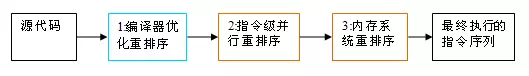
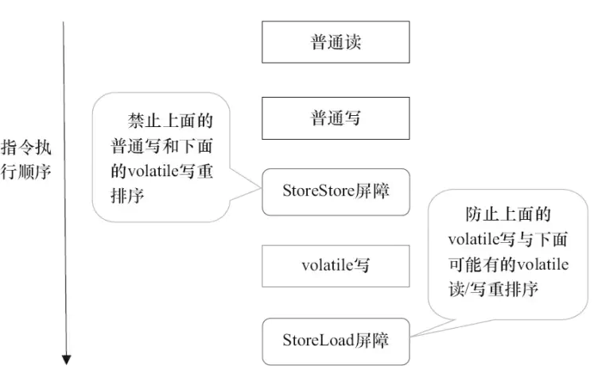
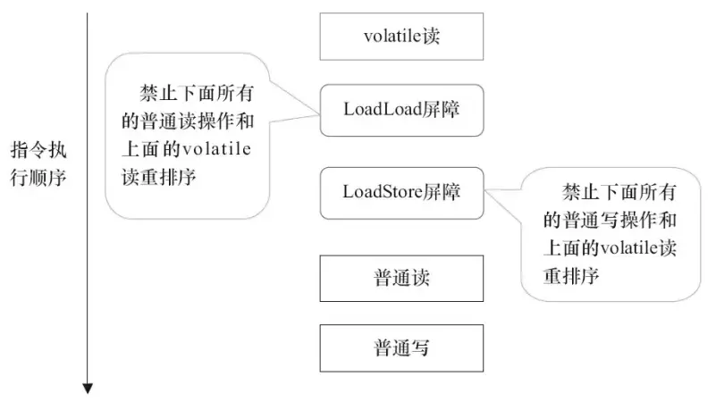
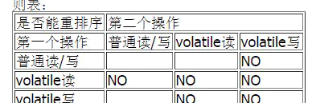

volatile关键词:
volatile 是一个类型修饰符。volatile 的作用是作为指令关键字，确保本条指令不会因编译器的优化而省略。

2.1 volatile 的特性
+ 保证了不同线程对这个变量进行操作时的可见性，即一个线程修改了某个变量的值，这新值对其他线程来说是立即可见的。（实现可见性）
+ 禁止进行指令重排序。（实现有序性）
+ volatile 只能保证对单次读/写的原子性。i++ 这种操作不能保证原子性。

内存语义:

volatile写得内存语义:当写一个volatile变量时，JMM会把该线程对应的本地内存中的共享变量刷新到主内存。

volatile读的内存语义如下：当读一个volatile变量时，JMM会把该线程对应的本地内存置为无效。线程接下来将从主内存中读取共享变量。
