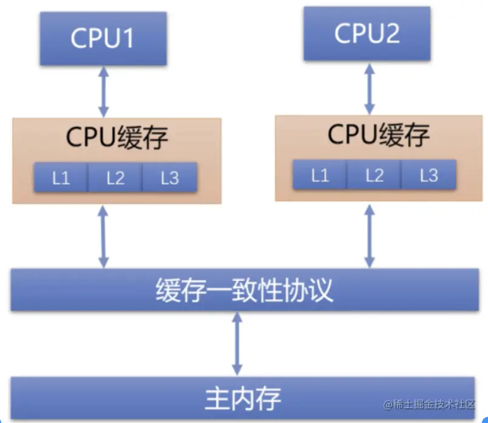
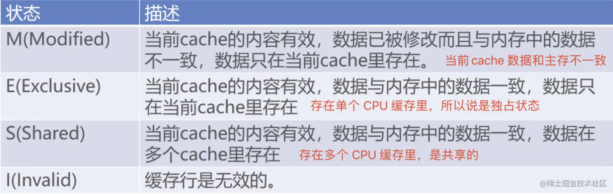
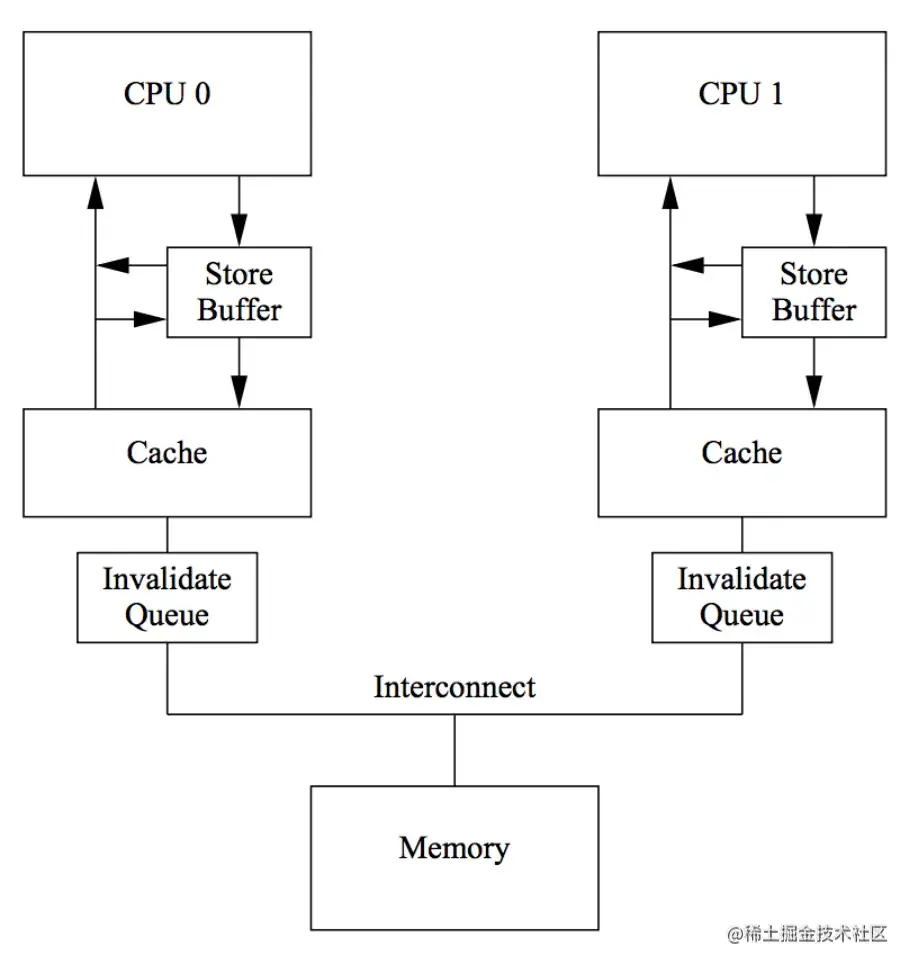
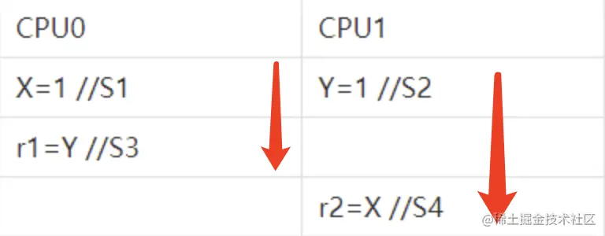
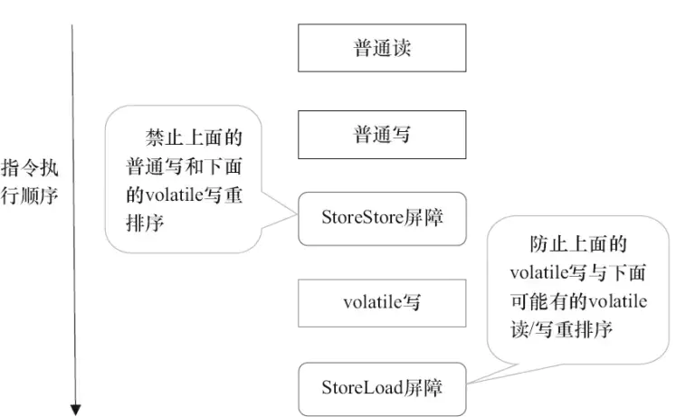
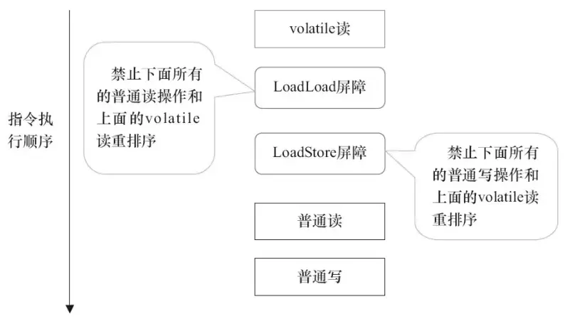
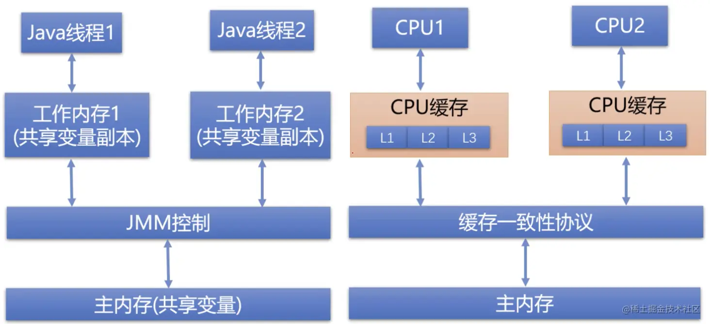

## volatile关键词:
volatile 是一个类型修饰符。volatile 的作用是作为指令关键字，确保本条指令不会因编译器的优化而省略。

2.1 volatile 的特性
+ 保证了不同线程对这个变量进行操作时的可见性，即一个线程修改了某个变量的值，这新值对其他线程来说是立即可见的。（实现可见性）
+ 禁止进行指令重排序。（实现有序性）
+ volatile 只能保证对单次读/写的原子性。i++ 这种操作不能保证原子性。

## volatile的底层原理
volatile 的底层原理涉及到硬件层面的多处理器缓存架构、缓存一致性协议、CPU内存屏障指令，然后再到 JVM 软件层面的 Java 内存模型 JMM，以及 JMM 如何去定义线程的本地内存和主内存之间的关系等。

volatile 的原理：

> 硬件层面
+ 1.多核处理器缓存架构导致多个处理器之间的缓存一致性问题


+ 2.为了解决缓存一致性问题引入了缓存一致性协议


+ 3.缓存一致性协议存在阻塞问题


+ 4.为了解决缓存一致性的阻塞问题引入了写缓冲区和失效队列


+ 5.写缓冲区和失效队列将缓存刷新消息异步化之后还是存在短暂延迟导致线程可见性


+ 6.为了解决可见性问题处理器层面又引入了内存屏障指令


>软件层面


+ 1.硬件层面上，处理器其实并不知道何时需要使用内存屏障指令，它只是提供内存屏障的能力，然后将决定权交给软件层


+ 2.软件层面上JVM 抽象处理 Java 内存模型 JMM 来定义线程本地内存和主内存之间的关系，并提供 volatile 关键字来让软件层面调用底层的内存屏障来解决多线程之间的可见性问题


+ 3.具体工作交给 JVM 在编译期对 volatile 变量的指令代码尾部添加 lock 前缀指令


+ 4.lock 前缀指令的会调用底层处理器的内存屏障
### 一、多核处理器缓存架构和缓存缓存一致性问题



每个 CPU 都有自己的高速缓存，它们共享一个主内存：从主内存读取同一个地址的数据放到自身的高速缓存里，就造成了数据不一致的可能性，于是就产生了 cache coherence 问题，为了解决 cache coherence 问题，引入了缓存一致性协议。

### 二、多核处理器缓存架构之间的缓存一致性协议

MESI 协议（Modified Exclusive Shared Invalid）
MESI 是缓存协议的一种，使用最广泛。



#### 1.1、MESI 协议的原理

MESI 协议的原理是在 CPU 缓存行中保存一个标志位，每个 Cache line 有4个状态，可用2个bit表示。MESI 是指4种状态的首字母：

M: Modified 被修改了

这个状态表示当前 cache line 只被缓存在该 CPU 中，并且是被修改过的脏数据，即和主存中的数据不一致，该缓存行中的内存需要在未来的某个时间点刷入主存。
当写回主存之后，该缓存行的状态会变成 E 独享状态。

E: Exclusive

该 cache line 只被缓存到该 CPU 中，其他 CPU 没缓存它。它是干净的数据，即与主存数据一致。
E 状态的 cache line 在任何时刻，当有其他 CPU 读取该内存时，变成 S 共享状态。
同样地，当 CPU 修改该缓存行数据时，状态变为 M Modified。

S: Share

缓存行为 S 状态意味着它被缓存到多个 CPU 中，并且各个缓存中的数据与主存一直，是干净的数据。
当其中一个 CPU 修改这个缓存数据时，其他 CPU 中的该缓存行可以被作废，变为 I Invalid 状态

I: Invalid

缓存失效，CPU 中的缓存已经不能使用了，因为被其他 CPU 修改过了，你要读取该数据必须重新读取主存。

一个写请求只有在该缓存行的状态是 M 或者 E 时才能被执行，如果缓存行处于 S 状态，意味着多个 CPU 都缓存了它，必须将其他 CPU 的该缓存行置为 Invalid 状态。

CPU的读取遵循下面几点：

如果缓存状态是 I，表示这个 cache line 失效了：直接从内存中读取
如果缓存状态是 M 或 E 的 CPU 嗅探到其他 CPU 有读操作，就把自己的缓存写入到内存中，并将自己的状态设置为 S。

回写法（Write BACK）：每次 CPU 修改了缓存数据，不会立即更新到内存，而是等到某个合适的时机才会更新到内存中去。这样做的目的是提升效率。（回写法中，缓存的改动不会立即写入主存）

1.2、MESI 协议的实现思路

如果 CPU1 修改了某个共享变量的数据，需要广播给其他 CPU
缓存中没有这个数据的 CPU 直接丢弃这个广播消息，无需处理
缓存中有这个数据的 CPU 监听到广播后，将相应的 cache line 置为 invalid 状态
当这些 CPU 下次读取这个数据时发现缓存行失效就去内存读取

以上的广播监听实际上是多处理器之间的总线嗅探技术。

1.3、Snooping：缓存一致性协议用到的 Snooping 嗅探技术
缓存一致性协议用到了 Snooping 嗅探技术：Snooping 是一种广播机制，会监听总线上的所有活动，而这些活动以广播的方式在总线上进行传播。在多核处理器场景，处理器通过嗅探技术来监听其他处理器操作主内存或内部缓存。
处理器修改内存或缓存后，把事件和缓存行的标志位以广播的形式在总线传播，其他处理器通过嗅探机制来监听这些广播并做出相应的缓存行失效操作。

### 三、缓存一致性协议存在的阻塞问题

在 MESI 中，依赖总线嗅探机制，整个过程是串行的，可能会发生阻塞。

如果 CPU0 发生 LW 时，首先会发 Invalidate 消息给到其他缓存了该数据的 CPU1，并且要等待 CPU1 的确认回执，CPU0 在这段时间内都会处于阻塞状态。

### 四、写缓冲区和失效队列：缓存一致性阻塞解决方案



如果严格按照 MESI 协议，会有严重的性能问题（阻塞）， 为了避免阻塞带来的资源浪费，CPU 引入的解决方案是写缓冲区（Store Buffer）和失效队列（Invalid Queue）。

#### 4.1、写缓冲区 Store Buffer
CPU0 只需要在写入共享数据时，直接把数据写入 Store Buffer中，同时发送 invalidate 消息给其他 CPU，然后就继续去处理其他指令了（异步）。（写高速缓存比写主存要快100倍）
当其他 CPU 发送了 invalidate acknowledge 消息时，CPU0 再将 Store Buffer 中的数据写入缓存行中，最后再从缓存行写入主存。（在原来的缓存行基础上细分了粒度，增加了 Store Buffer）
#### 4.2、失效队列 Innvalid Queue
失效队列也是属于每个 CPU，使用失效队列后，发生 RW 对应的 CPU 缓存不再同步地失效缓存并发送确认回执，而是将失效消息放入失效队列，立即发送确认回执。 后续 CPU 会在空闲时，对失效队列中的消息进行处理，将对应的 CPU 缓存失效。
经过上述性能优化后，又引入了新的问题：内存重排序。由于发通知从同步变为异步，要如何确保异步期间，其他 CPU 遵守缓存一致性协议呢？这里剧透解决方案：内存屏障。

首先这里需要区分一下各种重排序的区别，这是个容易混淆的概念。

5.1、重排序的分类


重排序有以下三种：

编译器重排序：对于没有依赖关系的语句，编译器对它们重排序
CPU 指令重排序：CPU 指令级别的重排序，目的是让没有依赖关系的多条指令并行执行
内存系统的重排序：CPU 使用高速缓存和读、写缓冲区（Store Buffer + Invalid Queue），导致指令执行顺序和最终写入主内存的顺序不完全一致。

第一种属于编译器重排序，后两种属于处理器重排序（发生在处理器内部）。指令重排序好理解，刚开始听到内存重排序的概念不是特别理解。

5.2、产生内存重排序的原因
MESI 通过引入写缓冲区和失效队列这种异步机制之后，存在以下问题：在某些中间状态下，多个 CPU 之间的数据并不一致，看起来就像是被重排序了，这就是所谓的内存重排序问题。写缓冲区和失效队列都有可能引起内存重排序。

引入 Store Buffer 后，可能造成缓冲区数据没能及时写入主内存

即使读写指令本身是按照顺序执行的，由于数据写入缓冲区之后刷入主内存的时机是不确定的，所以可能会造成乱序的现象。

引入 Invalid Queue 后，可能会读取到过时的数据

CPU 在嗅探到 cache line 失效广播时，仅仅将消息放到失效队列就发出失效确认应答（异步）
如果在失效队列还没处理之前，CPU 又读取到某个已放入失效队列里的变量缓存数据，就会读取到过时数据。



如上图表所示，当前有两个 CPU 同时执行：

CPU0 和 CPU1 分别执行S1和S2
然后再分别执行S3和S4
当 CPU1 执行到 S4时，CPU0 对 X = 1 的修改可能还在 CPU0 的写缓冲区中未刷入主内存。
所以 CPU1 读取到的 X 值还是 0，而实际上指令没有重排序，只是由于写缓冲区导致结果看起来重排序了

为了解决上述例子中内存重排序的问题，CPU 硬件层面提出了内存屏障作为解决方案。

### 六、引入CPU内存屏障指令解决可见性问题
内存屏障本质是一组 CPU 指令，用于实现对内存操作的顺序限制。在Java里使用 volatile 关键字来实现内存屏障。
6.1、内存屏障的作用

禁止屏障两侧的指令重排序
强制刷新内存和缓存失效：强制把写缓冲区中的脏数据刷入主内存；让其他 CPU 的缓存行失效

6.2、内存屏障有两个指令：读写屏障
通过对读、写屏障的各种组合策略，组成各种类型的内存屏障，来禁止对应各种类型的重排序。

写屏障（Store Barrier）：针对写缓冲区 Store Buffer


在指令之前插入 Load Barrier 读屏障，强制重新从主内存加载数据，可以让高速缓存中的数据失效

告诉处理器，在写屏障之前的所有 store buffer 数据都刷入主内存。即写屏障之前的写操作指令，对于屏障之后的读操作是可见的

读屏障（Load Barrier）：针对失效队列 Invalid Queue

在指令之后插入 Store Barrier 写屏障，强制将写入缓存中的最新数据刷入主内存 ，让其他线程可见

告诉 CPU 在执行任何的加载前，先处理所有在失效队列 Invalid Queue 中的消息。然后才能判断哪些数据失效，需要重新填充缓存行

#### 6.3、内存屏障分几种？

+ LoadLoad屏障：对于这样的语句Load1; LoadLoad; Load2，在Load2及后续读取操作要读取的数据被访问前，保证Load1要读取的数据被读取完毕。
+ StoreStore屏障：对于这样的语句Store1; StoreStore; Store2，在Store2及后续写入操作执行前，保证Store1的写入操作对其它处理器可见。

+ LoadStore屏障：对于这样的语句Load1; LoadStore; Store2，在Store2及后续写入操作被刷入主存前，保证Load1要读取的数据被读取完毕。
+ StoreLoad屏障：对于这样的语句Store1; StoreLoad; Load2，在Load2及后续所有读取操作执行前，保证Store1的写入对所有处理器可见。

StoreLoad 屏障
StoreLoad 屏障（即 X 代表 Store操作，Y 代表 Load 操作）能够禁止该指令之前的写操作与其右侧的任何读操作之间进行重排序。实际作用就是墙左边的写操作会被立即刷入主存，墙之后的读操作会从主存读最新的值。从而保证了可见性。
注意：基本内存屏障并不全面禁止重排序，比如 StoreLoad 屏障左侧的多个指令仍然可以重排序，但在到了屏障之前所有执行结果都会刷入内存，以便给墙后面的指令读取到最新的值。
它的开销是四种屏障中最大的。在大多数处理器的实现中，这个屏障是个万能屏障，兼具其它三种内存屏障的功能。
LoadLoad 屏障（针对失效队列）
LoadLoad 屏障是通过处理掉失效队列里的失效消息，来实现禁止 LoadLoad 重排序的。
不然的话，CPU0写共享变量时发出的失效消息到同样持有该共享变量副本的 CPU1之后，CPU1只是将失效消息入队然后就发出确认回执给 CPU0，然后 CPU0 将共享变量刷入主存，此时 CPU1 又从自己的本地内存读取这个还没来得及被失效的共享变量，于是就读到旧的副本数据。
而 LoadLoad 屏障就是确保了 CPU1 在读该共享变量前先处理掉失效队列里的失效消息，及时将该共享变量置为失效（删除高速缓存中的副本），之后 CPU1才会重新去主内存读取最新的共享变量值，确保了可见性。
低效的方式：如果 LoadLoad 只是不管三七二十一，直接让屏障指令前后的共享变量从主内存读取，这是很低效的，很多情况下并不需要，比如这些数据没被修改过的情况下，你还去重新从主存读取，是比较耗时的。所以这里粒度细化成处理失效队列的消息，失效队列的消息代表对应的变量数据已经被其他 CPU 修改过，你需要重新去主内存读取数据，按需读取才是效率最佳实践。
StoreStore 屏障（针对写缓冲区）
StoreStore 屏障是通过对写缓冲区里面的 Entry 进行标记来实现禁止 StoreStore 重排序。
StoreStore 屏障会将写缓冲区中现有的 Entry 做标记，表示这些 Entry的写操作要先于屏障之后的写操作被提交。于是，处理器在执行写操作时，如果发现写缓冲区中存在被标记的 Entry 条目，则将这个写操作写入缓冲区，从而使得 StoreStore 屏障之前的任何写操作先于该屏障之后的写操作被提交。
总结：StoreLoad 屏障能够实现其他 3 种基本内存屏障的效果，但开销也是最大的：StoreLoad 屏障会清空失效队列，并将写缓冲区中的 Entry 条目刷入高速缓存。
6.4、volatile 如何防止指令重排
volatile 具体是通过以下内存屏障策略，防止指令重排：

在 volatile 写操作之前，插入 StoreStore 屏障，保证当前 volatile 变量的写操作不会和之前的写操作重排序。（之前的写操作会先刷入主内存，这样 volatile 变量的写操作自然不会和前面重排序了）
在 volatile 写操作之后，插入 StoreLoad 屏障，保证当前 volatile 变量的写操作不会和之后的读操作冲排序。（确保当前的 volatile 变量写操作会先于后面的读操作被强刷入主内存）




在 volatile 读操作之后，插入 LoadLoad 屏障、 LoadStore 屏障， 保证当前 volatile 变量的读操作不会和之后的读、写操作重排序。

**基本内存屏障可以统一用 XY 来表示，其中的 X 和 Y 都可以代表 Load或者Store。
基本内存屏障是对一类指令的称呼，这类指令可以理解为一堵墙。其作用是墙左侧的任何 X 操作与墙右侧的任何 Y 指令之间进行重排序，从而确保墙左侧的任何 X 操作先于墙右侧的任何 Y 操作被提交。（即内存操作作用到主内存或者高速缓存上）**

6.5、示例：内存屏障
```java
class VolatileExample {
int a = 0;
volatile boolean flag = false;

    public void write() {
    	a = 1;//1
        flag = true;//2
    }
    
    public void read() {
    	if (flag) {//3
        	int i = a;//4
            ...
        }
    }
}
```

示例分析：这里从内存屏障的插入这个方面来进行分析。

步骤2是对一个 volatile 变量进行写操作：


在这个volatile 写操作之前会插入StoreStore屏障

禁止前面的普通写操作和该volatile写操作重排序，将步骤2之前的普通共享变量写操作刷入主内存对其他处理器可见

如果都换成普通写操作，则步骤1和2可能重排序，导致多线程常见下的可见性问题

在这个 volatile 写操作之后会插入StoreLoad屏障

禁止当前这个 volatile 写操作和接下来可能存在的其他 volatile 读/写操作重排序。


步骤3是对volatile变量进行读操作：


在这个 volatile 读操作之后连续插入两个屏障，先是LoadLoad屏障，接着是LoadStore屏障
LoadLoad屏障禁止后面所有普通读操作和该volatile读操作重排序
LoadStore屏障禁止后面所有普通写操作和该volatile读操作重排序

CPU 只是提供了内存屏障这个能力，但它自己没办法自己判断应在何时何地添加内存屏障，所以 CPU 把决定权交给了软件应用层面。各种处理器架构是有差异的，所以 JVM 在此基础上抽象出了 Java 内存模型 JMM 来屏蔽这些底层硬件层面的差异。
问题：到了 JVM 软件层，是如何打通和硬件层的关系呢？也就是软件层是怎么调用底层处理器的内存屏障指令来实现可见性、有序性的？
答：在Java 中是通过对共享变量增加 volatile 修饰符来插入内存屏障的：有了这个关键字，JVM 会在汇编层面会生层增加一个 lock 前缀指令来调用 CPU 层的内存屏障指令。


**内存语义:**
volatile写得内存语义:当写一个volatile变量时，JMM会把该线程对应的本地内存中的共享变量刷新到主内存。

volatile读的内存语义如下：当读一个volatile变量时，JMM会把该线程对应的本地内存置为无效。线程接下来将从主内存中读取共享变量。

### 七、lock 前缀指令

lock 指令前缀有两大作用：

开启总线锁或者缓存锁：通过在总线上发送 #LOCK 信号
与被 lock 修饰的汇编指令一起提供内存屏障的效果
就这样在 CPU 层面保证了多核 CPU 缓存的一致性。

上面这些都是由 JMM 来进行规范和控制的。

### 八、Java 内存模型 JMM
缓存一致性协议是在硬件层面就已经存在的问题，JVM 规范为了屏蔽掉各种硬件和操作系统的内存访问差异，提出了 JMM，Java Memory Model 虚拟机内存模型。

JMM 定义了线程和主内存之间的关系：线程间共享变量存储在主内存中，每个线程都有一个私有的本地内存，本地内存存储了共享变量的副本，以供该线程进行读/写操作。
在这个Java 内存模型中，线程对共享变量的操作必须在自己的本地内存中，不能直接操作主内存的共享变量。
线程间共享变量值的传递是通过主内存来完成的，这也是线程间的通信机制：共享主内存来实现线程间通信。


8.1、Java 内存模型 vs 多核CPU缓存架构



总结：从CPU缓存架构到内存屏障发展过程


+ 多个处理共用一个主内存，主内存访问速度太慢，于是引入高速缓存，以缓存行为单位。
+ 由于处理器在各自的高速缓存保存了一份共享变量的副本，产生了缓存一致性问题，于是在处理器层面引入了缓存一致性协议（Cache Coherence Protocol）。
+ MESI 协议解决了缓存一致性问题，但自身存在性能缺陷：阻塞。
例如，如果 CPU0 发生 LW 时，首先会发 Invalidate 消息给到其他缓存了该数据的 CPU1，并且要等待 CPU1 的确认回执。CPU0 在这段时间内都会处于阻塞状态。
为了解决该问题，硬件设计者引入了写缓冲区Store Buffer 和失效队列 Invalidate Queue：

  + 写缓冲区 Store Buffer：每个处理器都有各自的写缓冲区。不用等待其他 CPU 的 Invalidate 确认回执，直接写入 Store Buffer，避免写阻塞。
  + 失效队列 Invalidate Queue：处理器收到 Invalidate 消息之后，并不立即 Invalidate Cache Line（这部操作相对较耗时），而是马上将消息入队，同时发送确认回执，之后再处理这些消息，和 Store Buffer 结合通过异步的方式减少了写操作的等待时间，解决了 CPU 阻塞的性能问题。

+ 写缓冲区和无效队列的引入又会带来新问题：内存重排序和可见性问题。
+ 内存重排序：写缓冲区和失效队列都可能导致内存重排序。
多线程场景下，内存重排序可能导致线程安全问题，造成线程间可见性问题。

+ 为了解决内存重排序和可见性问题，处理器引入内存屏障机制，提供内存屏障指令给软件层去调用
+ 以上是CPU 硬件层面，JVM 软件层面则是通过 lock 前缀指令来调用硬件层内存屏障指令
+ 在 Java 中可以通过对共享变量增加 volatile 修饰符来实现
+ JVM 会对 volatile 共享变量的读写操作添加 lock 前缀指令

以上就是从硬件到软件的一个闭环。
JVM对 synchronized、volatile 和 final 关键字的语义的实现就是借助内存屏障的。


### 用生活中的例子来理解这个问题呢?
有一个很大的公司 . 里面有很多报表来整理和计算. 目前有4个人员来整理这个工作

前提是 , 每个人都把一份报表copy到自己的办公室来整理. 这样每个人手里拿到的都是备份

缓存一致性协议 : 如果一个人处理了这份文件的一项或者一部分, 通知前台(总线)其他人员该文件已经被修改了. 你们的文件不是最新的.  这时候前台通过嗅探技术来告知其他人员的文件状态. 文件状态用(MESI)来标记,用两个bit来确定

导致的问题是 : 如果我改了以后, 是同步的话, 我需要在办公室等待其他人都告知我他们收到了消息我才能进行下一步 . 

写缓冲区和失效队列  : 为了解决上面的问题.我找了两个助手, 当我改了这个文件后我直接给store buffer助手了.然后通知前台 ,等到其他的人都给我消息后, 我让store buffer写入到主内存里面 

同样,如果我收到了消息后,我把当前这个文件给Invalid Queue助手, 我给前台发通知, 但是这会助手可能还没有把该文件销毁

这样会出现重排序的问题. 我可能store助手还没写到内存里面,或者invalid助手还没有销毁该文件. 

所以公司(cpu)给两个助手添加了一种强限制限制 ,当有人员给我说出来store和load暗号时候, 我就强制监督两个助手去按照暗号去执行. 


