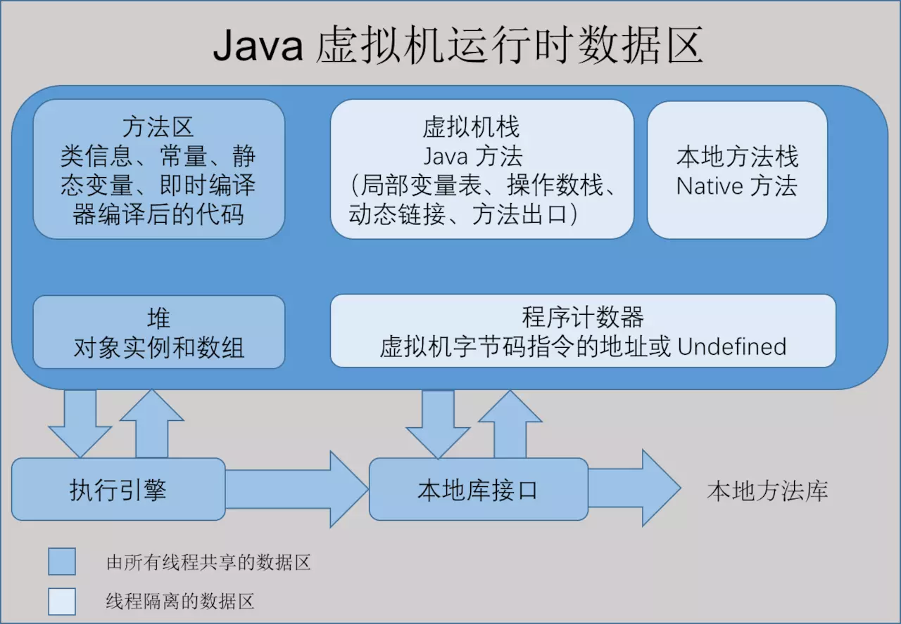
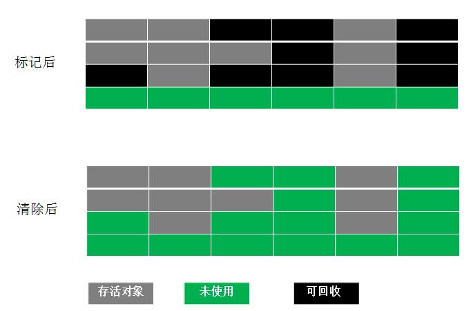

### 1.jvm的数据模式

1.1  程序计数器
  内存空间小，线程私有。字节码解释器工作是就是通过改变这个计数器的值来选取下一条需要执行指令的字节码指令，分支、循环、跳转、异常处理、线程恢复等基础功能都需要依赖计数器完成
如果线程正在执行一个 Java 方法，这个计数器记录的是正在执行的虚拟机字节码指令的地址；如果正在执行的是 Native 方法，这个计数器的值则为 (Undefined)。此内存区域是唯一一个在 Java 虚拟机规范中没有规定任何 OutOfMemoryError 情况的区域。

1.2 java虚拟机栈

线程私有, 生命周期和线程一致,描述的是java方法执行的内存模式,  每个方法在执行的时候都会创建一个栈帧(Stack Frame)用于存储局部变量表,操作数栈,动态链接,方法出口等信息,
     
java虚拟机栈的图片

java 局部变量表的示例

1.3 java的本地方法栈

本地方法栈是为虚拟机使用native方法服务的, native方法是用非java的语言编写的.

1.4 java堆

线程共享, 主要存放的是对象实例和数组,同时内部会划分出多个线程私有的分配缓冲区

1.5 方法区

线程共享 , 存储已被虚拟机加载的类信息,常量,静态变量,即时编译器编译后的代码等数据

最后用一张图来介绍每个区域存储的内容

2.垃圾回收算法
2.1 标记-清除算法

直接标记清除就可
两个缺点:  效率不高,空间会产生大量的碎片

2.2 复制算法

把空间分成两块，每次只对其中一块进行 GC。当这块内存使用完时，就将还存活的对象复制到另一块上面。

>解决前一种方法的不足，但是会造成空间利用率低下。因为大多数新生代对象都不会熬过第一次 GC。所以没必要 1 : 1 划分空间。可以分一块较大的 Eden 空间和两块较小的 Survivor 空间，每次使用 Eden 空间和其中一块 Survivor。当回收时，将 Eden 和 Survivor 中还存活的对象一次性复制到另一块 Survivor 上，最后清理 Eden 和 Survivor 空间。大小比例一般是 8 : 1 : 1，每次浪费 10% 的 Survivor 空间。但是这里有一个问题就是如果存活的大于 10% 怎么办？这里采用一种分配担保策略：多出来的对象直接进入老年代。
>

2.3 标记-整理算法
不同于针对新生代的复制算法，针对老年代的特点，创建该算法。主要是把存活对象移到内存的一端。
结合了以上两个算法，为了避免缺陷而提出。标记阶段和Mark-Sweep算法相同，标记后不是清理对象，而是将存活对象移向内存的一端。然后清除端边界外的对象。如图：

2.3.4 分代回收

根据存活对象划分几块内存区，一般是分为新生代和老年代。然后根据各个年代的特点制定相应的回收算法。

新生代--------每次垃圾回收都有大量对象死去，只有少量存活，选用复制算法比较合理。

老年代--------老年代中对象存活率较高、没有额外的空间分配对它进行担保。所以必须使用 标记 —— 清除 或者 标记 —— 整理 算法回收。

3. 垃圾回收器

     

