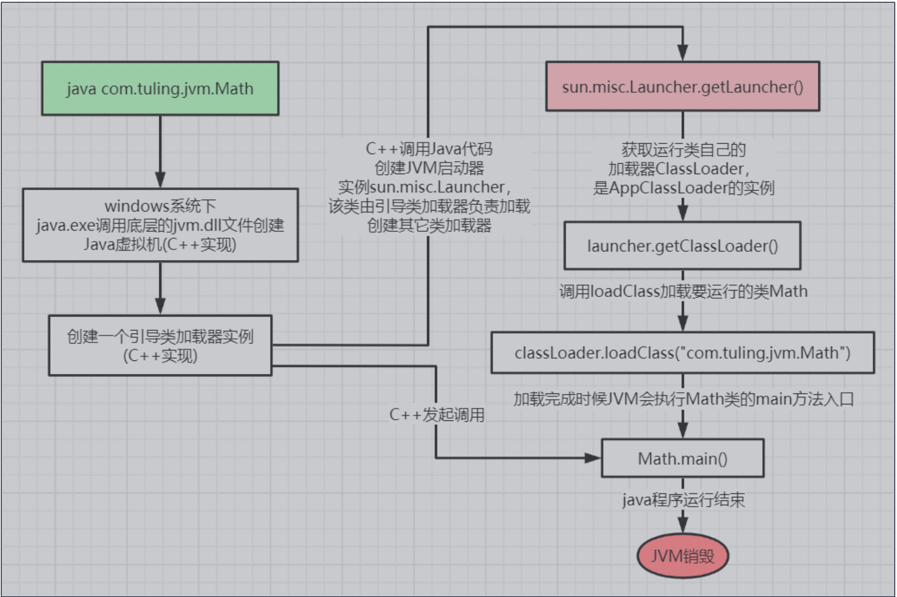
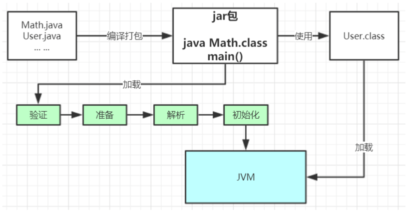
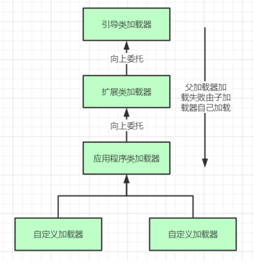

### 类加载运行全过程 
当我们用java命令运行某个类的main函数启动程序时，首先需要通过类加载器把主类加载到 JVM。

```
public class Math {
            public static final int initData = 666;
            public static User user = new User();
            public int compute() { //一个方法对应一块栈帧内存区域
                 int a = 1;
                  int b = 2;
                   int c = (a + b) * 10;
                   return c;
            }
            public static void main(String[] args) {
                Math math = new Math();
                math.compute();
            }
}

```
通过Java命令执行代码的大体流程如下：



其中loadClass的类加载过程有如下几步： 加载 >> 验证 >> 准备 >> 解析 >> 初始化 >> 使用 >> 卸载 
+ 加载：在硬盘上查找并通过IO读入字节码文件，使用到类时才会加载，例如调用类的 main()方法，new对象等等，在加载阶段会在内存中生成一个代表这个类的 java.lang.Class对象，作为方法区这个类的各种数据的访问入口 
+ 验证：校验字节码文件的正确性 
+ 准备：给类的静态变量分配内存，并赋予默认值 
+ 解析：将符号引用替换为直接引用，该阶段会把一些静态方法(符号引用，比如 main()方法)替换为指向数据所存内存的指针或句柄等(直接引用)，这是所谓的静态链接过 程(类加载期间完成)，动态链接是在程序运行期间完成的将符号引用替换为直接引用
+ 初始化：对类的静态变量初始化为指定的值，执行静态代码块
  + 初始化补充 等放在下面



类被加载到方法区中后主要包含 运行时常量池、类型信息、字段信息、方法信息、类加载器的 引用、对应class实例的引用等信息。 
+ 类加载器的引用：这个类到类加载器实例的引用 
+ 对应class实例的引用：类加载器在加载类信息放到方法区中后，会创建一个对应的Class 类型的 对象实例放到堆(Heap)中, 作为开发人员访问方法区中类定义的入口和切入点。

注意，主类在运行过程中如果使用到其它类，会逐步加载这些类。 jar包或war包里的类不是一次性全部加载的，是使用到时才加载。


### 类加载器和双亲委派机制 
上面的类加载过程主要是通过类加载器来实现的，Java里有如下几种类加载器 
+ 引导类加载器：负责加载支撑JVM运行的位于JRE的lib目录下的核心类库，比如 rt.jar、charsets.jar等 
+ 扩展类加载器：负责加载支撑JVM运行的位于JRE的lib目录下的ext扩展目录中的JAR 
+ 类包应用程序类加载器：负责加载ClassPath路径下的类包，主要就是加载你自己写的那些类
+ 自定义加载器：负责加载用户自定义路径下的类包

### 类加载器初始化过程：
会创建JVM启动器实例sun.misc.Launcher。 sun.misc.Launcher初始化使用了单例模式设计，
保证一个JVM虚拟机内只有一个 sun.misc.Launcher实例。 在Launcher构造方法内部，其创建了两个类加载器，分别是 sun.misc.Launcher.ExtClassLoader(扩展类加载器)和sun.misc.Launcher.AppClassLoader(应用类加载器)。 
JVM默认使用Launcher的getClassLoader()方法返回的类加载器AppClassLoader的实例加载我们的应用程序

### 双亲委派机制



这里类加载其实就有一个双亲委派机制，加载某个类时会先委托父加载器寻找目标类，找不到再 委托上层父加载器加载，如果所有父加载器在自己的加载类路径下都找不到目标类，则在自己的 类加载路径中查找并载入目标类。

为什么要设计双亲委派机制？ 
+ 沙箱安全机制：自己写的java.lang.String.class类不会被加载，这样便可以防止核心 API库被随意篡改 
+ 避免类的重复加载：当父亲已经加载了该类时，就没有必要子ClassLoader再加载一 次，保证被加载类的唯一性

### 类的加载过程中准备和初始化 (单独介绍)

#### 准备阶段
当完成字节码文件的校验之后，JVM 便会开始为类变量分配内存并初始化。这里需要注意两个关键点，即内存分配的对象以及初始化的类型。

内存分配的对象。Java 中的变量有「类变量」和「类成员变量」两种类型，「类变量」指的是被 static 修饰的变量，而其他所有类型的变量都属于「类成员变量」。在准备阶段，JVM 只会为「类变量」分配内存，而不会为「类成员变量」分配内存。「类成员变量」的内存分配需要等到初始化阶段才开始。
例如下面的代码在准备阶段，只会为 factor 属性分配内存，而不会为 website 属性分配内存。

```aidl
public static int factor = 3;
public String website = "www.cnblogs.com/chanshuyi";

```
初始化的类型。在准备阶段，JVM 会为类变量分配内存，并为其初始化。但是这里的初始化指的是为变量赋予 Java 语言中该数据类型的零值，而不是用户代码里初始化的值。
例如下面的代码在准备阶段之后，sector 的值将是 0，而不是 3。

```aidl
public static int sector = 3;
```

但如果一个变量是常量（被 static final 修饰）的话，那么在准备阶段，属性便会被赋予用户希望的值。例如下面的代码在准备阶段之后，number 的值将是 3，而不是 0。
```aidl
public static final int number = 3;
```

#### 初始化（重点）

到了初始化阶段，用户定义的 Java 程序代码才真正开始执行。在这个阶段，JVM 会根据语句执行顺序对类对象进行初始化，一般来说当 JVM 遇到下面 5 种情况的时候会触发初始化：

遇到 new、getstatic、putstatic、invokestatic 这四条字节码指令时，如果类没有进行过初始化，则需要先触发其初始化。生成这4条指令的最常见的Java代码场景是：
- 使用new关键字实例化对象的时候、读取或设置一个类的静态字段（被final修饰、已在编译器把结果放入常量池的静态字段除外）的时候，以及调用一个类的静态方法的时候。
- 使用 java.lang.reflect 包的方法对类进行反射调用的时候，如果类没有进行过初始化，则需要先触发其初始化。
- 当初始化一个类的时候，如果发现其父类还没有进行过初始化，则需要先触发其父类的初始化。
- 当虚拟机启动时，用户需要指定一个要执行的主类（包含main()方法的那个类），虚拟机会先初始化这个主类。
- 当使用 JDK1.7 动态语言支持时，如果一个 java.lang.invoke.MethodHandle实例最后的解析结果 REF_getstatic,REF_putstatic,REF_invokeStatic 的方法句柄，并且这个方法句柄所对应的类没有进行初始化，则需要先出触发其初始化。

看到上面几个条件你可能会晕了，但是不要紧，不需要背，知道一下就好，后面用到的时候回到找一下就可以了。


#### 拿题来巩固一下

```aidl
public class Book {
    public static void main(String[] args)
    {
        System.out.println("Hello ShuYi.");
    }

    Book()
    {
        System.out.println("书的构造方法");
        System.out.println("price=" + price +",amount=" + amount);
    }

    {
        System.out.println("书的普通代码块");
    }

    int price = 110;

    static
    {
        System.out.println("书的静态代码块");
    }

    static int amount = 112;
}

```

答案是 
> 书的静态代码块
Hello ShuYi.


在我们代码中，我们只知道有一个构造方法，但实际上Java代码编译成字节码之后，是没有构造方法的概念的，只有类初始化方法 和 对象初始化方法 。

那么这两个方法是怎么来的呢？

类初始化方法。编译器会按照其出现顺序，收集类变量的赋值语句、静态代码块，最终组成类初始化方法。类初始化方法一般在类初始化的时候执行。

```aidl
上面的这个例子，其类初始化方法就是下面这段代码了：

    static
    {
        System.out.println("书的静态代码块");
    }
    static int amount = 112;
```

对象初始化方法。编译器会按照其出现顺序，收集成员变量的赋值语句、普通代码块，最后收集构造函数的代码，最终组成对象初始化方法。对象初始化方法一般在实例化类对象的时候执行。


```aidl
    {
        System.out.println("书的普通代码块");
    }
    int price = 110;
    System.out.println("书的构造方法");
    System.out.println("price=" + price +",amount=" + amount);

```

上面这个例子，其对象初始化方法就是下面这段代码了：
```aidl
    {
        System.out.println("书的普通代码块");
    }
    int price = 110;
    System.out.println("书的构造方法");
    System.out.println("price=" + price +",amount=" + amount);
```
类初始化方法 和 对象初始化方法 之后，我们再来看这个例子，我们就不难得出上面的答案了。


