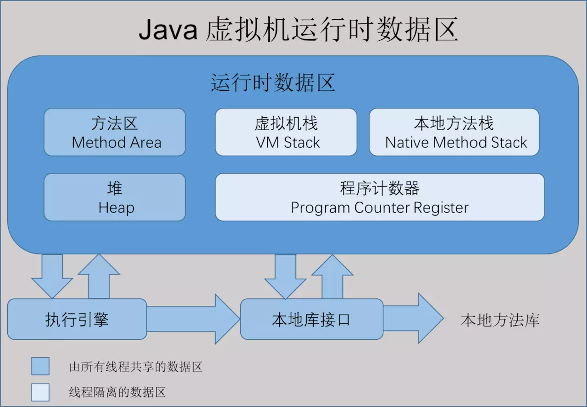
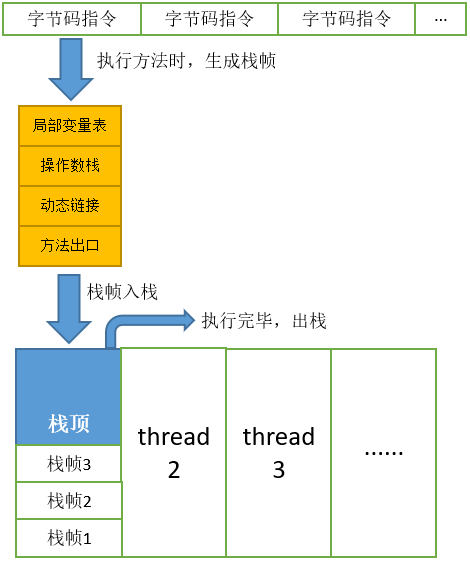
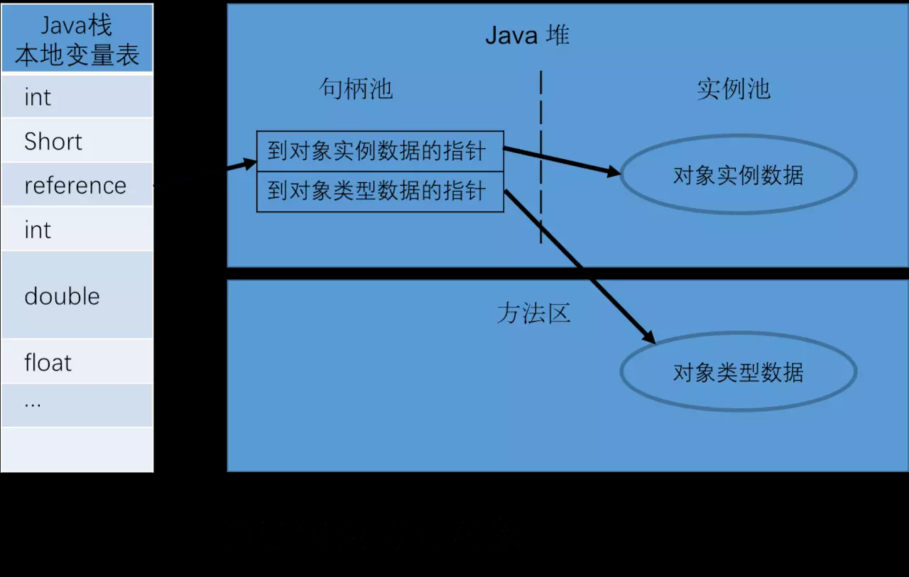
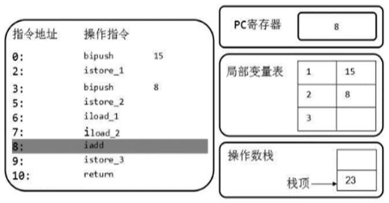

## 运行时数据区

### 1.jvm的数据模式



最后用一张图来介绍每个区域存储的内容


### 程序计数器

JVM中的程序计数寄存器（Program Counter Register）中，Register的命名源于CPU的寄存器，寄存器存储指令相关的现场信息。CPU只有把数据装载到寄存器才能够运行。这里，并非是广义上所指的物理寄存器，或许将其翻译为PC计数器（或指令计数器）会更加贴切（也称为程序钩子），并且也不容易引起一些不必要的误会。JVM中的PC寄存器是对物理PC寄存器的一种抽象模拟。

#### 作用
PC寄存器用来存储指向下一条指令的地址，也即将要执行的指令代码。由执行引擎读取下一条指令。

#### 代码演示

我们首先写一个简单的代码 
```java
public class PCRegisterTest {
    public static void main(String[] args) {
        int i = 10;
        int j = 20;
        int k = i + j;
    }
}
```

然后将代码进行编译成字节码文件，我们再次查看 ，发现在字节码的左边有一个行号标识，它其实就是指令地址，用于指向当前执行到哪里。

```java
0: bipush        10
2: istore_1
3: bipush        20
5: istore_2
6: iload_1
7: iload_2
8: iadd
9: istore_3
10: return

```
通过PC寄存器，我们就可以知道当前程序执行到哪一步了


使用PC寄存器存储字节码指令地址有什么用呢？
因为CPU需要不停的切换各个线程，这时候切换回来以后，就得知道接着从哪开始继续执行。

JVM的字节码解释器就需要通过改变PC寄存器的值来明确下一条应该执行什么样的字节码指令。

#### 虚拟机栈

1.2 java虚拟机栈

线程私有, 生命周期和线程一致,描述的是java方法执行的内存模式,  每个方法在执行的时候都会创建一个栈帧(Stack Frame)用于存储局部变量表,操作数栈,动态链接,方法出口等信息,

java虚拟机栈的图片


java 局部变量表的示例


局部变量表：Local Variables，被称之为局部变量数组或本地变量表

定义为一个数字数组，主要用于存储方法参数和定义在方法体内的局部变量这些数据类型包括各类基本数据类型、对象引用（reference），以及returnAddress类型。

由于局部变量表是建立在线程的栈上，是线程的私有数据，因此不存在数据安全问题

局部变量表所需的容量大小是在编译期确定下来的，并保存在方法的Code属性的maximum local variables数据项中。在方法运行期间是不会改变局部变量表的大小的。

方法嵌套调用的次数由栈的大小决定。一般来说，栈越大，方法嵌套调用次数越多。对一个函数而言，它的参数和局部变量越多，使得局部变量表膨胀，它的栈帧就越大，以满足方法调用所需传递的信息增大的需求。进而函数调用就会占用更多的栈空间，导致其嵌套调用次数就会减少。

局部变量表中的变量只在当前方法调用中有效。在方法执行时，虚拟机通过使用局部变量表完成参数值到参数变量列表的传递过程。当方法调用结束后，随着方法栈帧的销毁，局部变量表也会随之销毁。

>关于Slot的理解

参数值的存放总是在局部变量数组的index0开始，到数组长度-1的索引结束。

局部变量表，最基本的存储单元是Slot（变量槽）局部变量表中存放编译期可知的各种基本数据类型（8种），引用类型（reference），returnAddress类型的变量。

在局部变量表里，32位以内的类型只占用一个slot（包括returnAddress类型），64位的类型（1ong和double）占用两个slot。

byte、short、char 在存储前被转换为int，boolean也被转换为int，0表示false，非0表示true。 1ong和double则占据两个slot。

JVM会为局部变量表中的每一个Slot都分配一个访问索引，通过这个索引即可成功访问到局部变量表中指定的局部变量值

当一个实例方法被调用的时候，它的方法参数和方法体内部定义的局部变量将会按照顺序被复制到局部变量表中的每一个slot上

如果需要访问局部变量表中一个64bit的局部变量值时，只需要使用前一个索引即可。（比如：访问1ong或doub1e类型变量）

如果当前帧是由构造方法或者实例方法创建的，那么该对象引用this将会存放在index为0的s1ot处，其余的参数按照参数表顺序继续排列。


>Slot的重复利用

栈帧中的局部变量表中的槽位是可以重用的，如果一个局部变量过了其作用域，那么在其作用域之后申明的新的局部变就很有可能会复用过期局部变量的槽位，从而达到节省资源的目的。


##### 操作数栈：Operand Stack

每一个独立的栈帧除了包含局部变量表以外，还包含一个后进先出（Last - In - First -Out）的 操作数栈，也可以称之为 表达式栈（Expression Stack）

操作数栈，在方法执行过程中，根据字节码指令，往栈中写入数据或提取数据，即入栈（push）和 出栈（pop）

某些字节码指令将值压入操作数栈，其余的字节码指令将操作数取出栈。使用它们后再把结果压入栈
比如：执行复制、交换、求和等操作


操作数栈，主要用于保存计算过程的中间结果，同时作为计算过程中变量临时的存储空间。

操作数栈就是JVM执行引擎的一个工作区，当一个方法刚开始执行的时候，一个新的栈帧也会随之被创建出来，这个方法的操作数栈是空的。.

这个时候数组是有长度的，因为数组一旦创建，那么就是不可变的

每一个操作数栈都会拥有一个明确的栈深度用于存储数值，其所需的最大深度在编译期就定义好了，保存在方法的Code属性中，为maxstack的值。

栈中的任何一个元素都是可以任意的Java数据类型

32bit的类型占用一个栈单位深度
64bit的类型占用两个栈单位深度
操作数栈并非采用访问索引的方式来进行数据访问的，而是只能通过标准的入栈和出栈操作来完成一次数据访问

如果被调用的方法带有返回值的话，其返回值将会被压入当前栈帧的操作数栈中，并更新PC寄存器中下一条需要执行的字节码指令。

操作数栈中元素的数据类型必须与字节码指令的序列严格匹配，这由编译器在编译器期间进行验证，同时在类加载过程中的类检验阶段的数据流分析阶段要再次验证。|

另外，我们说Java虚拟机的解释引擎是基于栈的执行引擎，其中的栈指的就是操作数栈。

##### 代码跟踪

我们给定代码
```java
public void testAddOperation() {
    byte i = 15;
    int j = 8;
    int k = i + j;
}

```
使用javap 命令反编译class文件： javap -v 类名.class


>byte、short、char、boolean 内部都是使用int型来进行保存的

>从上面的代码我们可以知道，我们都是通过bipush对操作数 15 和 8进行入栈操作

>同时使用的是 iadd方法进行相加操作，i -> 代表的就是 int，也就是int类型的加法操作
> 
>

执行流程如下所示：

首先执行第一条语句，PC寄存器指向的是0，也就是指令地址为0，然后使用bipush让操作数15入栈。


执行完后，让PC + 1，指向下一行代码，下一行代码就是将操作数栈的元素存储到局部变量表1的位置，我们可以看到局部变量表的已经增加了一个元素


>为什么局部变量表不是从0开始的呢？

>其实局部变量表也是从0开始的，但是因为0号位置存储的是this指针，所以说就直接省略了~

然后PC+1，指向的是下一行。让操作数8也入栈，同时执行store操作，存入局部变量表


然后从局部变量表中，依次将数据放在操作数栈中


然后将操作数栈中的两个元素执行相加操作，并存储在局部变量表3的位置




最后PC寄存器的位置指向10，也就是return方法，则直接退出方法

i++和++i的区别


栈顶缓存技术
栈顶缓存技术：Top Of Stack Cashing

前面提过，基于栈式架构的虚拟机所使用的零地址指令更加紧凑，但完成一项操作的时候必然需要使用更多的入栈和出栈指令，这同时也就意味着将需要更多的指令分派（instruction dispatch）次数和内存读/写次数。

由于操作数是存储在内存中的，因此频繁地执行内存读/写操作必然会影响执行速度。为了解决这个问题，HotSpot JVM的设计者们提出了栈顶缓存（Tos，Top-of-Stack Cashing）技术，将栈顶元素全部缓存在物理CPU的寄存器中，以此降低对内存的读/写次数，提升执行引擎的执行效率。

寄存器：指令更少，执行速度快


#### java的本地方法栈

本地方法栈是为虚拟机使用native方法服务的, native方法是用非java的语言编写的.

#### java堆

线程共享, 主要存放的是对象实例和数组,同时内部会划分出多个线程私有的分配缓冲区

#### 方法区

线程共享 , 存储已被虚拟机加载的类信息,常量,静态变量,即时编译器编译后的代码等数据


