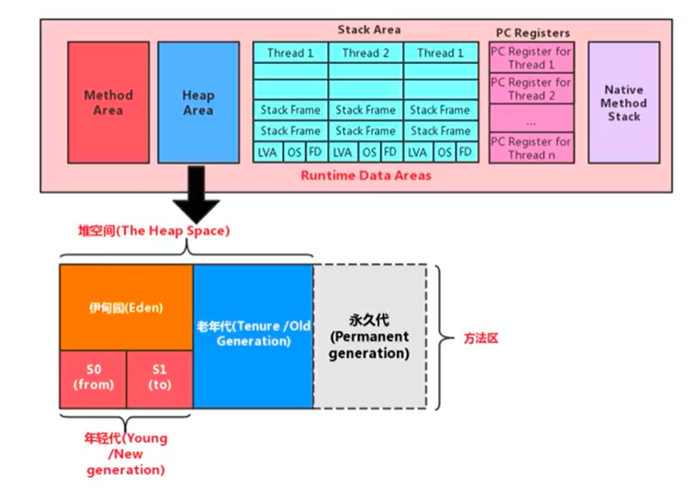
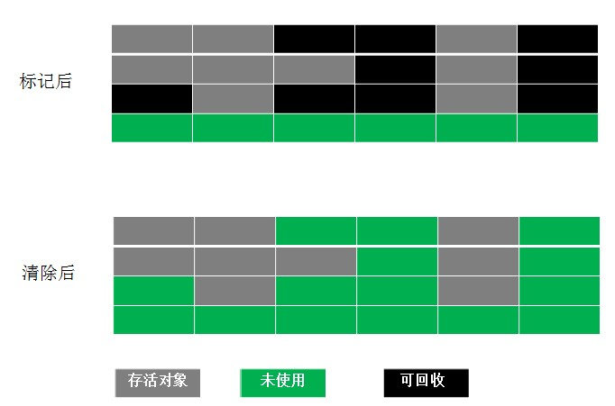
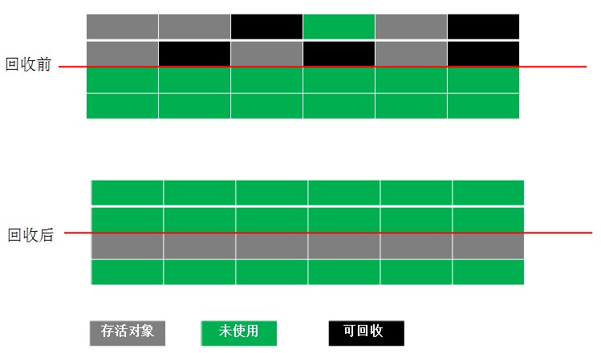
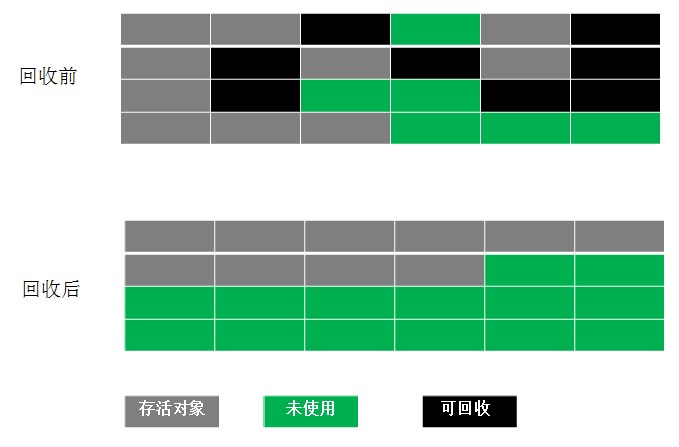
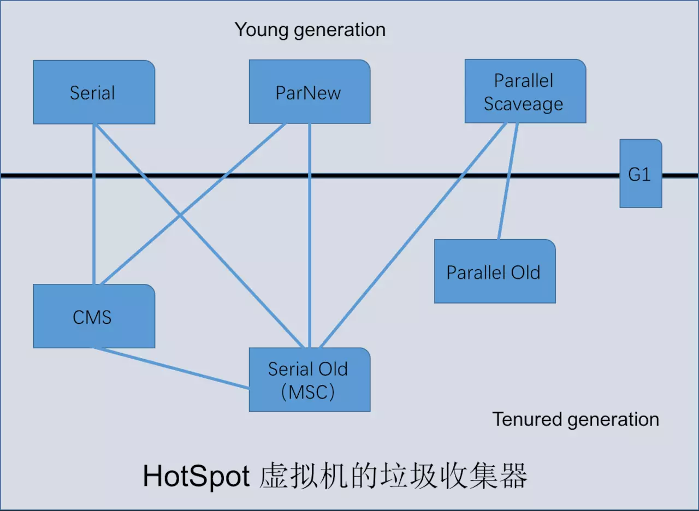

## 堆的核心概念
堆针对一个JVM进程来说是唯一的，也就是一个进程只有一个JVM，但是进程包含多个线程，他们是共享同一堆空间的。

《Java虚拟机规范》规定，堆可以处于物理上不连续的内存空间中，但在逻辑上它应该被视为连续的。

所有的线程共享Java堆，在这里还可以划分线程私有的缓冲区（Thread Local Allocation Buffer，TLAB）。

>-Xms10m：最小堆内存

>-Xmx10m：最大堆内存
>

堆内存细分
Java 7及之前堆内存逻辑上分为三部分：新生区+养老区+永久区

Young Generation Space 新生区 Young/New 又被划分为Eden区和Survivor区
Tenure generation space 养老区 Old/Tenure
Permanent Space永久区 Perm
Java 8及之后堆内存逻辑上分为三部分：新生区养老区+元空间

Young Generation Space新生区 Young/New 又被划分为Eden区和Survivor区
Tenure generation space 养老区 Old/Tenure
Meta Space 元空间 Meta
约定：新生区 -> 新生代 -> 年轻代 、 养老区 -> 老年区 -> 老年代、 永久区 -> 永久代

### 设置堆内存大小与OOM
Java堆区用于存储Java对象实例，那么堆的大小在JVM启动时就已经设定好了，大家可以通过选项"-Xmx"和"-Xms"来进行设置。

“-Xms"用于表示堆区的起始内存，等价于-xx:InitialHeapSize
“-Xmx"则用于表示堆区的最大内存，等价于-XX:MaxHeapSize
一旦堆区中的内存大小超过“-xmx"所指定的最大内存时，将会抛出outofMemoryError异常。

通常会将-Xms和-Xmx两个参数配置相同的值，其目的是为了能够在ava垃圾回收机制清理完堆区后不需要重新分隔计算堆区的大小，从而提高性能。

默认情况下

初始内存大小：物理电脑内存大小/64

最大内存大小：物理电脑内存大小/4

## 2.垃圾回收算法
2.1 标记-清除算法

直接标记清除就可
两个缺点:  效率不高,空间会产生大量的碎片

2.2 复制算法

把空间分成两块，每次只对其中一块进行 GC。当这块内存使用完时，就将还存活的对象复制到另一块上面。

>解决前一种方法的不足，但是会造成空间利用率低下。因为大多数新生代对象都不会熬过第一次 GC。所以没必要 1 : 1 划分空间。可以分一块较大的 Eden 空间和两块较小的 Survivor 空间，每次使用 Eden 空间和其中一块 Survivor。当回收时，将 Eden 和 Survivor 中还存活的对象一次性复制到另一块 Survivor 上，最后清理 Eden 和 Survivor 空间。大小比例一般是 8 : 1 : 1，每次浪费 10% 的 Survivor 空间。但是这里有一个问题就是如果存活的大于 10% 怎么办？这里采用一种分配担保策略：多出来的对象直接进入老年代。
>

2.3 标记-整理算法
不同于针对新生代的复制算法，针对老年代的特点，创建该算法。主要是把存活对象移到内存的一端。
结合了以上两个算法，为了避免缺陷而提出。标记阶段和Mark-Sweep算法相同，标记后不是清理对象，而是将存活对象移向内存的一端。然后清除端边界外的对象。如图：

2.3.4 分代回收

根据存活对象划分几块内存区，一般是分为新生代和老年代。然后根据各个年代的特点制定相应的回收算法。

新生代--------每次垃圾回收都有大量对象死去，只有少量存活，选用复制算法比较合理。

老年代--------老年代中对象存活率较高、没有额外的空间分配对它进行担保。所以必须使用 标记 —— 清除 或者 标记 —— 整理 算法回收。

3. 垃圾回收器

     

