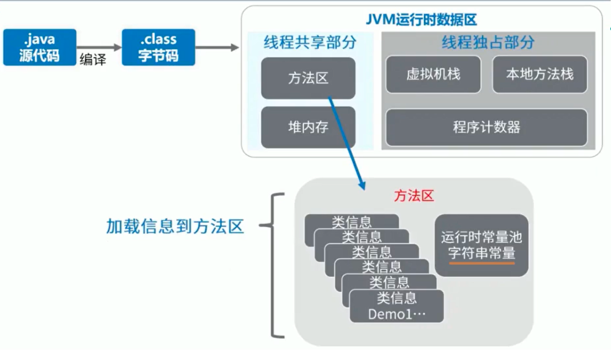
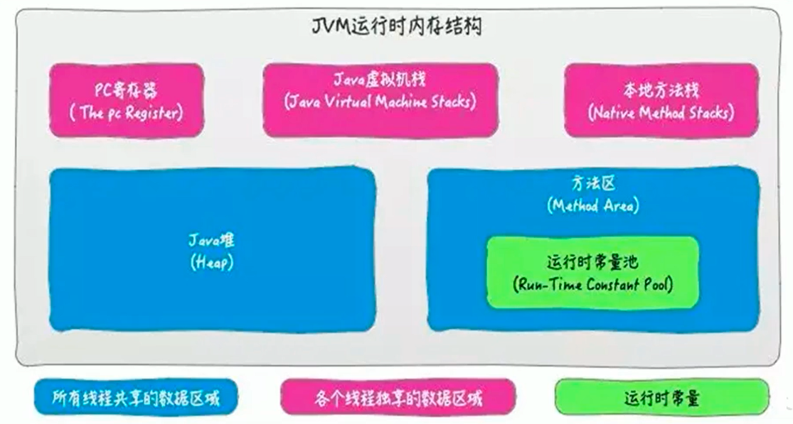
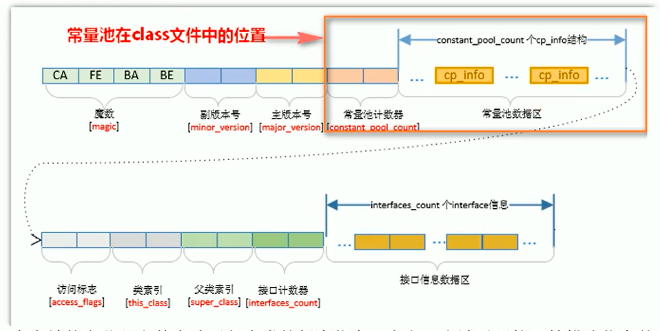

## 方法区的理解

《Java虚拟机规范》中明确说明：“尽管所有的方法区在逻辑上是属于堆的一部分，但一些简单的实现可能不会选择去进行垃圾收集或者进行压缩。”但对于HotSpotJVM而言，方法区还有一个别名叫做Non-Heap（非堆），目的就是要和堆分开。

所以，方法区看作是一块独立于Java堆的内存空间。

方法区主要存放的是 Class，而堆中主要存放的是 实例化的对象

方法区（Method Area）与Java堆一样，是各个线程共享的内存区域。
方法区在JVM启动的时候被创建，并且它的实际的物理内存空间中和Java堆区一样都可以是不连续的。
方法区的大小，跟堆空间一样，可以选择固定大小或者可扩展。
方法区的大小决定了系统可以保存多少个类，如果系统定义了太多的类，导致方法区溢出，虚拟机同样会抛出内存溢出错误：ava.lang.OutofMemoryError：PermGen space 或者java.lang.OutOfMemoryError:Metaspace
加载大量的第三方的jar包
Tomcat部署的工程过多（30~50个）
大量动态的生成反射类
关闭JVM就会释放这个区域的内存。


方法区的内部结构



《深入理解Java虚拟机》书中对方法区（Method Area）存储内容描述如下：它用于存储已被虚拟机加载的类型信息、常量、静态变量、即时编译器编译后的代码缓存等。


类型信息
对每个加载的类型（类class、接口interface、枚举enum、注解annotation），JVm必须在方法区中存储以下类型信息：

- 这个类型的完整有效名称（全名=包名.类名）
- 这个类型直接父类的完整有效名（对于interface或是java.lang.object，都没有父类）
- 这个类型的修饰符（public，abstract，final的某个子集）
- 这个类型直接接口的一个有序列表

域信息
JVM必须在方法区中保存类型的所有域的相关信息以及域的声明顺序。

域的相关信息包括：域名称、域类型、域修饰符（public，private，protected，static，final，volatile，transient的某个子集）

方法（Method）信息
JVM必须保存所有方法的以下信息，同域信息一样包括声明顺序：

方法名称
- 方法的返回类型（或void）
- 方法参数的数量和类型（按顺序）
- 方法的修饰符（public，private，protected，static，final，synchronized，native，abstract的一个子集）
- 方法的字节码（bytecodes）、操作数栈、局部变量表及大小（abstract和native方法除外）
- 异常表（abstract和native方法除外）
- 每个异常处理的开始位置、结束位置、代码处理在程序计数器中的偏移地址、被捕获的异常类的常量池索引

non-final的类变量
静态变量和类关联在一起，随着类的加载而加载，他们成为类数据在逻辑上的一部分

类变量被类的所有实例共享，即使没有类实例时，你也可以访问它

## 运行时常量池 VS 常量池

运行时常量池，就是运行时常量池



- 方法区，内部包含了运行时常量池
- 字节码文件，内部包含了常量池
- 要弄清楚方法区，需要理解清楚C1assFile，因为加载类的信息都在方法区。
- 要弄清楚方法区的运行时常量池，需要理解清楚classFile中的常量池。

常量池



一个有效的字节码文件中除了包含类的版本信息、字段、方法以及接口等描述符信息外，还包含一项信息就是常量池表（Constant Pool Table），包括各种字面量和对类型、域和方法的符号引用

为什么需要常量池
一个java源文件中的类、接口，编译后产生一个字节码文件。而Java中的字节码需要数据支持，通常这种数据会很大以至于不能直接存到字节码里，换另一种方式，可以存到常量池，这个字节码包含了指向常量池的引用。r在动态链接的时候会用到运行时常量池，之前有介绍。

比如：如下的代码：

```java
public class SimpleClass {
public void sayHello() {
System.out.println("hello");
}
}
```

虽然上述代码只有194字节，但是里面却使用了String、System、PrintStream及Object等结构。这里的代码量其实很少了，如果代码多的话，引用的结构将会更多，这里就需要用到常量池了。


常量池中有什么
数量值
字符串值
类引用
字段引用
方法引用
例如下面这段代码

public class MethodAreaTest2 {
public static void main(String args[]) {
Object obj = new Object();
}
}
Copy to clipboardErrorCopied
将会被翻译成如下字节码

```java
new #2  
dup
invokespecial

```

小结
常量池、可以看做是一张表，虚拟机指令根据这张常量表找到要执行的类名、方法名、参数类型、字面量等类型

### 运行时常量池
运行时常量池（Runtime Constant Pool）是方法区的一部分。

常量池表（Constant Pool Table）是Class文件的一部分，用于存放编译期生成的各种字面量与符号引用，这部分内容将在类加载后存放到方法区的运行时常量池中。

运行时常量池，在加载类和接口到虚拟机后，就会创建对应的运行时常量池。

JVM为每个已加载的类型（类或接口）都维护一个常量池。池中的数据项像数组项一样，是通过索引访问的。

运行时常量池中包含多种不同的常量，包括编译期就已经明确的数值字面量，也包括到运行期解析后才能够获得的方法或者字段引用。此时不再是常量池中的符号地址了，这里换为真实地址。

运行时常量池，相对于Class文件常量池的另一重要特征是：具备动态性。

运行时常量池类似于传统编程语言中的符号表（symboltable），但是它所包含的数据却比符号表要更加丰富一些。

当创建类或接口的运行时常量池时，如果构造运行时常量池所需的内存空间超过了方法区所能提供的最大值，则JVM会抛outofMemoryError异常。


