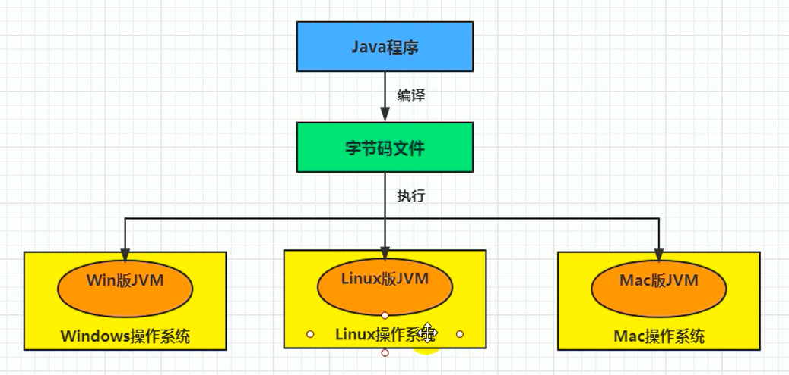
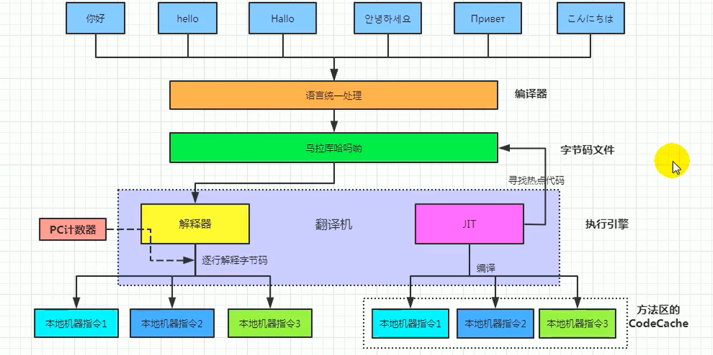
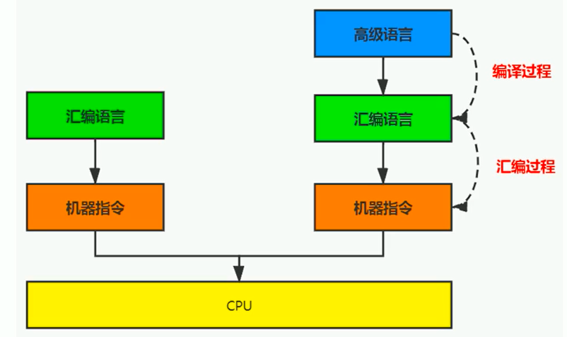
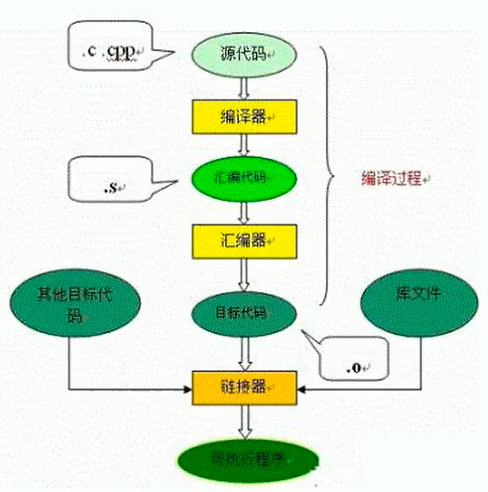

## 执行引擎概述
执行引擎属于JVM的下层，里面包括 解释器、及时编译器、垃圾回收器

执行引擎是Java虚拟机核心的组成部分之一。“虚拟机”是一个相对于“物理机”的概念，这两种机器都有代码执行能力，其区别是物理机的执行引擎是直接建立在处理器、缓存、指令集和操作系统层面上的，而虚拟机的执行引擎则是由软件自行实现的，因此可以不受物理条件制约地定制指令集与执行引擎的结构体系，能够执行那些不被硬件直接支持的指令集格式。

JVM的主要任务是负责装载字节码到其内部，但字节码并不能够直接运行在操作系统之上，因为字节码指令并非等价于本地机器指令，它内部包含的仅仅只是一些能够被JVM所识别的字节码指令、符号表，以及其他辅助信息。

我们用一个总的图，来说说 解释器和编译器

什么是解释器（Interpreter）
当Java虚拟机启动时会根据预定义的规范对字节码采用逐行解释的方式执行，将每条字节码文件中的内容“翻译”为对应平台的本地机器指令执行。

什么是IT编译器
JIT（Just In Time Compiler）编译器：就是虚拟机将源代码直接编译成和本地机器平台相关的机器语言。

为什么Java是半编译半解释型语言
JDK1.e时代，将Java语言定位为“解释执行”还是比较准确的。再后来，Java也发展出可以直接生成本地代码的编译器。现在JVM在执行Java代码的时候，通常都会将解释执行与编译执行二者结合起来进行。

翻译成本地代码后，就可以做一个缓存操作，存储在方法区中

机器码、指令、汇编语言
机器码
各种用二进制编码方式表示的指令，叫做机器指令码。开始，人们就用它采编写程序，这就是机器语言。

机器语言虽然能够被计算机理解和接受，但和人们的语言差别太大，不易被人们理解和记忆，并且用它编程容易出差错。

用它编写的程序一经输入计算机，CPU直接读取运行，因此和其他语言编的程序相比，执行速度最快。

机器指令与CPU紧密相关，所以不同种类的CPU所对应的机器指令也就不同。

指令
由于机器码是有0和1组成的二进制序列，可读性实在太差，于是人们发明了指令。

指令就是把机器码中特定的0和1序列，简化成对应的指令（一般为英文简写，如mov，inc等），可读性稍好

由于不同的硬件平台，执行同一个操作，对应的机器码可能不同，所以不同的硬件平台的同一种指令（比如mov），对应的机器码也可能不同。

指令集
不同的硬件平台，各自支持的指令，是有差别的。因此每个平台所支持的指令，称之为对应平台的指令集。 如常见的

x86指令集，对应的是x86架构的平台
ARM指令集，对应的是ARM架构的平台
汇编语言
由于指令的可读性还是太差，于是人们又发明了汇编语言。

在汇编语言中，用助记符（Mnemonics）代替机器指令的操作码，用地址符号（Symbo1）或标号（Labe1）代替指令或操作数的地址。在不同的硬件平台，汇编语言对应着不同的机器语言指令集，通过汇编过程转换成机器指令。

由于计算机只认识指令码，所以用汇编语言编写的程序还必须翻译成机器指令码，计算机才能识别和执行。

高级语言
为了使计算机用户编程序更容易些，后来就出现了各种高级计算机语言。

高级语言比机器语言、汇编语言更接近人的语言当计算机执行高级语言编写的程序时，仍然需要把程序解释和编译成机器的指令码。完成这个过程的程序就叫做解释程序或编译程序。

高级语言也不是直接翻译成 机器指令，而是翻译成汇编语言吗，如下面说的C和C++

C、C++源程序执行过程
编译过程又可以分成两个阶段：编译和汇编。

编译过程：是读取源程序（字符流），对之进行词法和语法的分析，将高级语言指令转换为功能等效的汇编代码

汇编过程：实际上指把汇编语言代码翻译成目标机器指令的过程。

字节码
字节码是一种中间状态（中间码）的二进制代码（文件），它比机器码更抽象，需要直译器转译后才能成为机器码

字节码主要为了实现特定软件运行和软件环境、与硬件环境无关。

字节码的实现方式是通过编译器和虚拟机器。编译器将源码编译成字节码，特定平台上的虚拟机器将字节码转译为可以直接执行的指令。

字节码典型的应用为：Java bytecode

解释器
JVM设计者们的初衷仅仅只是单纯地为了满足Java程序实现跨平台特性，因此避免采用静态编译的方式直接生成本地机器指令，从而诞生了实现解释器在运行时采用逐行解释字节码执行程序的想法。

现状
由于解释器在设计和实现上非常简单，因此除了Java语言之外，还有许多高级语言同样也是基于解释器执行的，比如Python、Per1、Ruby等。但是在今天，基于解释器执行已经沦落为低效的代名词，并且时常被一些C/C++程序员所调侃。

为了解决这个问题，JVM平台支持一种叫作即时编译的技术。即时编译的目的是避免函数被解释执行，而是将整个函数体编译成为机器码，每次函数执行时，只执行编译后的机器码即可，这种方式可以使执行效率大幅度提升。

不过无论如何，基于解释器的执行模式仍然为中间语言的发展做出了不可磨灭的贡献。

JIT编译器
Java代码的执行分类
第一种是将源代码编译成字节码文件，然后在运行时通过解释器将字节码文件转为机器码执行

第二种是编译执行（直接编译成机器码）。现代虚拟机为了提高执行效率，会使用即时编译技术（JIT，Just In Time）将方法编译成机器码后再执行

HotSpot VM是目前市面上高性能虚拟机的代表作之一。它采用解释器与即时编译器并存的架构。在Java虚拟机运行时，解释器和即时编译器能够相互协作，各自取长补短，尽力去选择最合适的方式来权衡编译本地代码的时间和直接解释执行代码的时间。

在今天，Java程序的运行性能早已脱胎换骨，已经达到了可以和C/C++ 程序一较高下的地步。

问题来了
有些开发人员会感觉到诧异，既然HotSpot VM中已经内置JIT编译器了，那么为什么还需要再使用解释器来“拖累”程序的执行性能呢？比如JRockit VM内部就不包含解释器，字节码全部都依靠即时编译器编译后执行。

JRockit虚拟机是砍掉了解释器，也就是只采及时编译器。那是因为呢JRockit只部署在服务器上，一般已经有时间让他进行指令编译的过程了，对于响应来说要求不高，等及时编译器的编译完成后，就会提供更好的性能
首先明确： 当程序启动后，解释器可以马上发挥作用，省去编译的时间，立即执行。 编译器要想发挥作用，把代码编译成本地代码，需要一定的执行时间。但编译为本地代码后，执行效率高。

所以： 尽管JRockit VM中程序的执行性能会非常高效，但程序在启动时必然需要花费更长的时间来进行编译。对于服务端应用来说，启动时间并非是关注重点，但对于那些看中启动时间的应用场景而言，或许就需要采用解释器与即时编译器并存的架构来换取一个平衡点。

在此模式下，当Java虚拟器启动时，解释器可以首先发挥作用，而不必等待即时编译器全部编译完成后再执行，这样可以省去许多不必要的编译时间。随着时间的推移，编译器发挥作用，把越来越多的代码编译成本地代码，获得更高的执行效率。

同时，解释执行在编译器进行激进优化不成立的时候，作为编译器的“逃生门”。

HotSpot JVM执行方式
当虚拟机启动的时候，解释器可以首先发挥作用，而不必等待即时编译器全部编译完成再执行，这样可以省去许多不必要的编译时间。并且随着程序运行时间的推移，即时编译器逐渐发挥作用，根据热点探测功能，将有价值的字节码编译为本地机器指令，以换取更高的程序执行效率。

热点探测技术
一个被多次调用的方法，或者是一个方法体内部循环次数较多的循环体都可以被称之为“热点代码”，因此都可以通过JIT编译器编译为本地机器指令。由于这种编译方式发生在方法的执行过程中，因此被称之为栈上替换，或简称为OSR（On Stack Replacement）编译。

一个方法究竟要被调用多少次，或者一个循环体究竟需要执行多少次循环才可以达到这个标准？必然需要一个明确的阈值，JIT编译器才会将这些“热点代码”编译为本地机器指令执行。这里主要依靠热点探测功能。

目前HotSpot VM所采用的热点探测方式是基于计数器的热点探测。

采用基于计数器的热点探测，HotSpot V将会为每一个方法都建立2个不同类型的计数器，分别为方法调用计数器（Invocation Counter）和回边计数器（Back Edge Counter）。

- 方法调用计数器用于统计方法的调用次数
- 回边计数器则用于统计循环体执行的循环次数

