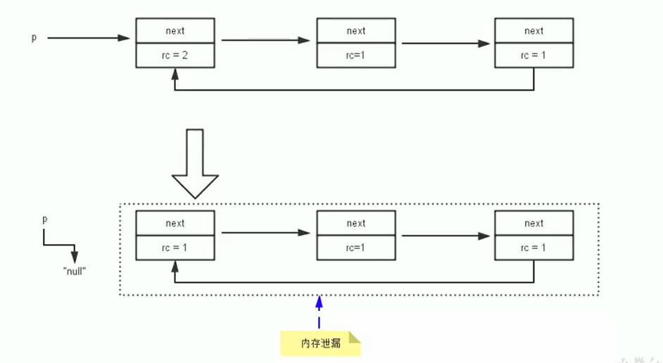
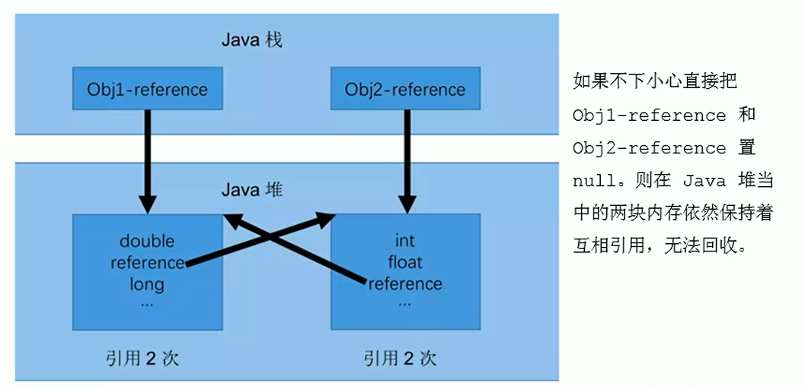
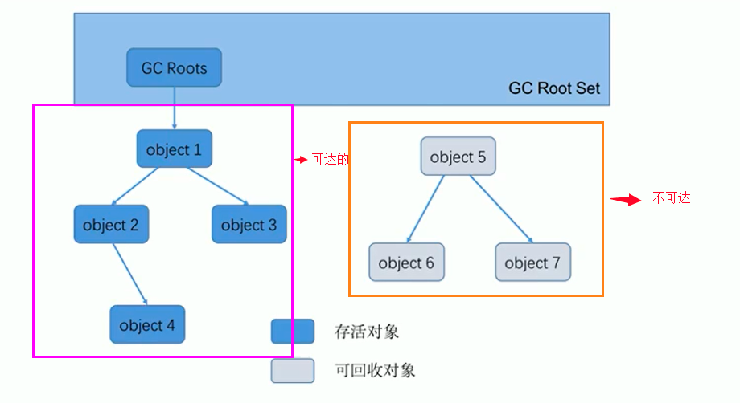
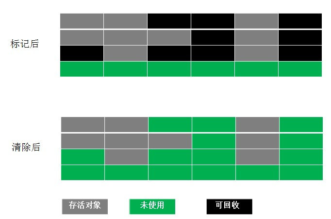
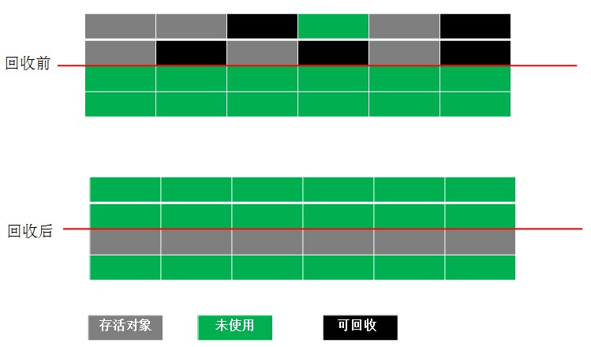
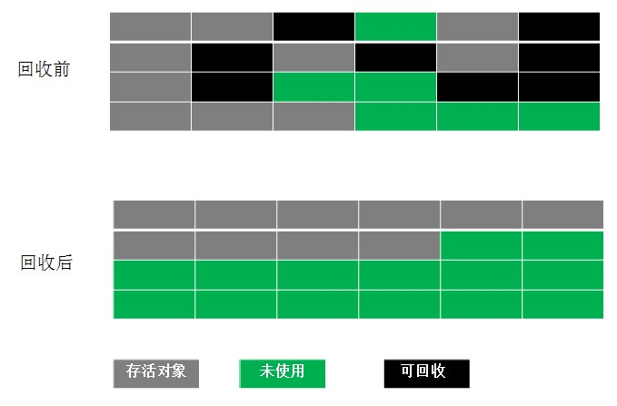

## 标记阶段：引用计数算法
在堆里存放着几乎所有的Java对象实例，在GC执行垃圾回收之前，首先需要区分出内存中哪些是存活对象，哪些是已经死亡的对象。只有被标记为己经死亡的对象，GC才会在执行垃圾回收时，释放掉其所占用的内存空间，因此这个过程我们可以称为垃圾标记阶段。

那么在JVM中究竟是如何标记一个死亡对象呢？简单来说，当一个对象已经不再被任何的存活对象继续引用时，就可以宣判为已经死亡。

判断对象存活一般有两种方式：**引用计数算法和可达性分析算法。**

引用计数算法（Reference Counting）比较简单，对每个对象保存一个整型的引用计数器属性。用于记录对象被引用的情况。

对于一个对象A，只要有任何一个对象引用了A，则A的引用计数器就加1；当引用失效时，引用计数器就减1。只要对象A的引用计数器的值为0，即表示对象A不可能再被使用，可进行回收。

优点：实现简单，垃圾对象便于辨识；判定效率高，回收没有延迟性。

缺点：它需要单独的字段存储计数器，这样的做法增加了存储空间的开销。

>每次赋值都需要更新计数器，伴随着加法和减法操作，这增加了时间开销。 引用计数器有一个严重的问题，即无法处理循环引用的情况。这是一条致命缺陷，导致在Java的垃圾回收器中没有使用这类算法。

### 循环引用
当p的指针断开的时候，内部的引用形成一个循环，这就是循环引用，从而造成内存泄漏

如果使用引用计数算法，那么这两个对象将会无法回收。而现在两个对象被回收了，说明Java使用的不是引用计数算法来进行标记的。

### 小结
引用计数算法，是很多语言的资源回收选择，例如因人工智能而更加火热的Python，它更是同时支持引用计数和垃圾收集机制。

具体哪种最优是要看场景的，业界有大规模实践中仅保留引用计数机制，以提高吞吐量的尝试。

Java并没有选择引用计数，是因为其存在一个基本的难题，也就是很难处理循环引用关系。Python如何解决循环引用？

>手动解除：很好理解，就是在合适的时机，解除引用关系。 使用弱引用weakref，weakref是Python提供的标准库，旨在解决循环引用。

## 标记阶段：可达性分析算法
### 概念
可达性分析算法：也可以称为 根搜索算法、追踪性垃圾收集

相对于引用计数算法而言，可达性分析算法不仅同样具备实现简单和执行高效等特点，更重要的是该算法可以有效地解决在引用计数算法中循环引用的问题，防止内存泄漏的发生。

相较于引用计数算法，这里的可达性分析就是Java、C#选择的。这种类型的垃圾收集通常也叫作追踪性垃圾收集（Tracing Garbage Collection）

### 思路
所谓"GCRoots”根集合就是一组必须活跃的引用。

基本思路：

可达性分析算法是以根对象集合（GCRoots）为起始点，按照从上至下的方式搜索被根对象集合所连接的目标对象是否可达。
使用可达性分析算法后，内存中的存活对象都会被根对象集合直接或间接连接着，搜索所走过的路径称为引用链（Reference Chain）
如果目标对象没有任何引用链相连，则是不可达的，就意味着该对象己经死亡，可以标记为垃圾对象。
在可达性分析算法中，只有能够被根对象集合直接或者间接连接的对象才是存活对象。

## GC Roots可以是哪些？
+ 虚拟机栈中引用的对象
比如：各个线程被调用的方法中使用到的参数、局部变量等。
+ 本地方法栈内JNI（通常说的本地方法）引用的对象方法区中类静态属性引用的对象
比如：Java类的引用类型静态变量
+ 方法区中常量引用的对象
比如：字符串常量池（string Table）里的引用
+ 所有被同步锁synchronized持有的对象
+ Java虚拟机内部的引用。
基本数据类型对应的Class对象，一些常驻的异常对象（如：Nu11PointerException、outofMemoryError），系统类加载器。
+ 反映java虚拟机内部情况的JMXBean、JVMTI中注册的回调、本地代码缓存等。

### 总结
总结一句话就是，除了堆空间外的一些结构，比如 虚拟机栈、本地方法栈、方法区、字符串常量池 等地方对堆空间进行引用的，都可以作为GC Roots进行可达性分析

### 注意
如果要使用可达性分析算法来判断内存是否可回收，那么分析工作必须在一个能保障一致性的快照中进行。这点不满足的话分析结果的准确性就无法保证。

这点也是导致GC进行时必须“stop The World”的一个重要原因。

即使是号称（几乎）不会发生停顿的CMS收集器中，枚举根节点时也是必须要停顿的。

## 清除阶段：标记-清除算法
当成功区分出内存中存活对象和死亡对象后，GC接下来的任务就是执行垃圾回收，释放掉无用对象所占用的内存空间，以便有足够的可用内存空间为新对象分配内存。目前在JVM中比较常见的三种垃圾收集算法是

标记一清除算法（Mark-Sweep）
复制算法（copying）
标记-压缩算法（Mark-Compact）
标记-清除算法（Mark-Sweep）是一种非常基础和常见的垃圾收集算法，该算法被J.McCarthy等人在1960年提出并并应用于Lisp语言。

2.2 复制算法
把空间分成两块，每次只对其中一块进行 GC。当这块内存使用完时，就将还存活的对象复制到另一块上面。

解决前一种方法的不足，但是会造成空间利用率低下。因为大多数新生代对象都不会熬过第一次 GC。所以没必要 1 : 1 划分空间。可以分一块较大的 Eden 空间和两块较小的 Survivor 空间，每次使用 Eden 空间和其中一块 Survivor。当回收时，将 Eden 和 Survivor 中还存活的对象一次性复制到另一块 Survivor 上，最后清理 Eden 和 Survivor 空间。大小比例一般是 8 : 1 : 1，每次浪费 10% 的 Survivor 空间。但是这里有一个问题就是如果存活的大于 10% 怎么办？这里采用一种分配担保策略：多出来的对象直接进入老年代。

2.3 标记-整理算法

不同于针对新生代的复制算法，针对老年代的特点，创建该算法。主要是把存活对象移到内存的一端。
结合了以上两个算法，为了避免缺陷而提出。标记阶段和Mark-Sweep算法相同，标记后不是清理对象，而是将存活对象移向内存的一端。然后清除端边界外的对象。如图：

2.3.4 分代回收

根据存活对象划分几块内存区，一般是分为新生代和老年代。然后根据各个年代的特点制定相应的回收算法。

新生代--------每次垃圾回收都有大量对象死去，只有少量存活，选用复制算法比较合理。

老年代--------老年代中对象存活率较高、没有额外的空间分配对它进行担保。所以必须使用 标记 —— 清除 或者 标记 —— 整理 算法回收。

