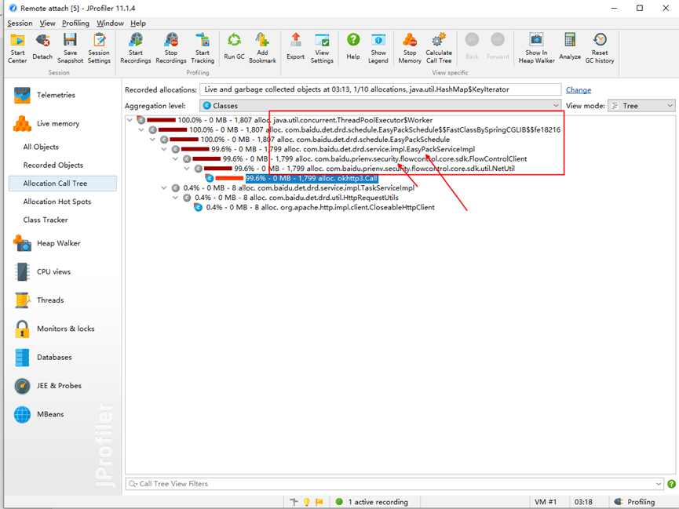
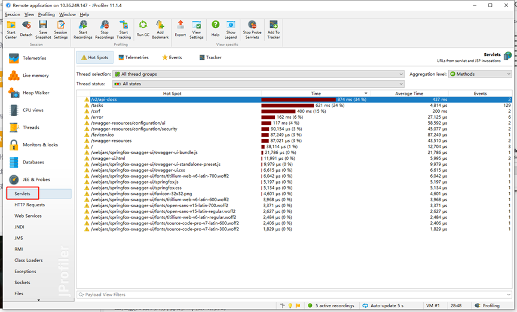

## 安装Jprofile

### 客户端安装
>win

https://www.cnblogs.com/zhangxl1016/articles/16220183.html
mac

官网下载: https://download.ej-technologies.com/jprofiler/jprofiler_macos_11_1_4.dmg

破解码

https://www.waitsun.com/serial/jprofiler

### 服务器端安装（K8S）

首先下载jprofiler服务端文件
wget https://download.ej-technologies.com/jprofiler/jprofiler_linux_11_1_4.tar.gz

解压

tar -zxf jprofiler_linux_11_1_4.tar.gz -C /data/jprofiler/jprofiler11.1.4/

增加java启动参数，端口8849可根据实际情况修改

-agentpath:/app/jprofiler/bin/linux-x64/libjprofilerti.so=port=8849,nowait

## 操作描述

前置条件
已经安装好JProfiler，并且服务已经配置好JProfiler注入，暴露出JProfiler的端口

###  添加监控服务器
新建一个session，配置远程服务的地址和端口号

#### 功能介绍

#### 内存剖析 Memory profiler
JProfiler 的内存视图部分可以提供动态的内存使用状况更新视图和显示关于内存分配状况信息的视图。所有的视图都有几个聚集层并且能够显示现有存在的对象和作为垃圾回收的对象。
* 所有对象 显示类或在状况统计和尺码信息堆上所有对象的包。你可以标记当前值并显示差异值。
* 记录对象 Record objects 显示类或所有已记录对象的包。你可以标记出当前值并且显示差异值。
* 分配访问树 Allocation call tree 显示一棵请求树或者方法、类、包或对已选择类有带注释的分配信息的J2EE组件。
* 分配热点 Allocation hot spots 显示一个列表，包括方法、类、包或分配已选类的J2EE组件。你可以标注当前值并且显示差异值。对于每个热点都可以显示它的跟踪记录树。
#### 堆遍历 Heap walker
  在JProfiler的堆遍历器(Heap walker)中，你可以对堆的状况进行快照并且可以通过选择步骤下寻找感兴趣的对象。堆遍历器有五个视图：
* 类 Classes 显示所有类和它们的实例。
* 分配 Allocations 为所有记录对象显示分配树和分配热点。
* 索引 References 为单个对象和“显示到垃圾回收根目录的路径”提供索引图的显示功能。还能提供合并输入视图和输出视图的功能。
* 数据 Data 为单个对象显示实例和类数据。
* 时间 Time 显示一个对已记录对象的解决时间的柱状图。
#### CPU 剖析 CPU profiler
  JProfiler 提供不同的方法来记录访问树以优化性能和细节。线程或者线程组以及线程状况可以被所有的视图选择。所有的视图都可以聚集到方法、类、包或J2EE组件等不同层上。CPU视图部分包括：
* 访问树 Call tree 显示一个积累的自顶向下的树,树中包含所有在JVM中已记录的访问队列。JDBC,JMS和JNDI服务请求都被注释在请求树中。请求树可以根据Servlet和JSP对URL的不同需要进行拆分。
* 热点 Hot spots 显示消耗时间最多的方法的列表。对每个热点都能够显示回溯树。该热点可以按照方法请求，JDBC，JMS和JNDI服务请求以及按照URL请求来进行计算。
* 访问图 Call graph 显示一个从已选方法、类、包或J2EE组件开始的访问队列的图。
  线程剖析 Thread profiler
  对线程剖析，JProfiler提供以下视图:
* 线程历史 Thread history 显示一个与线程活动和线程状态在一起的活动时间表。
* 线程监控 Thread monitor 显示一个列表，包括所有的活动线程以及它们目前的活动状况。
* 死锁探测图表 Deadlock Detection 显示一个包含了所有在JVM里的死锁图表。
* 目前使用的监测器 Current monitor useage 显示目前使用的监测器并且包括它们的关联线程。
* 历史检测记录 History usage history 显示重大的等待事件和阻塞事件的历史记录。
* 监测使用状态 Monitor usage statistics 显示分组监测，线程和监测类的统计监测数据。
#### VM 遥感勘测技术 VM telemetry
  观察JVM的内部状态，JProfiler提供了不同的遥感勘测视图，如下所示:
* 堆 Heap 显示一个堆的使用状况和堆尺寸大小活动时间表。
* 记录的对象 Recorded objects 显示一张关于活动对象与数组的图表的活动时间表。
* 垃圾回收 Garbage collector 显示一张关于垃圾回收活动的活动时间表。
* 类 Classes 显示一个与已装载类的图表的活动时间表。
* 线程 Threads 显示一个与动态线程图表的活动时间表

### 内存类数据收集
+ 1、 打开内存分析页面，查看全部对象状态

+ 2、 查看记录对象状态

+ 3、 找到一个内存对象查看对象的调用树 

+ 4、 根据调用树对象的信息排查具体类的报错

###  堆对象数据收集

1、 进入 heap 分析页面，选择当前时间快照

2、 查看堆里面的大对象信息

3、 选择一个对象查看谁引用了该对象

4、结合具体的业务逻辑和开发该功能的同学进行排查问题

### CPU 类数据收集

1、 进入 cpu 分析界面，使用 Call tree 通过树形图清晰地展现了方法间的层次调用关系。同
时，JProfiler 将子方法按照它们的执行总时间由大到小排序，能快速定位关键方法

 

2、 以此查看方法对于 cpu 的状态，分析问题。
参数说明 ：
⚫ Runable 是方法运行时间
⚫ Waiting 是方法等待时间
⚫ Blocked 是方法阻塞时间
⚫ Net IO 是方法的网络 IO 时间

3、确定一个方法去排查问题，使用 Show Call Graph 功能

4、 根据业务逻辑分析问题

### 线程类数据收集

1、 打开线程分析页面，对线程进行分析

参数说明 ：
1、 绿色表明线程正在运行并能接收 CPU 时间，不表明线程正在消耗 CPU 时间，只表
明线程准备运行并且没有阻塞或睡眠。线程被分配了多少 CPU 时间，
2、 橙色表示线程正在等待。线程正在睡眠并等待计时器或其它线程唤醒
3、 `红色表示线程阻塞`。线程尝试进入同步代码块或有其它线程控制的同步方法
4、 亮蓝色表示线程正在 Net I/O 操作，线程在等待 Java 库的网络操作完成。在线程监
听 socket 连接或者等待读写数据到 socket 中时，会产生这种状态

2、 网上找了一个有线程大量阻塞的分析图，我们重点关注红色的状态线程

3、结合具体的业务逻辑和开发该功能的同学进行排查线程问题

### 接口性能数据收集

1、 打开接口分析界面，生成数据面板

2、 监控服务器的 http 接口调用情况，重点关注时间耗时长的接口

3、 通过接口的相应时间依次分析服务器的 http 接口调用情况，并结合内存和 cpu 等分析
情况来定位问题。

4、 监控并分析服务器调用外部的 http 接口情况，重点关注时间耗时长的接口

5、通过接口的相应时间依次分析服务器的 http 接口调用情况，并结合内存和 cpu 等分析情
况来定位问题

