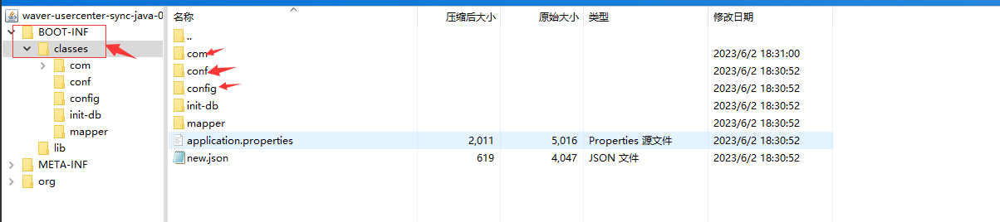

## springboot的classpath是什么

### 在idea等工具里面的classpath指的是什么

在Spring Boot中，classpath指的是类路径（classpath）。

在Spring Boot应用程序中，默认的类路径是**src/main/resources目录和src/main/java目录**。这意味着在这两个目录下的文件都可以通过类路径进行访问。

### 在jar包里面的classpath指的是那个路径

我们打开一个jar包可以看到如下的结构



在使用 Maven 打包的 Spring Boot 应用程序中，类路径可以理解为 BOOT-INF/classes/ 目录下的路径。

BOOT-INF/classes/ 目录是在构建可执行的 Spring Boot JAR 文件时，用于存放编译后的类文件的目录。该目录是 JAR 文件的一部分，并且在运行时会被 Spring Boot 自动加载。


## 我们在程序里面如何使用classpath

### 通常使用的是Class与Classloader的getResourceAsStream()两种办法来获取classpath的中的配置文件

+ Class.getResourceAsStream() 分两种情况 : 
第一种情况 : path不以’/‘开头时，默认是指所在类的相对路径，从这个相对路径下取资源；

>这里指的是 : 当前的类的路径地址

第二种情况 : path以’/'开头时，则是从项目的ClassPath根下获取资源，就是要写相对于classpath类路径下的绝对路径。
>这里指的是 : classpath的路径地址

+ Class.getClassLoader.getResourceAsStream(String path)：

第一种情况 : 默认则是从ClassPath类路径下获取，path不能以’/'开头，最终是由ClassLoader获取资源。
>这里指的的是 classpath的路径地址

第二种情况 : 如果以‘/’ 开头，则返回的是ClassLoader加载器Boot ClassLoader的加载范围，所以返回的也是null
>这里指的是 类加载器是C++的顶级. 也就是null

## 获取获取当前的路径并打印出来

### Class.getResourceAsStream()打印类路径
```java
String classPath = MyClass.class.getResource("").getPath();
System.out.println("当前类的类路径: " + classPath);
```

### 类.getClassLoader.getResourceAsStream(String path)：
```java 
ClassLoader classLoader = ClassLoaderExample.class.getClassLoader();
URL[] urls = ((URLClassLoader) classLoader).getURLs();
System.out.println("类加载器的类路径:");
for (URL url : urls) {
    System.out.println(url.getFile());
}
```

## springboot中application.properties 的查找顺序
+ 内置默认位置：Spring Boot 会首先在 JAR 文件的内置默认位置查找 application.properties 文件。默认情况下，它会在 JAR 文件的根目录下查找。

+ 外部配置文件：如果在 JAR 文件所在的目录中存在 application.properties 文件（或 application.yml 文件），则会优先加载该外部配置文件。这样可以方便地在部署时替换或修改配置文件，而无需重新打包 JAR 文件。

+ 类路径上的 /config 目录：如果 JAR 文件所在的目录中不存在 application.properties 文件，Spring Boot 将会在类路径（classpath）上的 /config 目录中查找该文件。这个 /config 目录是默认的外部配置文件位置之一，可以通过在 JAR 文件所在目录中创建 /config 目录来放置配置文件。

+ 类路径的根目录：如果上述位置都找不到 application.properties 文件，Spring Boot 将会在 JAR 文件的类路径的根目录中查找该文件。这是最后的默认位置，在 JAR 文件中的根目录下查找配置文件。


需要注意的是，这些位置是按照优先级从高到低的顺序进行查找。也就是说，如果在高优先级的位置找到了 application.properties 文件，则会使用该文件，而不会再继续查找后续位置。

>对于 Spring Boot 应用程序中的其他文件，如 YAML 文件、JSON 文件、XML 文件等，加载顺序也遵循类似的规则，即按照优先级从高到低的顺序进行查找。

