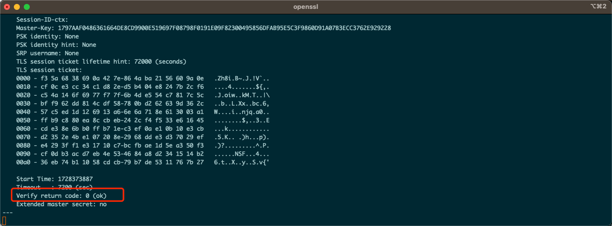
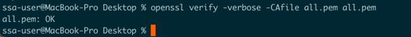

记录一下遇到的实际问题， 在调用第三方服务过程中，他们的证书有问题。feign在调用过程中直接报错了，开始排查问题。

## 理论知识
  需要知道数字证书的诞生背景和交互过程。具体请看本人架构博客 ： [数字证书](https://wonggaozh.github.io/architecture_book/#/./architect-perspective/transport-security) </br>
  同时需要了解 摘要和加密以及签名的含义 ，请看[传输](https://wonggaozh.github.io/architecture_book/#/./architect-perspective/system-security?id=%e4%bc%a0%e8%be%93)
### 证书链
  1、准备证书文件：
确保你有服务器证书文件、中间证书文件和根证书文件，通常以 .pem 或 .crt 格式保存。

  2、合并顺序：
按照从服务器证书开始，接着是中间证书（如果有多个，按顺序排列），最后是根证书的顺序进行合并。

  3、合并
  cat server.crt intermediate.crt root.crt > chained_cert.pem
  或者直接用文本编辑器操作。
## 实战
### 使用 openssl 工具
```text
# 判断网站证书情况
openssl s_client -connect baidu.com:443
```




```text
# 拿到本地证书验证

openssl verify -verbose -CAfile test.pem test.pem
```


正确数据：

