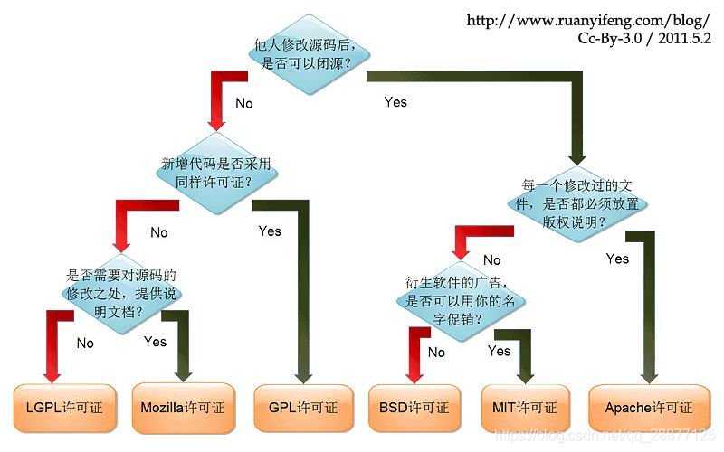
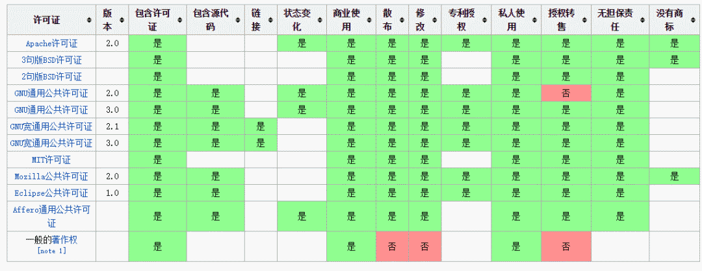

## 开源协议的作用
 开源协议规定了你在使用开源软件时的权利和责任，也就是规定了你可以做什么，不可以做什么。

## 如何选择开源协议
世界上的开源许可证（Open Source License）大概有上百种，今天我们来介绍下几种我们常见的开源协议。大致有GPL、AGPL、BSD、MIT、Mozilla、Apache和LGPL等。

| 许可证协议  | 描述                                             |  备注 |
|---|------------------------------------------------|---|
| BSD  |分发软件时，必须保留原始的许可证声明                              |   |
| MIT  | 分发软件时，必须保留原始的许可证声明，与 BSD（二条款版）基本一致。            |   |
| Apache 2  | 分发软件时，必须保留原始的许可证声明。凡是修改过的文件，必须向用户说明该文件修改过；没有修改过的文件，必须保持许可证不变。 |   |
| AGPL  | 如果云服务（即 SAAS）用到的代码是该许可证，那么云服务的代码也必须开源。         |   |
| GPL  | 如果项目包含了 GPL 许可证的代码，那么整个项目都必须使用 GPL 许可证。        |   |
| LGPL  | 如果项目采用动态链接调用该许可证的库，项目可以不用开源。                   |   |
| MPL  | 只要该许可证的代码在单独的文件中，新增的其他文件可以不用开源。                |   |

下面通过这几张图，大家可以一目了然的选择合适的开源协议：

> 备注：除了 Affero GPL (AGPL) ，其他许可证都规定只有在 "分发" 时，才需要遵守许可证。换言之，如果不 "分发"，就不需要遵守。

