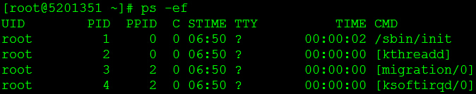
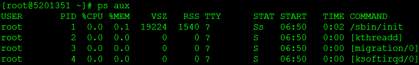

#
## linux命令第一部分(程序相关)


** 代表重要

*** 在下面会解释都是什么意思

| | 名称           | 命令                                                | 描述 |
|-----|--------------|---------------------------------------------------|------|
|*| 查看端口占用       | netstat -anp &#124; grep 8443    lsof -i:8443     | 
|***| 查看项目进程       | ps -ef &#124; grep  java或者ps aux &#124; grep java |ps --- Process Status   Process 是过程的意思  status 状态 ps -ef 是用标准的格式显示进程的 ps aux 是用BSD的格式来显示、其格式如下 | 
|*| 检测其他服务端口通不通  | telnet 192.168.2.186 22                           | 然后按 ctrl + ] 能够进入telnet状态
|*| 生产环境,调用服务接口等 | curl  {url}                                       | |
|*|              |                                                   | |


---
#### ps命令

ps -ef &#124; grep  java 命令

ps --- Process Status   Process 是过程的意思  status 状态

grep 全称是Global Regular Expression Print


ps -ef 是用标准的格式显示进程的 、其格式如下 


ps aux 是用BSD的格式来显示、其格式如下



#### curl命令
```shell
# 发送带header的get请求
curl -H "Authorization: Bearer <token>" https://example.com/api

# 发送post请求 
curl -X POST https://example.com/api -d '{"key": "value"}'

# 发送带有文件上传的请求：
curl -F "file=@/path/to/file" https://example.com/upload
```

---
