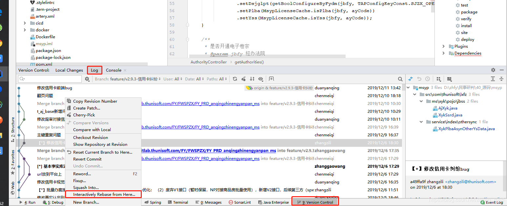
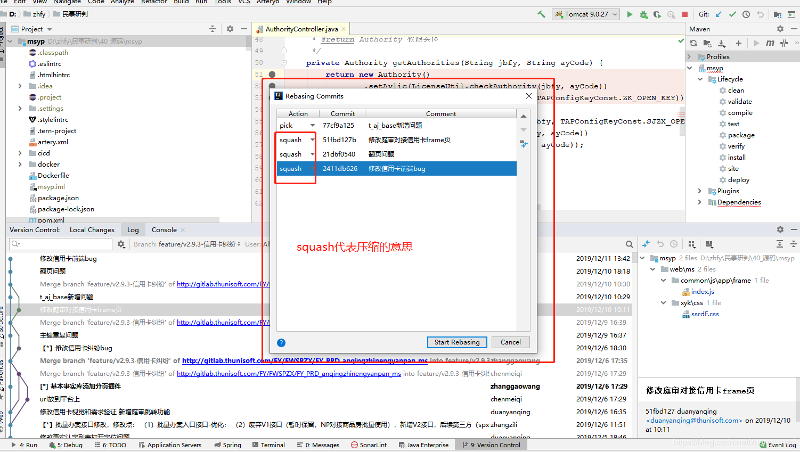

## git的使用

学习网址: https://learngitbranching.js.org/


## git基本使用

```text
# 配置当前仓库用户名和邮箱（不带--global，携带为修改全局）
git config --global user.name username
git config --global user.email  useremail@qq.com

# 查看配置是否成功
git config --list

```


```
# 查看
git branch 查看本地所有分支
git status 查看当前状态 
```

```
# 提交
git commit -m 'xxx'                    # 提交 
git commit --amend -m 'xxx'          # 合并上一次提交（用于反复修改） 
git commit --amend --no-edit  提交但是覆盖上次提交(只有一次提交记录)
git push origin HEAD:refs/for/master  推送到远程中台
git push <remote> <branch> -f
```

```java
# 撤销
--soft-将HEAD指针更新为在指定的提交。 工作目录和索引未更改。
--mixed -更新HEAD指针，并将索引重置为指定的提交。 工作目录保持不变。 这是reset命令的默认操作模式。
--hard -更新HEAD指针，并将索引和工作目录重置为指定的提交。 使用此选项时要格外小心，因为所有您尚未提交的本地更改都会被覆盖并丢失。

git reset --hard HEAD^   # 撤销上次操作,代码不会保留
git reset --soft HEAD^   # 撤销上次操作,代码会保留

git reset --soft origin/xxx(分支名)  # 有多次提交的时候, 撤销操作和远程一样, 并保留代码

```

```
# 拉取 
git fetch 获取远程版本库的提交
git pull  拉回远程版本库的提交
git rebase 分支变基
git rebase–interactive  交互式分支变基


```

```shell
## 从其他分支把代码拿过来
git cherry-pick命令
1.执行cherry-pick命令 git cherry-pick <commitid1>..<commitid2>  范围里面,左开右闭
2.有冲突使用git status命令查看
解决冲突文件: application.properties

3.解决完后标记已解决
 git add id-gate/src/main/resources/application.properties

4.解决后（执行 "git cherry-pick --continue" 以继续）
5.一直重复上述步骤
```

```shell
# 压缩提交commit
1.找一个节点 执行  git rebase -i 1984a642
2.把第二个pick到最后一个pick都改成squash   退出编辑 : wq
3.会提示一个commit信息修改好了, 退出编辑 :wq

```

```shell script

# gitpush失败,报错443的时候
git config --global http.sslBackend "openssl" 

```
## git的交互式rebase
命令: git rebase 分支名
图示操作,需要使用idea工具





