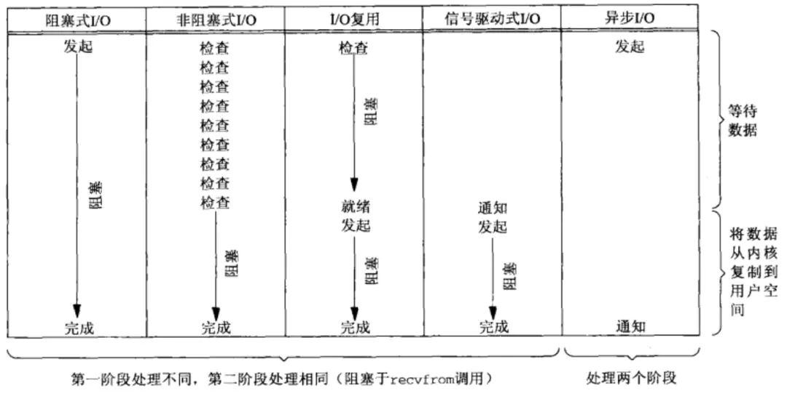
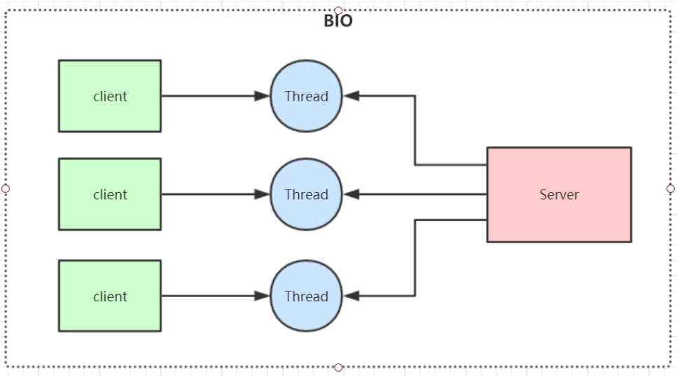
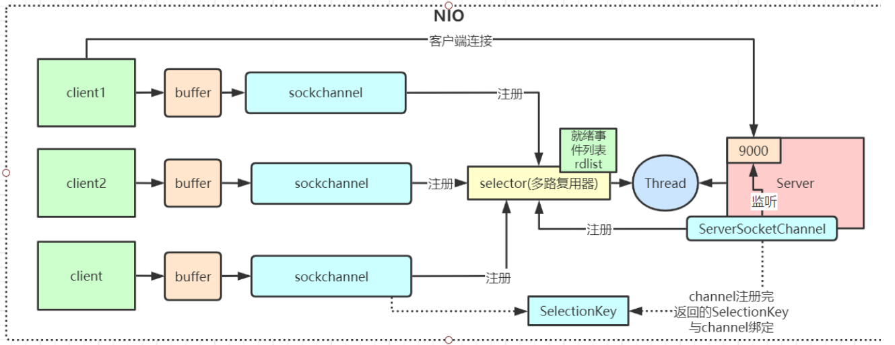
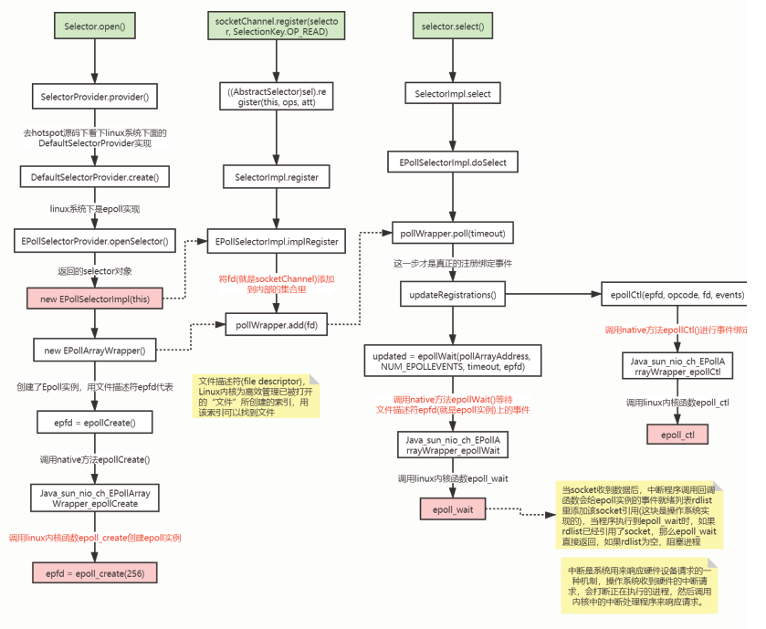

#
## BIO、NIO、AIO 有什么区别？

### 概念:
**在Java中，主要有三种IO模型**，分别是阻塞IO（BIO）、非阻塞IO（NIO）和 异步IO（AIO）。

Java中提供的IO有关的API，在文件处理的时候，其实依赖操作系统层面的IO操作实现的。比如在Linux 2.6以后，Java中NIO和AIO都是通过epoll来实现的，而在Windows上，AIO是通过IOCP来实现的。

BIO：Block IO 同步阻塞式 IO ;

NIO：New IO 同步非阻塞 IO，是传统 IO 的升级，客户端和服务器端通过 Channel（通道）通讯，实现了多路复用。

AIO：Asynchronous IO 是 NIO 的升级，也叫 NIO2，实现了异步非堵塞 IO ，异步 IO 的操作基于事件和回调机制

Linux的五种IO模型

**在Linux(UNIX)操作系统中，共有五种IO模型**，分别是：阻塞IO模型、非阻塞IO模型、IO复用模型、信号驱动IO模型以及异步IO模型。

#### Java中IO模型和linux中IO模型的对照关系 : 

|     | 同步                  | 异步 |
|-----|---------------------|--|
| 阻塞  | 阻塞IO  (BIO)              | 空 |
| 阻塞 | 非阻塞IO模型  信号驱动IO模型 IO复用模型(NIO)  | 异步IO(AIO) |

#### linux IO模型原理图示



发展过程1 :  阻塞IO, 这个时间段里面是数据没有返回时,我阻塞等着
发展过程2 :  非阻塞IO, 数据没有返回,立刻返回,并不断的去轮询操作系统,看看数据准备好了没, 
发展过程3 :  我定义一个多线程, 一个多线程绑定


#### JavaIO模型的原理:

BIO 用户线程发出 IO 请求之后，内核会去查看数据是否就绪，如果没有就绪就会等待数据就绪，而用户线程就会处于阻塞状态，用
户线程交出 CPU。

NIO 实际上就是多路复用 IO。在多路复用 IO模型中，会有一个线程不断去轮询多个 socket 的状态，只有当 socket 真正有读写事件时，才真

正调用实际的 IO 读写操作。因为在多路复用 IO 模型中，只需要使用一个线程就可以管理多个socket ;

AIO 是也就说用户线程完全不需要实际的整个 IO 操作是如何进行的，只需要先发起一个请求，当接收内核返回的成功信号时表示 IO 操作已经完成，可以直接去使用数据了

#### NIO模型的原理:

NIO 主要有三大核心部分：**Channel(通道)，Buffer(缓冲区), Selector。**

1、channel 类似于流，每个 channel 对应一个 buffer缓冲区，buffer 底层就是个数组

2、channel 会注册到 selector 上，由 selector 根据 channel 读写事件的发生将其交由某个空闲的线程处理

3、NIO 的 Buffer 和 channel 都是既可以读也可以写


### 源码分析

#### BIO模型
同步阻塞模型，一个客户端连接对应一个处理线程



缺点：

1、IO代码里read操作是阻塞操作，如果连接不做数据读写操作会导致线程阻塞，浪费资源

2、如果线程很多，会导致服务器线程太多，压力太大，比如C10K问题

应用场景：

BIO 方式适用于连接数目比较小且固定的架构， 这种方式对服务器资源要求比较高， 但程序简单易理解。

#### java 中的 NIO模型

同步非阻塞，服务器实现模式为**一个线程可以处理多个请求(连接)**，客户端发送的连接请求都会注册到多路复用器selector上，多路复用
器轮询到连接有IO请求就进行处理，JDK1.4开始引入。

**应用场景** : NIO方式适用于连接数目多且连接比较短（轻操作） 的架构， 比如聊天服务器， 弹幕系统， 服务器间通讯，编程比较复杂



NIO底层在JDK1.4版本是用linux的内核函数select()或poll()来实现，跟上面的NioServer代码类似，selector每次都会轮询所有的
sockchannel看下哪个channel有读写事件，有的话就处理，没有就继续遍历，
JDK1.5开始引入了epoll基于事件响应机制来优化NIO。


### Hotspot和Linux内核函数代码示意图
```aidl
1 Selector.open() //创建多路复用器
2 socketChannel.register() //将channel注册到多路复用器上
3 selector.select() //阻塞等待需要处理的事件发
```



总结：NIO整个调用流程就是Java调用了操作系统的内核函数来创建Socket，获取到Socket的文件描述符，再创建一个Selector
对象，对应操作系统的Epoll描述符，将获取到的Socket连接的文件描述符的事件绑定到Selector对应的Epoll文件描述符上，进
行事件的异步通知，这样就实现了使用一条线程，并且不需要太多的无效的遍历，将事件处理交给了操作系统内核(操作系统中断
程序实现)，大大提高了效率。

#### 内核Epoll函数详解
>int epoll_create(int size);

创建一个epoll实例，并返回一个非负数作为文件描述符，用于对epoll接口的所有后续调用。参数size代表可能会容纳size个描述
符，但size不是一个最大值，只是提示操作系统它的数量级，现在这个参数基本上已经弃用了。

>int epoll_ctl(int epfd, int op, int fd, struct epoll_event *event);
```aidl
使用文件描述符epfd引用的epoll实例，对目标文件描述符fd执行op操作。
参数epfd表示epoll对应的文件描述符，参数fd表示socket对应的文件描述符。
参数op有以下几个值：
EPOLL_CTL_ADD：注册新的fd到epfd中，并关联事件event；
EPOLL_CTL_MOD：修改已经注册的fd的监听事件；
EPOLL_CTL_DEL：从epfd中移除fd，并且忽略掉绑定的event，这时event可以为null；
```

>int epoll_wait(int epfd, struct epoll_event *events, int maxevents, int timeout);

等待文件描述符epfd上的事件。
epfd是Epoll对应的文件描述符，events表示调用者所有可用事件的集合，maxevents表示最多等到多少个事件就返回，
timeout是超时时间。

### Redis线程模型
Redis就是典型的基于epoll的NIO线程模型(nginx也是)，epoll实例收集所有事件(连接与读写事件)，由一个服务端线程连续处理所有事件
命令。
Redis底层关于epoll的源码实现在redis的src源码目录的ae_epoll.c文件里，感兴趣可以自行研究。

### 为什么Netty使用NIO而不是AIO？
在Linux系统上，AIO的底层实现仍使用Epoll，没有很好实现AIO，因此在性能上没有明显的优势，而且被JDK封装了一层不容易深度优
化，Linux上AIO还不够成熟。Netty是异步非阻塞框架，Netty在NIO上做了很多异步的封装。

参考连接:

https://blog.csdn.net/weixin_30363263/article/details/88106286