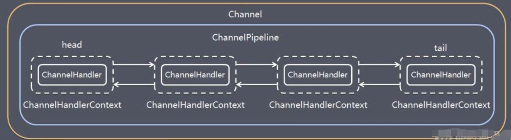
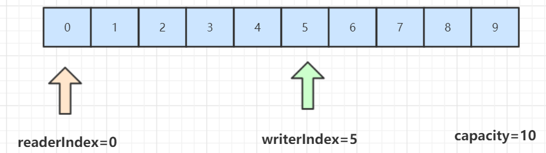
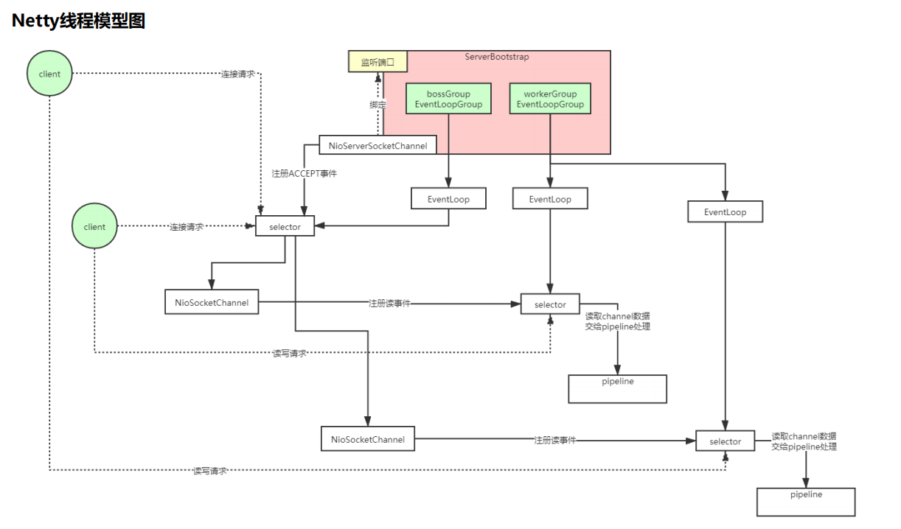
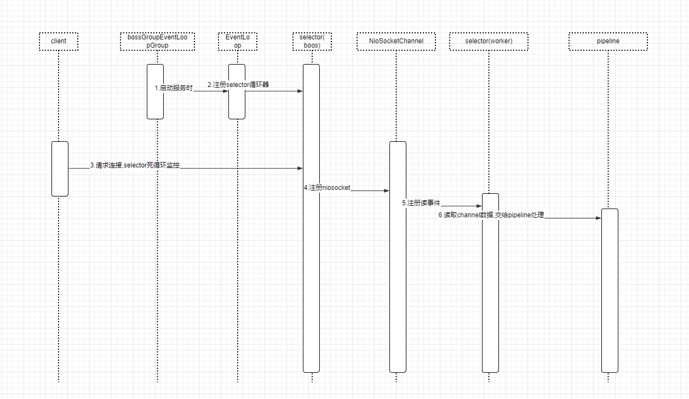
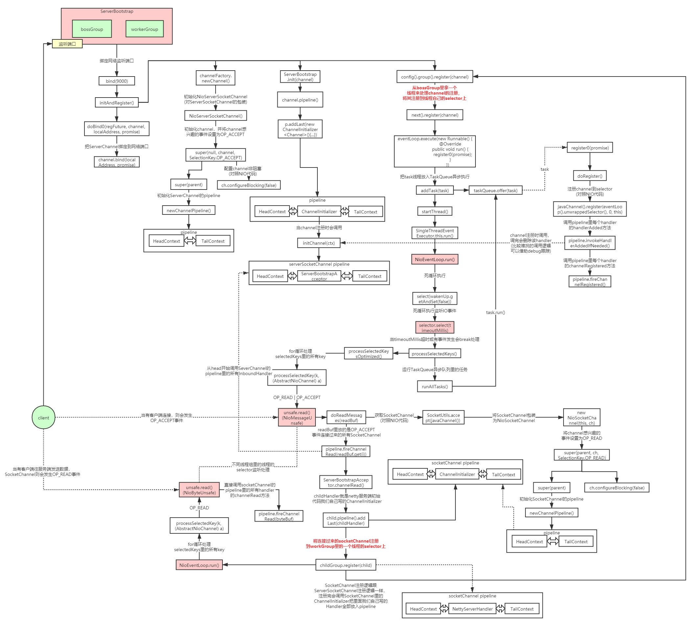
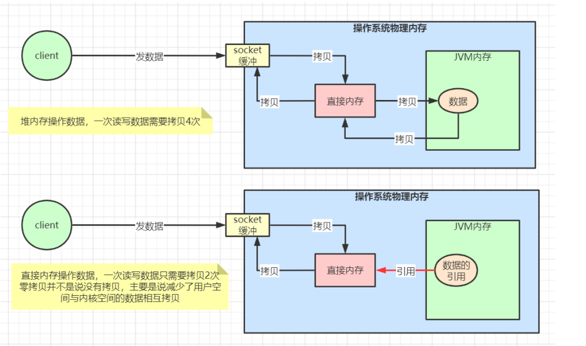

#
## 为什么使用netty
NIO 的类库和 API 繁杂， 使用麻烦： 需要熟练掌握Selector、 ServerSocketChannel、 SocketChannel、 ByteBuffer等。
开发工作量和难度都非常大： 例如客户端面临断线重连、 网络闪断、心跳处理、半包读写、 网络拥塞和异常流的处理等等。
Netty 对 JDK 自带的 NIO 的 API 进行了良好的封装，解决了上述问题。且Netty拥有高性能、 吞吐量更高，延迟更低，减少资源消耗，最小化不必要的内存复制等优点。

Netty框架的目标就是让你的业务逻辑从网络基础应用编码中分离出来，让你可以专注业务的开发，而不需写一大堆类似NIO的网络处理操作。

## Netty的使用场景：
+ 1）互联网行业：在分布式系统中，各个节点之间需要远程服务调用，高性能的 RPC 框架必不可少，Netty 作为异步高性能的通信框架，往往作为基础通信组件被这些 RPC 框架使用。典型的应用有：阿里分布式服务框架 Dubbo 的 RPC 框架使用 Dubbo 协议进行节点间通信，Dubbo 协议默认使用 Netty 作为基础通信组件，用于实现。各进程节点之间的内部通信。Rocketmq底层也是用的Netty作为基础通信组件。
+ 2）游戏行业：无论是手游服务端还是大型的网络游戏，Java 语言得到了越来越广泛的应用。Netty 作为高性能的基础通信组件，它本身提供了 TCP/UDP 和 HTTP 协议栈。
+ 3）大数据领域：经典的 Hadoop 的高性能通信和序列化组件 Avro 的 RPC 框架，默认采用 Netty 进行跨界点通信，它的 Netty Service 基于 Netty 框架二次封装实现。

## Netty的高性能原理

1. 主从Reactor线程模型
2. NIO多路复用非阻塞
3. 无锁串行化设计思想
4. 支持高性能序列化协议
5. 零拷贝(直接内存的使用)
6. ByteBuf内存池设计

## Netty线程模型
Netty的线程模型如下图所示：

模型解释：
1) Netty 抽象出两组线程池BossGroup和WorkerGroup，BossGroup专门负责接收客户端的连接, WorkerGroup专门负责网络的读写
2) BossGroup和WorkerGroup类型都是NioEventLoopGroup
3) NioEventLoopGroup 相当于一个事件循环线程组, 这个组中含有多个事件循环线程 ， 每一个事件循环线程是NioEventLoop
4) 每个NioEventLoop都有一个selector , 用于监听注册在其上的socketChannel的网络通讯
5) 每个Boss  NioEventLoop线程内部循环执行的步骤有 3 步
   + 处理accept事件 , 与client 建立连接 , 生成 NioSocketChannel
   + 将NioSocketChannel注册到某个worker  NIOEventLoop上的selector
   + 处理任务队列的任务 ， 即runAllTasks
6) 每个worker  NIOEventLoop线程循环执行的步骤
   轮询注册到自己selector上的所有NioSocketChannel 的read, write事件
   处理 I/O 事件， 即read , write 事件， 在对应NioSocketChannel 处理业务
   runAllTasks处理任务队列TaskQueue的任务 ，一些耗时的业务处理一般可以放入TaskQueue中慢慢处理，这样不影响数据在 pipeline 中的流动处理
7) 每个worker NIOEventLoop处理NioSocketChannel业务时，会使用 pipeline (管道)，管道中维护了很多 handler 处理器用来处理 channel 中的数据

## Netty模块组件
### 【Bootstrap、ServerBootstrap】：
Bootstrap 意思是引导，一个 Netty 应用通常由一个 Bootstrap 开始，主要作用是配置整个 Netty 程序，串联各个组件，Netty 中 Bootstrap 类是客户端程序的启动引导类，ServerBootstrap 是服务端启动引导类。
### 【Future、ChannelFuture】：
正如前面介绍，在 Netty 中所有的 IO 操作都是异步的，不能立刻得知消息是否被正确处理。
但是可以过一会等它执行完成或者直接注册一个监听，具体的实现就是通过 Future 和 ChannelFutures，他们可以注册一个监听，当操作执行成功或失败时监听会自动触发注册的监听事件。
### 【Channel】：
Netty 网络通信的组件，能够用于执行网络 I/O 操作。Channel 为用户提供：
1） 当前网络连接的通道的状态（例如是否打开？是否已连接？）
2） 网络连接的配置参数 （例如接收缓冲区大小）
3） 提供异步的网络 I/O 操作(如建立连接，读写，绑定端口)，异步调用意味着任何 I/O 调用都将立即返回，并且不保证在调用结束时所请求的 I/O 操作已完成。
4） 调用立即返回一个 ChannelFuture 实例，通过注册监听器到 ChannelFuture 上，可以 I/O 操作成功、失败或取消时回调通知调用方。
5） 支持关联 I/O 操作与对应的处理程序。
不同协议、不同的阻塞类型的连接都有不同的 Channel 类型与之对应。

### 【Selector】：
Netty 基于 Selector 对象实现 I/O 多路复用，通过 Selector 一个线程可以监听多个连接的 Channel 事件。
当向一个 Selector 中注册 Channel 后，Selector 内部的机制就可以自动不断地查询(Select) 这些注册的 Channel 是否有已就绪的 I/O 事件（例如可读，可写，网络连接完成等），这样程序就可以很简单地使用一个线程高效地管理多个 Channel 。
### 【NioEventLoop】：
NioEventLoop 中维护了一个线程和任务队列，支持异步提交执行任务，线程启动时会调用 NioEventLoop 的 run 方法，执行 I/O 任务和非 I/O 任务：
I/O 任务，即 selectionKey 中 ready 的事件，如 accept、connect、read、write 等，由 processSelectedKeys 方法触发。
非 IO 任务，添加到 taskQueue 中的任务，如 register0、bind0 等任务，由 runAllTasks 方法触发。
### 【NioEventLoopGroup】：
NioEventLoopGroup，主要管理 eventLoop 的生命周期，可以理解为一个线程池，内部维护了一组线程，每个线程(NioEventLoop)负责处理多个 Channel 上的事件，而一个 Channel 只对应于一个线程。
### 【ChannelHandler】：
ChannelHandler 是一个接口，处理 I/O 事件或拦截 I/O 操作，并将其转发到其 ChannelPipeline(业务处理链)中的下一个处理程序。
ChannelHandler 本身并没有提供很多方法，因为这个接口有许多的方法需要实现，方便使用期间，可以继承它的子类：

### 【ChannelHandlerContext】：
保存 Channel 相关的所有上下文信息，同时关联一个 ChannelHandler 对象。
### 【ChannelPipline】：
保存 ChannelHandler 的 List，用于处理或拦截 Channel 的入站事件和出站操作。
ChannelPipeline 实现了一种高级形式的拦截过滤器模式，使用户可以完全控制事件的处理方式，以及 Channel 中各个的 ChannelHandler 如何相互交互。
在 Netty 中每个 Channel 都有且仅有一个 ChannelPipeline 与之对应，它们的组成关系如下： 

一个 Channel 包含了一个 ChannelPipeline，而 ChannelPipeline 中又维护了一个由 ChannelHandlerContext 组成的双向链表，并且每个 ChannelHandlerContext 中又关联着一个 ChannelHandler。
read事件(入站事件)和write事件(出站事件)在一个双向链表中，入站事件会从链表 head 往后传递到最后一个入站的 handler，出站事件会从链表 tail 往前传递到最前一个出站的 handler，两种类型的 handler 互不干扰。

### ByteBuf详解
从结构上来说，ByteBuf 由一串字节数组构成。数组中每个字节用来存放信息。
ByteBuf 提供了两个索引，一个用于读取数据，一个用于写入数据。这两个索引通过在字节数组中移动，来定位需要读或者写信息的位置。
当从 ByteBuf 读取时，它的 readerIndex（读索引）将会根据读取的字节数递增。
同样，当写 ByteBuf 时，它的 writerIndex 也会根据写入的字节数进行递增。

需要注意的是极限的情况是 readerIndex 刚好读到了 writerIndex 写入的地方。
如果 readerIndex 超过了 writerIndex 的时候，Netty 会抛出 IndexOutOf-BoundsException 异常。

### 流程图和时序图

netty模型图 : 

netty时序图 :

netty流程图 :

### 无锁串行化设计思想
在大多数场景下，并行多线程处理可以提升系统的并发性能。但是，如果对于共享资源的并发访问处理不当，会带来严重的锁竞争，这最
终会导致性能的下降。为了尽可能的避免锁竞争带来的性能损耗，可以通过串行化设计，即消息的处理尽可能在同一个线程内完成，期间
不进行线程切换，这样就避免了多线程竞争和同步锁。NIO的多路复用就是一种无锁串行化的设计思想(理解下Redis和Netty的线程模型)
为了尽可能提升性能，Netty采用了串行无锁化设计，在IO线程内部进行串行操作，避免多线程竞争导致的性能下降。表面上看，串行化
设计似乎CPU利用率不高，并发程度不够。但是，通过调整NIO线程池的线程参数，可以同时启动多个串行化的线程并行运行，这种局部
无锁化的串行线程设计相比一个队列-多个工作线程模型性能更优。
Netty的NioEventLoop读取到消息之后，直接调用ChannelPipeline的fireChannelRead(Object msg)，只要用户不主动切换线程，一直
会由NioEventLoop调用到用户的Handler，期间不进行线程切换，这种串行化处理方式避免了多线程操作导致的锁的竞争，从性能角度
看是最优的。

### 直接内存(零拷贝)
直接内存（Direct Memory）并不是虚拟机运行时数据区的一部分，也不是Java虚拟机规范中定义的内存区域，某些情况下这部分内存也
会被频繁地使用，而且也可能导致OutOfMemoryError异常出现。Java里用DirectByteBuffer可以分配一块直接内存(堆外内存)，**元空间
对应的内存也叫作直接内存，它们对应的都是机器的物理内存**

### ByteBuf内存池设计
随着JVM虚拟机和JIT即时编译技术的发展，对象的分配和回收是个非常轻量级的工作。但是对于缓冲区Buffer(相当于一个内存块)，情况
却稍有不同，特别是对于堆外直接内存的分配和回收，是一件耗时的操作。为了尽量重用缓冲区，Netty提供了基于ByteBuf内存池的缓冲
区重用机制。需要的时候直接从池子里获取ByteBuf使用即可，使用完毕之后就重新放回到池子里去。

