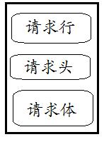
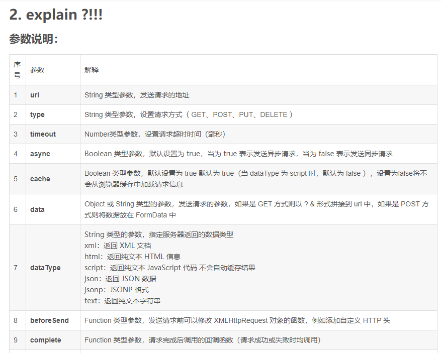
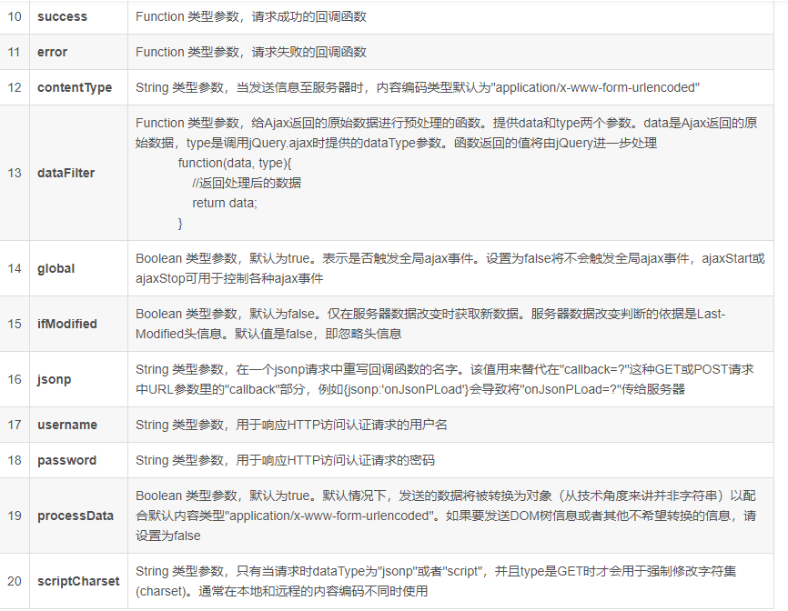
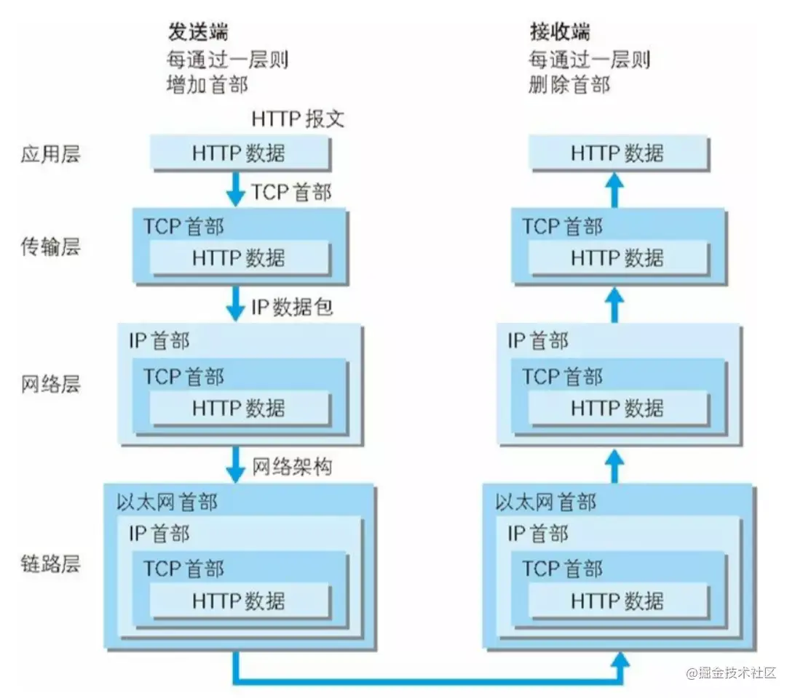

# http原理

## HTTP请求报文解剖 
HTTP请求报文由3部分组成（请求行+请求头+请求体）：




下面是一个实际的请求报文： 


①是请求方法，GET和POST是最常见的HTTP方法，除此以外还包括DELETE、HEAD、OPTIONS、PUT、TRACE。不过，当前的大多数浏览器只支持GET和POST，Spring 3.0提供了一个HiddenHttpMethodFilter，允许你通过“_method”的表单参数指定这些特殊的HTTP方法（实际上还是通过POST提交表单）。服务端配置了HiddenHttpMethodFilter后，Spring会根据_method参数指定的值模拟出相应的HTTP方法，这样，就可以使用这些HTTP方法对处理方法进行映射了。 

②为请求对应的URL地址，它和报文头的Host属性组成完整的请求URL，③是协议名称及版本号。 

④是HTTP的报文头，报文头包含若干个属性，格式为“属性名:属性值”，服务端据此获取客户端的信息。 

⑤是报文体，它将一个页面表单中的组件值通过param1=value1&param2=value2的键值对形式编码成一个格式化串，它承载多个请求参数的数据。不但报文体可以传递请求参数，请求URL也可以通过类似于“/chapter15/user.html? param1=value1&param2=value2”的方式传递请求参数。 

对照上面的请求报文，我们把它进一步分解，你可以看到一幅更详细的结构图： 


常见的HTTP请求报文头属性 

Accept 

请求报文可通过一个“Accept”报文头属性告诉服务端 客户端接受什么类型的响应。 

如下报文头相当于告诉服务端，俺客户端能够接受的响应类型仅为纯文本数据啊，你丫别发其它什么图片啊，视频啊过来，那样我会歇菜的~~~： 
Accept:text/plain  

Accept属性的值可以为一个或多个MIME类型的值，关于MIME类型，大家请参考：http://en.wikipedia.org/wiki/MIME_type 


---

ajax参数解析

1 . 样例:get请求
```
$.ajax({
        type: "GET",
        url: "localhost:8080/travle/news/list",
        data: { page: $("#page").val(), limit: 5 },
        dataType: "JSON",
        success: function(result) {}
      });
```

post请求 
```
$.ajax({
        type: "POST",
        url: "localhost:8080/travle/admin/login",
        data: {
          username: $("#username").val(),
          password: $("#password").val()
        },
        dataType: "JSON",
        success: function(result) {}
      });

```






## HTTP在网络中传输

