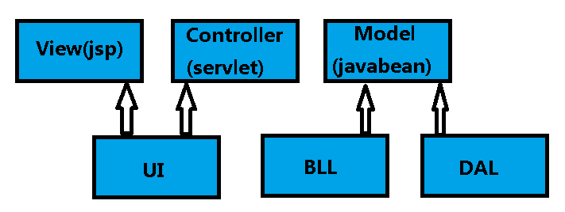

#
### springMVC是什么： 
   
springMVC是一个MVC的开源框架，springMVC=struts2+spring，springMVC就相当于是Struts2加上sring的整合，但是这里有一个疑惑就是，springMVC和spring是什么样的关系呢？这个在百度百科上有一个很好的解释：意思是说，springMVC是spring的一个后续产品，其实就是spring在原有基础上，又提供了web应用的MVC模块，可以简单的把springMVC理解为是spring的一个模块（类似AOP，IOC这样的模块），网络上经常会说springMVC和spring无缝集成，其实springMVC就是spring的一个子模块，所以根本不需要同spring进行整合。

#### mvc和jsp的关系

jsp全称是java server page  本质是java代码整合html的代码

而springmvc包括

所以可以看出来jsp只是springmvc的一个view层页面

springmvc的原理

SpringMVC流程
1、  用户发送请求至前端控制器DispatcherServlet。

2、  DispatcherServlet收到请求调用HandlerMapping处理器映射器。

3、  处理器映射器找到具体的处理器(可以根据xml配置、注解进行查找)，生成处理器对象及处理器拦截器(如果有则生成)一并返回给DispatcherServlet。

4、  DispatcherServlet调用HandlerAdapter处理器适配器。

5、  HandlerAdapter经过适配调用具体的处理器(Controller，也叫后端控制器)。

6、  Controller执行完成返回ModelAndView。

7、  HandlerAdapter将controller执行结果ModelAndView返回给DispatcherServlet。

8、  DispatcherServlet将ModelAndView传给ViewReslover视图解析器。

9、  ViewReslover解析后返回具体View。

10、DispatcherServlet根据View进行渲染视图（即将模型数据填充至视图中）。

11、 DispatcherServlet响应用户。

看到这些步骤我相信大家很感觉非常的乱，这是正常的，但是这里主要是要大家理解springMVC中的几个组件：

前端控制器（DispatcherServlet）：接收请求，响应结果，相当于电脑的CPU。

处理器映射器（HandlerMapping）：根据URL去查找处理器

处理器（Handler）：（需要程序员去写代码处理逻辑的）

处理器适配器（HandlerAdapter）：会把处理器包装成适配器，这样就可以支持多种类型的处理器，类比笔记本的适配器（适配器模式的应用）

视图解析器（ViewResovler）：进行视图解析，多返回的字符串，进行处理，可以解析成对应的页面