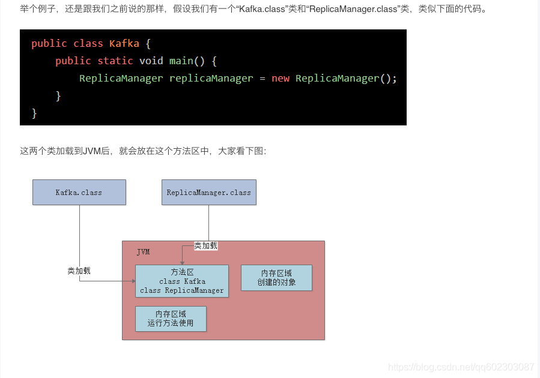
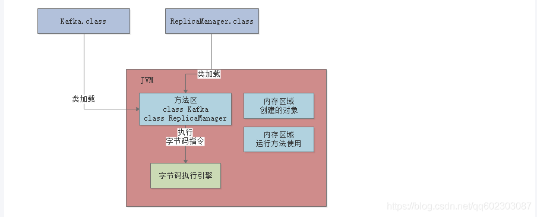
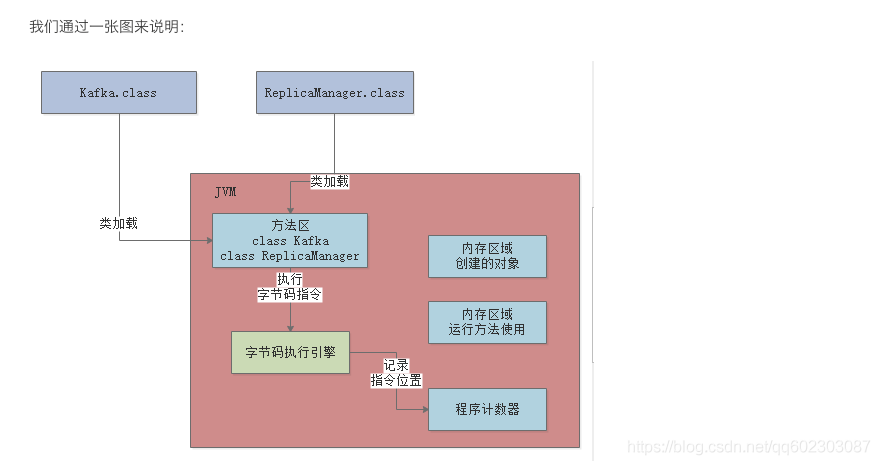
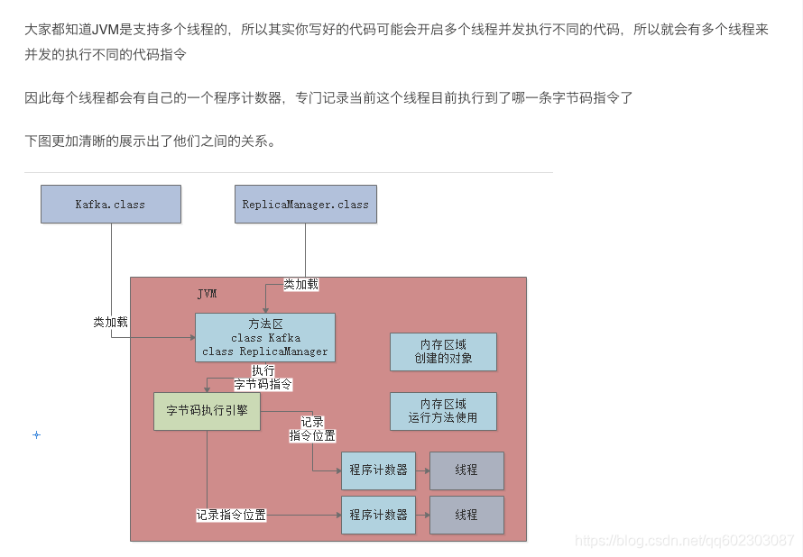
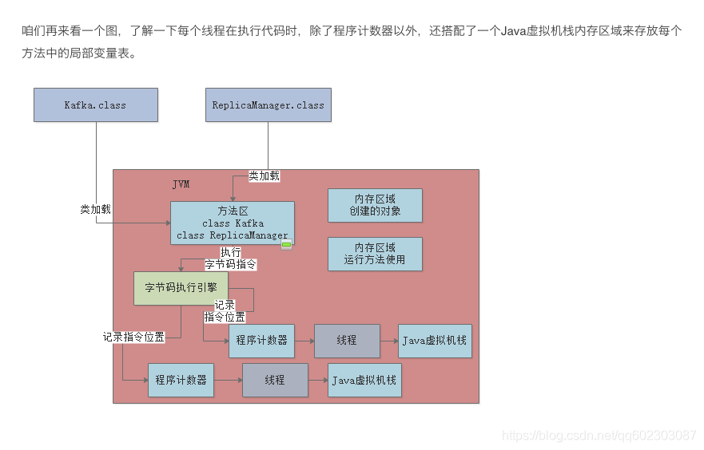
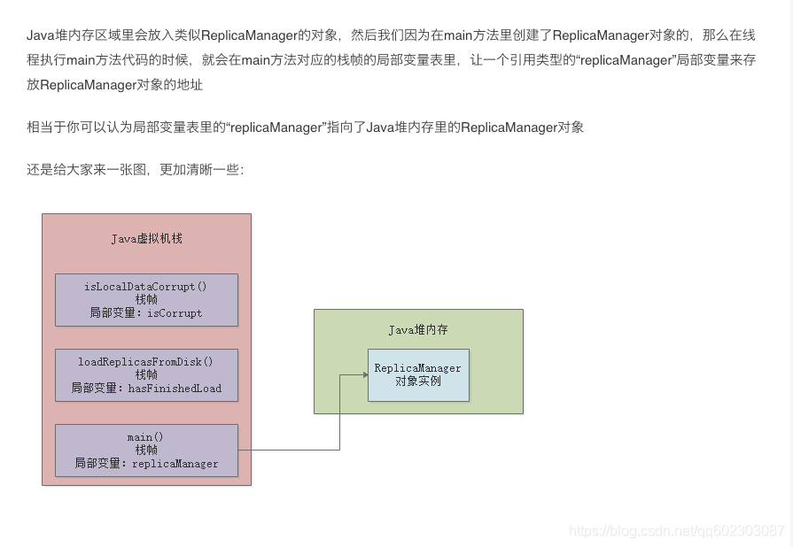
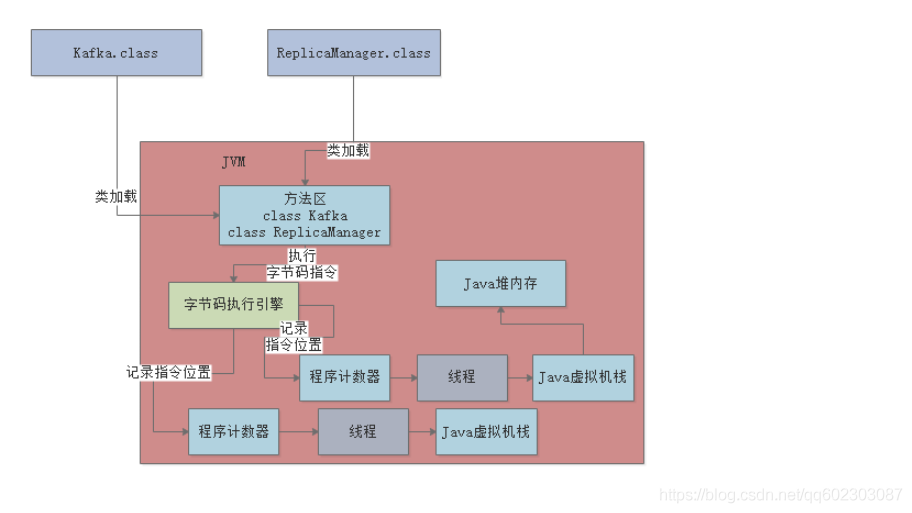

### 类的加载和实例化区别和在jvm内存的过程

### 1. 类的加载和实例化区别

首先打两个比方: 
加载是找设计图纸，实例化是根据设计图纸造飞机。

举个例子，你要喝水，那么你会用水瓢从水缸里取出水来喝，JVM所干的事情就相当于替你取水到水瓢中，那么水缸就相当于你的硬盘，水瓢就相当于内存，你真正喝水的时候相当于实例化。你不喝水，那么水也是在水瓢中，当你喝的时候就可以直接喝了，也就是你可以直接new对象了。

总结起来时new对象的时候有两步：（1）类的加载；（2）实例化。

JVM（java虚拟机）会预先将类加载进内存，这个就是类的加载（你自己是看不到的）。

类的实例化，就是从类到具体的一个对象。

在实例化一个对象时，JVM首先会检查相关类型是否已经加载并初始化，如果没有，则JVM立即进行加载并调用类构造器完成类的初始化。如果实例化了的话,会直接从元数据里面copy出来一份对象在堆里面.

### 2. 类的加载和实例化在jvm内存过程流程

>类的加载过程 : 

加载-->验证--> 准备-->解析-->初始化-->使用-->卸载

>每个阶段在jvm里面的过程

1）存放类的方法区

2)执行代码指令用的程序计数器

java代码会被编译成字节码。对应各种字节码指令，所以当JVM加载类信息到内存之后，实际上就会使用自己的字节码执行引擎，去执行我们写的代码，如图：

那么，当执行字节码指令的时候，JVM就需要一个特殊的内存区域，那就是程序计数器，这个程序计数器就是用来存放当前执行字节码指令的位置，也就是记录目前执行到哪一条字节码指令

3) java虚拟机栈

java虚拟机栈就是用来存放每个方法内存的局部遍历的数据，每个线程都有自己的java虚拟机栈，如果一个线程执行了一个方法，就会对这个方法调用创建一个栈针，栈针里就有这个方法的局部遍历表，操作数栈，动态链接，方法出口等，

JVM中的java虚拟机栈的作用就是调用任何方法时，都会给方法创建栈针，在栈针里存放这个方法对应的局部变量之类的数据，方法执行完毕后就出栈，

4)JAVA堆内存

5)总结:

1：当JVM启用，会将kafka类加载到内存里，然后有一个main线程，开始执行kafka中的main方法,main线程关联了一个程序计数器，记录main线程执行的指令

2：其次就是在main线程在执行main方法时，会在main线程关联的java虚拟机栈里，压入一个main方法的栈针，接着发现需要创建一个ReplicaManager 类的实例对象，此刻就会把ReplicaManager类加载到内存中，然后回去创建一个ReplicaManager的对象分配在Java堆内存中，并且在main（）方法的栈针里的局部遍历表中引入一个“replicaManager”变量，让他引用ReplicaManager 对象在Java堆内存中的地址，

3：接着main线程开始执行ReplicaManager 中的方法，一次把自己执行到的方法对应的栈针压入到自己的java虚拟机栈，执行完方法后在把对应的栈针从自己的java虚拟机栈里出栈，

### 3.类的加载过程中静态代码块,代码块,构造函数,普通方法的

java 虚拟机中，分为类加载和对象实例化两部分。

类加载主要是做static部分

static的成员变量和static的代码块按照代码顺序执行。

先执行父类的这两个操作，再执行子类的两个操作。

参考文章  : 

https://blog.csdn.net/qq602303087/article/details/108801490

      
      

