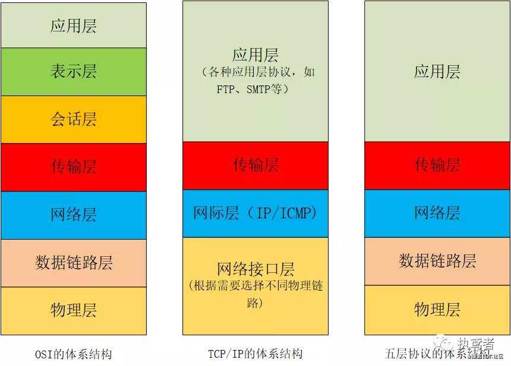
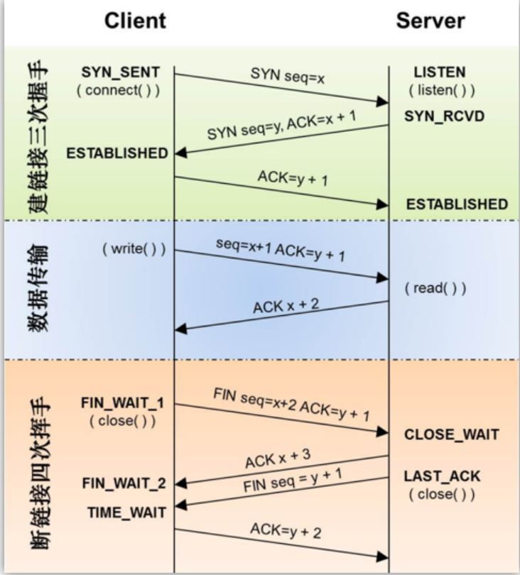

#
## 网络协议

> OSI体系



>数据传输过程:
```
 从高到低
 
 在应用层将所有数据转为二进制.
 在传输层将二进制数据进行分段处理,分割成小的数据段,并为某个分段后的数据封装上TCP报文头部.(TCP报文内部有一个字段信息标识上层协议或应用程序确保上层数据的正常通信)
 在网络层将传输层封装的数据段封装上IP头部(IP头部有IP地址.用于标识网络的逻辑地址)
 数据链路层.为网络层封装的数据添加上MAC地址(MAC地址就是固化在硬件设备内部的全球唯一的物理地址。)
 物理层将这些二进制数字比特流转换成电信号在网络中传输
 
 从低到高
 
 物理层将电信信号转化为二进制数据发送到链路层
 链路层中把MAC头部处理掉.并将剩余的传入网络层
 在网络层将IP头部处理掉,并将剩余的传入传输层
 在传输层将TCP头部处理掉,将真实的数据传入应用层
```
 
 

> 在这里,主要说五层模型中的应用层和传输层的

+ 传输层(TCP传输控制和UDP用户数据报协议)

位于应用层和网络层之间,定义传输数据的协议和端口号
将数据进行分段打包传输,对每个数据包编号控制顺序,运输过程中丢、重发、丢弃处理,流量控制避免拥塞常用的有TCP、UDP

TCP: 传输控制协议.可靠,面向连接的协议,传输效率低).将数据进行分段打包传输,对每个数据包编号控制顺序.运输过程中丢失、重发、丢弃处理.

UDP: 用户数据报协议,不可靠,无连接服务,传输效率高.发送端不关心发送的数据是否到达目标主机、数据是否出错等，收到数据的主机也不会告诉 发送方是否收到了数据，它的可靠性由上层协议来保障.在数据传输时能实现最小的开销，如果进程想发送很短的报文而对可靠性要求不高可以使用

+ 应用层(HTTP、FTP、DNS)

在应用层要把各式各样的数据如字母、数字、汉字、图片等转换成二进制

[HTTP原理](./http.md)


> TCP的三次握手和四次挥手


```
TCP三次握手和四次挥手？

客户端–发送带有SYN标志的数据包–一次握手–服务端
服务端–发送带有SYN/ACK标志的数据包–二次握手–客户端
客户端–发送带有带有ACK标志的数据包–三次握手–服务端

四次挥手：

客户端-发送一个FIN，用来关闭客户端到服务器的数据传送
服务器-收到这个FIN，它发回一个ACK，确认序号为收到的序号加1 。和SYN一样，一个FIN将占用一个序号
服务器-关闭与客户端的连接，发送一个FIN给客户端
客户端-发回ACK报文确认，并将确认序号设置为收到序号加1

```

### 思考
> TCP的三次握手过程？为什么会采用三次握手，若采用二次握手可以吗？
 三次握手的目的是“为了防止已经失效的连接请求报文段突然又传到服务端，因而产生错误”，
 
   建立连接的过程是利用客户服务器模式，假设主机A为客户端，主机B为服务器端。
 
 （1）TCP的三次握手过程：主机A向B发送连接请求；主机B对收到的主机A的报文段进行确认；主机A再次对主机B的确认进行确认。
 
 （2）采用三次握手是为了防止失效的连接请求报文段突然又传送到主机B，因而产生错误。失效的连接请求报文段是指：主机A发出的连接请求没有收到主机B的确认，于是经过一段时间后，主机A又重新向主机B发送连接请求，且建立成功，顺序完成数据传输。考虑这样一种特殊情况，主机A第一次发送的连接请求并没有丢失，而是因为网络节点导致延迟达到主机B，主机B以为是主机A又发起的新连接，于是主机B同意连接，并向主机A发回确认，但是此时主机A根本不会理会，主机B就一直在等待主机A发送数据，导致主机B的资源浪费。
 
> TCP 四次挥手的过程,原因

因为TCP是一个全双工协议，必须单独拆除每一条信道。4次挥手的目的是终止数据传输，并回收资源，此时两个端点两个方向的序列号已经没有了任何关系，必须等待两方向都没有数据传输时才能拆除虚链路，不像初始化时那么简单，发现SYN标志就初始化一个序列号并确认SYN的序列号。因此必须单独分别在一个方向上终止该方向的数据传输。

如果是三次挥手，会怎么样？三次的话，被动关闭端在收到FIN消息之后，需要同时回复ACK和Server端的FIN消息。如果Server端在该连接上面并没有Pending的消息要处理，那么是可以的，如果Server端还需要等待一段时间才可以关闭另外一个方向的连接，那么这样的三次挥手就不能满足条件。

> 四次挥手失败了会怎么样？
```
四次挥手里面，最经典的场景，是Client处于TIME_WAIT之后的2MSL的时间处理。（备注：MSL是TCP报文里面最大生存时间，它是任何报文段被丢弃前在网络内的最长时间。）

设置2MSL的目的是为了处理，Server端在重传最后一个FIN的时候，Client能够发送最后一个ACK的时间。

这个时间段内，不管是Client端还是Server端，最好都不要重用这个TCP的端口，否则的话，可能会导致根据这个端口新建立的连接被错误的关掉，详细情况如下所示：

step1:Server发送给Client的最后一个FIN，Client收到了，也发了ACK给Server，但是Server并没有收到这个ACK。
step2:于是CLient复用了这个Port号，于是新建了一条连接，这里假设叫newConnection。
step3:Server在此过程中已经发送了重传的FIN给Client，Client上面刚建立完成的newConnection就会再次被关掉。


```