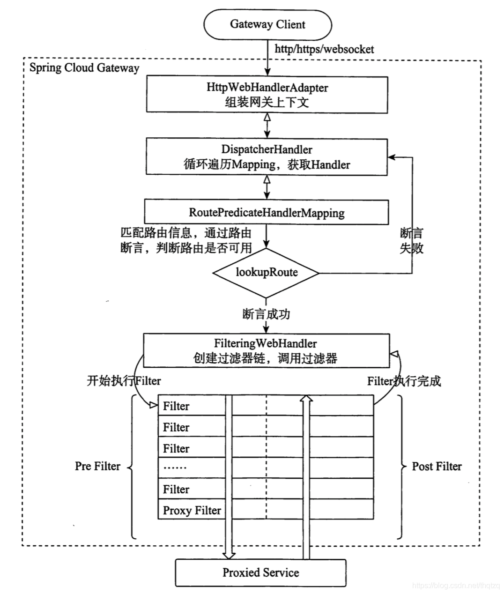

## 服务的网关  Netflix zuul 和spirng gatway的关系

### 1.背景和差异(选型)
Zuul 1.x基于Servlet 2. 5使用阻塞架构它不支持任何长连接(如WebSocket) Zuul的设计模式和Nginx较像，每次I0操作都是从工作线程中选择一个执行， 请求线程被阻塞到工作线程完成，但是差别是Nginx用C++实现，Zuul 用Java实现，而JVM本身会有第一次加载较慢的情况，使得Zuul 的性能相对较差。

Zuul 2.x理念更先进，想基于Netty非阻塞和支持长连接,但SpringCloud目前还没有整合。Zuul 2.x的性能较Zuul 1.x有较大提升。在性能方面，根据官方提供的基准测试， Spring Cloud Gateway的RPS (每秒请求数)是Zuul的1.6倍。

Spring Cloud Gateway建立在Spring Framework

Project Reactor和Spring Boot2之上，使用非阻塞API。

Spring Cloud Gateway还支持WebSocket,并且 与Spring紧密集成拥有更好的开发体验

多方面综合考虑Gateway是很理想的网关选择。

### 2.网关的作用

+ 做跨域请求的配置
+ 做协议之间的转化，比如从http协议转成其他协议，
+ 配合nginx的话，不需要在nginx里面配置很多的ip地址
* spring gatway配置security来实现权限的管理

### 3.gatway的原理
> Spring Cloud Gateway 的核心处理流程如下图，Gateway的客户端回向Spring Cloud Gateway发起请求，请求首先会被HttpWebHandlerAdapter进行提取组装成网关的上下文，然后网关的上下文会传递到DispatcherHandler。DispatcherHandler是所有请求的分发处理器，DispatcherHandler主要负责分发请求对应的处理器，比如将请求分发到对应RoutePredicateHandlerMapping(路由断言处理器映射器）。路由断言处理映射器主要用于路由的查找，以及找到路由后返回对应的FilteringWebHandler。FilteringWebHandler主要负责组装Filter链表并调用Filter执行一系列Filter处理，然后把请求转到后端对应的代理服务处理，处理完毕后，将Response返回到Gateway客户端

> 在Filter链中，通过虚线分割Filter的原因是，过滤器可以在转发请求之前处理或者接收到被代理服务的返回结果之后处理。所有的Pre类型的Filter执行完毕之后，才会转发请求到被代理的服务处理。被代理的服务把所有请求完毕之后，才会执行Post类型的过滤器。

### 4. 如何保证高可用
用nginx+多部署的gatway来实现

### 5. 疑惑
####  *.有了gatway为嘛还需要nginx啊
如果你的项目还是单体的话nginx足够，但你的项目拆分成了多个微服务，各个微服务有不同的ip+端口，再用nginx配置你试试多恶心(能不能做到我也不清楚)，gateway还有个重要功能是将所有微服务端口统一入口改为gateway的端口，隐藏其他服务的端口

### 相关文章推荐
https://blog.csdn.net/rain_web/article/details/102469745?ops_request_misc=%257B%2522request%255Fid%2522%253A
%2522161526610216780255293867%2522%252C%2522scm%2522%253A%252220140713.130102334..%2522%257D&request_id=161526610216780255293867&biz_id=0&utm_medium=distribute.pc_search_result.none-task-blog-2~all~baidu_landing_v2~default-1-102469745.first_rank_v2_pc_rank_v29&utm_term=gatway%E7%9A%84%E4%BD%9C%E7%94%A8