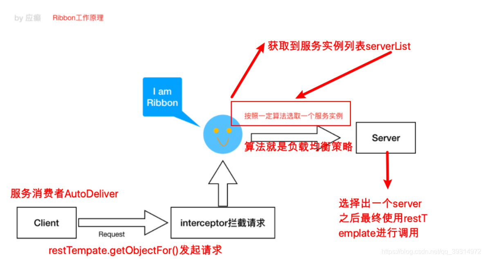

## 服务通信


### 1.介绍
> 首先确认一下Feign Ribbon Hystrix 三者关系
>Feign是一款Java语言编写的HttpClient绑定器，在Spring Cloud微服务中用于实现微服务之间的声明式调用。Feign 可以定义请求到其他服务的接口，用于微服务间的调用，不用自己再写http请求，在客户端实现，调用此接口就像远程调用其他服务一样，当请求出错时可以调用接口的实现类来返回
>Ribbon是Netflix发布的开源项目，主要功能是提供客户端的软件负载均衡算法，将Netflix的中间层服务连接在一起。Ribbon客户端组件提供一系列完善的配置项如连接超时，重试等。简单的说，就是在配置文件中列出Load Balancer后面所有的机器，Ribbon会自动的帮助你基于某种规则（如简单轮询，随机连接等）去连接这些机器。我们也很容易使用Ribbon实现自定义的负载均衡算法。简单地说，Ribbon是一个客户端负载均衡器。
>Hystrix熔断器，容错管理工具，旨在通过熔断机制控制服务和第三方库的节点,从而对延迟和故障提供更强大的容错能力。在Spring Cloud Hystrix中实现了线程隔离、断路器等一系列的服务保护功能。它也是基于Netflix的开源框架 Hystrix实现的


### 2.原理

#### Ribbon

```
先从注册中心获取服务实例列表ServerList
从列表中选择⼀个server
图中核⼼是负载均衡管理器LoadBalancer（总的协调者，相当于⼤脑，为了做事情，协调四肢），围绕它周围的多有IRule、IPing等
IRule：是在选择实例的时候的负载均衡策略对象
IPing：是⽤来向服务发起⼼跳检测的，通过⼼跳检测来判断该服务是否可⽤
ServerListFilter：根据⼀些规则过滤传⼊的服务实例列表
ServerListUpdater：定义了⼀系列的对服务列表的更新操作
```


#### hystrix
```
hystrix的特性:
* 资源隔离: 
Hystrix通过将每个依赖服务分配独立的线程池进行资源隔离, 从而避免服务雪崩. 

* 熔断器:
服务的健康状况 = 请求失败数 / 请求总数. 
熔断器开关由关闭到打开的状态转换是通过当前服务健康状况和设定阈值比较决定的.
    当熔断器开关关闭时, 请求被允许通过熔断器. 如果当前健康状况高于设定阈值, 开关继续保持关闭. 如果当前健康状况低于
    设定阈值, 开关则切换为打开状态.
    当熔断器开关打开时, 请求被禁止通过.
    当熔断器开关处于打开状态, 经过一段时间后, 熔断器会自动进入半开状态, 这时熔断器只允许一个请求通过. 当该请求调用
    成功时, 熔断器恢复到关闭状态. 若该请求失败, 熔断器继续保持打开状态, 接下来的请求被禁止通过.
熔断器的开关能保证服务调用者在调用异常服务时, 快速返回结果, 避免大量的同步等待. 并且熔断器能在一段时间后继续侦测请求执行结果, 提供恢复服务调用的可能.

* 命令模式: 
Hystrix使用命令模式(继承HystrixCommand类或者是HystrixObservableCommand类)来包裹具体的服务调用逻辑(run方法), 并在命令模式中添加了服务调用失败后的降级逻辑(getFallback).同时我们在Command的构造方法中可以定义当前服务线程池和熔断器的相关参数. 如下代码所示:
代码具体见链接https://blog.csdn.net/qq_25484147/article/details/83375225

```


### 如何保证高可用
当一个新的 Eureka Server 节点启动后，会首先尝试从邻近节点获取所有注册列表信息，并完成初始化。Eureka Server 通过 getEurekaServiceUrls() 方法获取所有的节点，并且会通过心跳契约的方式定期更新。

### 参考资料
https://blog.csdn.net/eleanoryss/article/details/111154354?ops_request_misc=&request_id=&biz_id=102&utm_term=%E5%BE%AE%E6%9C%8D%E5%8A%A1ribben%20hystrix%E7%9A%84%E5%8C%BA%E5%88%AB&utm_medium=distribute.pc_search_result.none-task-blog-2~all~sobaiduweb~default-1-.first_rank_v2_pc_rank_v29&spm=1018.2226.3001.4187
