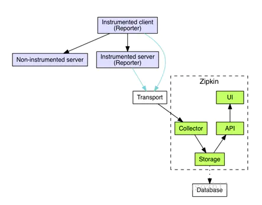

## spring cloud sleuth
### 介绍 
微服务架构中，必须实现分布式链路追踪，去跟进一个请求到底有哪些服务参与，参与的顺序又是怎样的，从而达到每个请求的步骤清晰可见，出了问题，很快定位。

### 原理

基础术语

> Span：基本工作单元，发送一个远程调度任务 就会产生一个Span，Span是一个64位ID唯一标识的，Trace是用另一个64位ID唯一标识的，Span还有其他数据信息，比如摘要、时间戳事件、Span的ID、以及进度ID
>
>Trace：一系列Span组成的一个树状结构。请求一个微服务系统的API接口，这个API接口，需要调用多个微服务，调用每个微服务都会产生一个新的Span，所有由这个请求产生的Span组成了这个Trace
>
>Annotation：用来及时记录一个事件的存在，一些核心annotations用来定义一个请求的开始和结束
>
>  cs - Client Sent -客户端发起一个请求，这个annotion描述了这个span的开始
   sr - Server Received -服务端获得请求并准备开始处理它，如果将其sr减去cs时间戳便可得到网络延迟
   ss - Server Sent -注解表明请求处理的完成(当请求返回客户端)，如果ss减去sr时间戳便可得到服务端需要的处理请求时间
   cr - Client Received -表明span的结束，客户端成功接收到服务端的回复，如果cr减去cs时间戳便可得到客户端从服务端获取回复的所有所需时间
>

在http中怎么传输
```java

Sleuth 通过 traceId 实现了对分布式系统调用链路的跟踪。在一次服务请求链路中，会保持并传递一个 traceId，从而将不同服务的请求跟踪信息串联起来，不同服务的 traceId 相同表示处在同一请求链中。
 基于 HTTP 请求的数据传递有两种方式：一种是做为参数传递，另一种是做为头信息传递。而 Sleuth 的 traceId 属于附加信息，不参与实际的业务，所以做为参数传递并不合适，实际也是作为头信息来传递的。
创建一个Span对象，其中span id重新生成，trace id不变
还要将span id、trace id等信息添加到http的header中


web环境下的sleuth执行原理:

首先sleuth创建TraceFilter，对所有的网络请求进行拦截，如果请求的header中没有span信息，则创建Span对象，生成span id、trace id等，如果header中有，则直接使用header中的数据创建Span对象，之后将span id、trace id设置到sl4j的MDC中。

RestTemplate发送请求时的sleuth执行原理:

RestTemplateInterceptorInjector拦截器对请求拦截，将新生成的span id、trace id等信息设置到请求的header中。这样服务端收到请求后就可以从header中解析出Span信息


```


Trace信息如何透传
```java
在Dapper的论文里面和网上看到阿里的Eagle Eye都是通过threadLocal来实现的全局链路跟踪，就决定去研究一下threaLocal的工作原理。

总的来说，调用会有两种情况：

线程/进程间的调用，例如：RPC，http，异步。

线程内的调用。

线程间的调用使用参数传递

线程内的调用使用ThreadLocal传递

线程间参数透传的方法:
HTTP: 通过header来透传trace信息
RPC: 通过自定义RPC协议

总的来说还是通过参数透传,这个可以通过修改通用库来实现无感知的透传。

线程内参数透传的方法:
ThreadLocal
ThreadLocal其实是一个线程的局部变量，会和一个线程同生共死。通过ThreadLocal创建的变量只能被当前线程访问修改。
进入线程时，将Trace信息存储在ThreadLocal变量中，出线程时，从ThreadLocal变量中取出Trace信息，作为参数传递到下一个线程。


```

基于HTTP请求的数据传递两种方式的数据结构：一种是，另一种是做为头信息传递
```java
1.做为头信息传递 Request Header

spanid：一个工作单元(rpc 调用)的唯一标识。
parentspanid：当前工作单元的上一个工作单元，Root Span(请求链路的第一个工作单元)的值为空。
traceid：一条请求链条(trace) 的唯一标识。
sampled：是否被抽样为输出的标志，1 为需要被输出，0 为不需要被输出。

2.做为参数传递
Sleuth 会把跟踪数据 (appname、traceId、spanId、exportable) 添加到 Slf4J MDC
MDC 的实现实际是将需要记录到日志的信息设置到当前线程的上下文(ThreadContext)中。

MDC 中的信息：[appname,traceId,spanId,exportable]
appname：应用名称，即 spring.application.name 的值。
tranceId：整个请求链路的唯一ID。
spanId：基本的工作单元，一个 RPC 调用就是一个新的 span。启动跟踪的初始 span 称为 root span ，此 spanId 的值与 traceId 的值相同。
exportable：是否将数据导入到 Zipkin 中，true 表示导入成功，false 表示导入失败
```


zipkin原理

Zipkin的基础架构，它主要由4个核心组件构成：


```java
Collector（收集器组件）：主要负责收集外部系统跟踪信息，转化为Zipkin内部的Span格式。
Storage（存储组件）：主要负责收到的跟踪信息的存储，默认为存储在内存中，同时支持存储到Mysql、Cassandra以及ElasticSearch。
API（Query）： 负责查询Storage中存储的数据，提供简单的JSON API获取数据，主要提供给web UI使用。
Web UI（展示组件）：提供简单的web界面，方便进行跟踪信息的查看以及查询，同时进行相关的分析。
```

zipkin+seluth的使用
```java
spring cloud sleuth可以结合zipkin，将信息发送到zipkin，利用zipkin的存储来存储信息，利用zipkin ui来展示数据。同时也可以只是简单的将数据记在日志中。
sleuth+log：这种方式只需要引入jar包(Maven中加入spring-cloud-starter-sleuth依赖)即可
sleuth+zipkin+http：sleuth收集跟踪信息通过http请求发给zipkin。这种需要启动一个zipkin,zipkin用来存储数据和展示数据。zipkin如果不配置存储的话，默认是在内存中的。如果存储在内存中，当重启应用后，数据就会丢失了
sletuh+streaming+zipkin：这种方式通过spring cloud streaming将追踪信息发送到zipkin。spring cloud streaming目前只支持kafka和rabbitmq。Zipkin Collector从消息中间件中读取数据并存储。
```


### 实战
```
基于http形式
    开启注解@EnableZipkinServier
    spring.zipkin.base-url:地址
    spring.sleuth.sampler.percentage: 采样的概率
    就可以去查看zipkin的地址,点击Find Trackes 按钮,
```

```
基于rabbitmq形式
    开启注解@EnableZipkinStreamServer
    依赖引spring-cloud-starter-stream-rabbit   spring-cloud-starter-zipkin-stream
    yml文件里面, 添加spring.rabbitmq.host或者port等参数
```