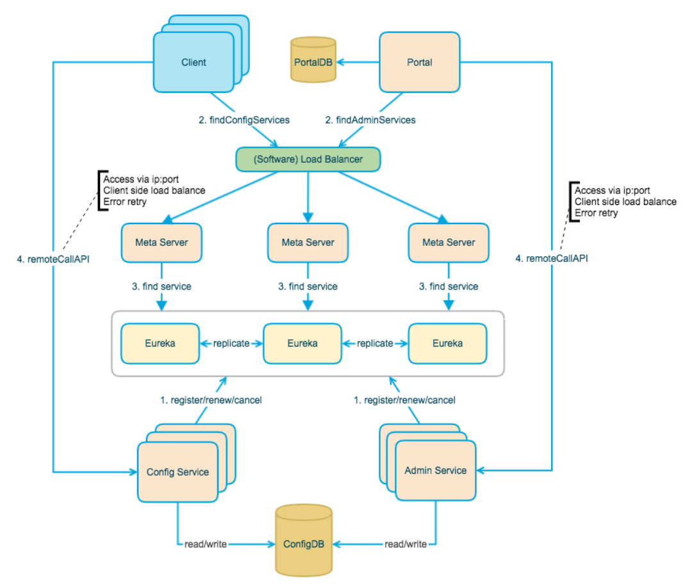
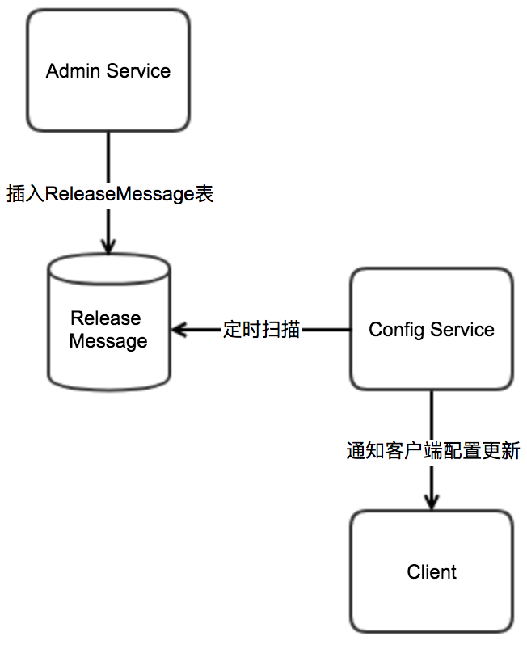

## 配置中心 

### 1.背景和差异(选型)

Spring Cloud Config有两个角色(类似Eureka): Server和Client。Spring Cloud Config Server作为配置中心的服务端承担如下作用:

拉取配置时更新Git仓库副本，保证是配置为最新;
支持从yml、json、properties等文件加载配置;
配合Eureke可实现服务发现，配合Cloud Bus(这个后面我们在详细说明)可实现配置推送更新;
默认配置存储基于Git仓库(可以切换为SVN)，从而支持配置的版本管理.
而对于，Spring Cloud Config Client则非常方便，只需要在启动配置文件中增加使用Config Server上哪个配置文件即可。


Apollo（阿波罗）是携程框架部门研发的开源配置管理中心，能够集中化管理应用不同环境、不同集群的配置，配置修改后能够实时推送到应用端，并且具备规范的权限、流程治理等特性。

Spring Cloud Config  + spring cloud bus  等于 apollo配置中心


### 2.Apollo原理

>架构图



```
从下往上看依次是：
① ConfigService：
+ 提供配置获取接口
+ 提供配置更新推送接口（基于Http long polling）
服务端使用Spring DeferredResult实现异步化，从而大大增加长连接数量
目前使用的tomcat embed默认配置是最多10000个连接（可以调整），使用了4C8G的虚拟机实测可以支撑10000个连接，所以满足需求（一个应用实例只会发起一个长连接）。
+ 接口服务对象为Apollo客户端


② AdminService：配置Portal，可视化配置得后端服务

提供配置管理接口
提供配置修改发布接口
③ Eureka：实现服务注册与发现（为什么选择Eureka？答案）

ConfigService/AdminService 会向其注册实例
与ConfigService部署在一起
④ Client：客户端依赖，使用方以jar包依赖得方式与服务端交互

与服务端交互，定时刷新配置
长轮询实时获取配置
实现客户端动态刷新功能
⑤ MetaServer：元数据服务集群，类似于一个 Eureka得通用代理（屏蔽不同语言得差异）

供Portal与Client调用
⑥ SLB：负载均衡

由于元数据服务是集群，前面需要提供一层负载均衡策略，然后获取到Eureka注册中心得服务列表，再由调用端发起服务请求

```

> 二、服务端设计

2.1 配置发布后的实时推送设计
在配置中心中，一个重要的功能就是配置发布后实时推送到客户端。下面我们简要看一下这块是怎么设计实现的。


上图简要描述了配置发布的大致过程：

1. 用户在Portal操作配置发布
2. Portal调用Admin Service的接口操作发布
3. Admin Service发布配置后，发送ReleaseMessage给各个Config Service
4. Config Service收到ReleaseMessage后，通知对应的客户端

2.1.1 发送ReleaseMessage的实现方式

Admin Service在配置发布后，需要通知所有的Config Service有配置发布，从而Config Service可以通知对应的客户端来拉取最新的配置。

从概念上来看，这是一个典型的消息使用场景，Admin Service作为producer发出消息，各个Config Service作为consumer消费消息。通过一个消息组件（Message Queue）就能很好的实现Admin Service和Config Service的解耦。

在实现上，考虑到Apollo的实际使用场景，以及为了尽可能减少外部依赖，我们没有采用外部的消息中间件，而是通过数据库实现了一个简单的消息队列。

实现方式如下：

Admin Service在配置发布后会往ReleaseMessage表插入一条消息记录，消息内容就是配置发布的AppId+Cluster+Namespace，参见DatabaseMessageSender
Config Service有一个线程会每秒扫描一次ReleaseMessage表，看看是否有新的消息记录，参见ReleaseMessageScanner
Config Service如果发现有新的消息记录，那么就会通知到所有的消息监听器（ReleaseMessageListener），如NotificationControllerV2，消息监听器的注册过程参见ConfigServiceAutoConfiguration
NotificationControllerV2得到配置发布的AppId+Cluster+Namespace后，会通知对应的客户端




2.1.2 Config Service通知客户端的实现方式
上一节中简要描述了NotificationControllerV2是如何得知有配置发布的，那NotificationControllerV2在得知有配置发布后是如何通知到客户端的呢？

实现方式如下：

客户端会发起一个Http请求到Config Service的notifications/v2接口，也就是NotificationControllerV2，参见RemoteConfigLongPollService
NotificationControllerV2不会立即返回结果，而是通过Spring DeferredResult把请求挂起
如果在60秒内没有该客户端关心的配置发布，那么会返回Http状态码304给客户端
如果有该客户端关心的配置发布，NotificationControllerV2会调用DeferredResult的setResult方法，传入有配置变化的namespace信息，同时该请求会立即返回。客户端从返回的结果中获取到配置变化的namespace后，会立即请求Config Service获取该namespace的最新配置。


### 3.高可用
+ 使用Eureka集群
+ 使用了MetaServer：元数据服务集群 和 SLB：负载均衡来做高可用


### 4.参考资料
[Apollo官方文档](https://www.apolloconfig.com/#/zh/design/apollo-design)

[Apollo Wiki](https://github.com/ctripcorp/apollo/wiki/Apollo%E9%85%8D%E7%BD%AE%E4%B8%AD%E5%BF%83%E8%AE%BE%E8%AE%A1)


### 5. 补充
> *DeferredResult实现异步处理+长轮询

DeferredResult与Callable实现的功能类似，都是异步返回，只不过Callable不能直接设置超时时间，需要与FutureTask配合才行；DeferredResult可直接设置超时时间。

核心流程：

1、定义一个DeferredResult：DeferredResult<ResponseMsg<String>> deferredResult = new DeferredResult<>(OUT_OF_TIME, OUT_OF_TIME_RESULT);

2、然后在主线程中直接返回deferredResult结果；此时servlet容器线程被释放，继续服务其他请求，以此提高吞吐量，后台任务线程执行耗时长的任务；

3、将任务放入队列中，后台定义一个专门执行任务的线程，循环执行队列中的任务；

4、执行完的任务，直接调用deferredResult.setResult()方法，即可将结果返回给客户端，和Callable、Future性质一样。

采用这种长轮询的好处是，相比一直循环请求服务器，实例一多的话会对服务器产生很大的压力，http长轮询的方式会在服务器变更的时候主动推送给客户端，其他时间客户端是挂起请求的，这样同时满足了性能和实时性。

> HTTP 长连接？短连接？长短连接和轮询？


经过一些查阅，才了解到，HTTP作为应用层协议，其实它的生命周期在服务器返回结果时就已经结束了，而所谓的支持长连接，其实是基于'Keep-Alive'请求头所约定，从而向下进行长连接发起的一种机制。该长连接依然是基于TCP的。因此：*所谓HTTP1.1及以上支持长连接，并不是HTTP1.1可以建立长连接，而是它支持以请求头的方式进行长连接发起（并且要求客户端与服务端都要具备 ‘Keep-Alive: true’ ）。

那么就再来理一理这几个概念的思路吧
                
                    
短连接所谓短连接，及连接只保持在数据传输过程，请求发起，连接建立，数据返回，连接关闭。它适用于一些实时数据请求，配合轮询来进行新旧数据的更替。               
                    
长连接长连接便是在连接发起后，在请求关闭连接前客户端与服务端都保持连接，实质是保持这个通信管道，之后便可以对其进行复用。它适用于涉及消息推送，请求频繁的场景（直播，流媒体）。连接建立后，在该连接下的所有请求都可以重用这个长连接管道，避免了频繁了连接请求，提升了效率。

所谓轮询，即是在一个循环周期内不断发起请求来得到数据的机制。只要有请求的的地方，都可以实现轮询，譬如各种事件驱动模型。它的长短是在于某次请求的返回周期。
                
                    
短轮询 短轮询指的是在循环周期内，不断发起请求，每一次请求都立即返回结果，根据新旧数据对比决定是否使用这个结果。
                    
长轮询 而长轮询及是在请求的过程中，若是服务器端数据并没有更新，那么则将这个连接挂起，直到服务器推送新的数据，再返回，然后再进入循环周期。


