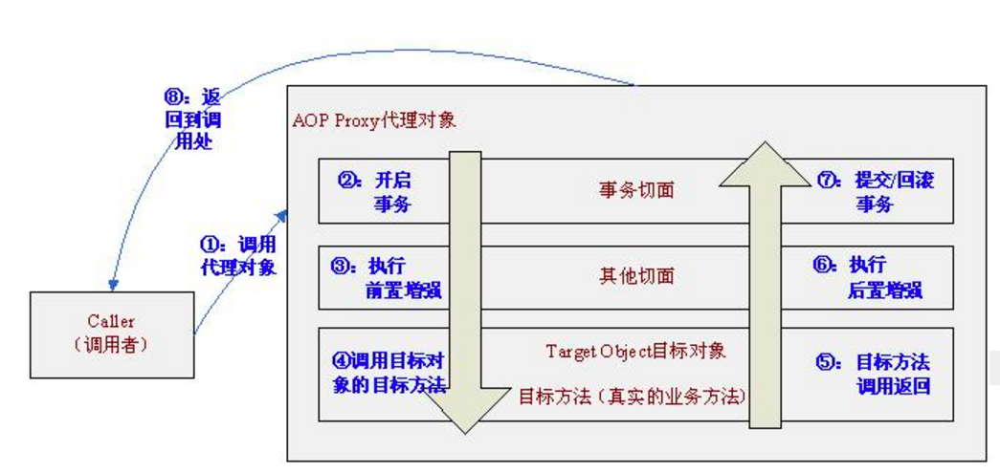
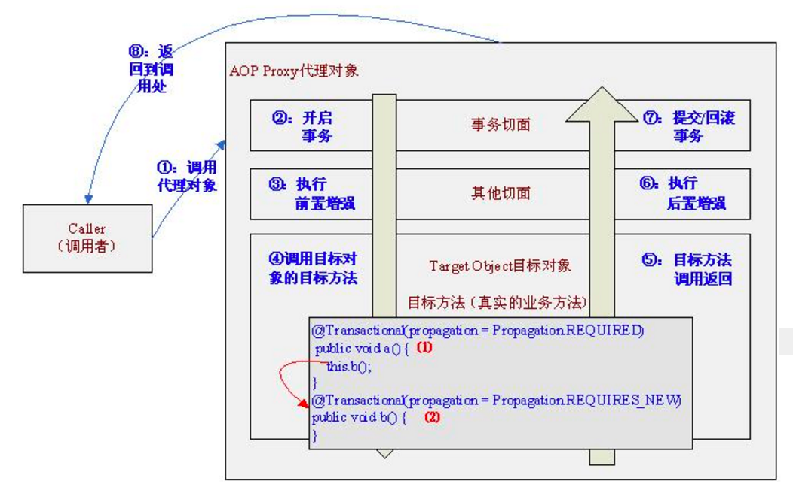

## spring  bean的生命周期

### spring bean生命周期


+ 实例化bean对象--createBeanInstance方法
 通过反射创建对象,在堆内存里面开辟空间,属性都是默认值
+ 初始化bean对象
    赋值操作-给自定义属性赋值:populateBean()
    赋值操作-给容器对象赋值:invokeAwareMethods()
    判断对象是否需要扩展操作
    执行前置处理方法:beanPostProcesssor
    执行初始化方法:invokeinitmethods()->判断当前是否实现了initilizingBean接口->afterPropertiesSet
    执行后置处理方法: beanPostProcesssor

+ 使用bean对象
+ bean对象的销毁


### spring bean的更详细版生命周期（不容易记住，需要的时候看看）
```
1.spring 容器完成扫描-----class-----beanDefinition---bdmap
2.开始遍历这个map
3.parse bd 解析beanDefinition
4.validate 校验
5.推断构造方法
6.利用构造方法---反射来执行----实例化对象
7.判断这个对象是否需要合并
8.判断这个对象是否需要提前暴露一个工厂?如果需要提前暴露,会缓存一个工厂在map中
9.自动注入---填充属性
10. 回调部分的aware方法 (BeanNameAware的setBeanName方法  还有BeanFactoryAware的setBeanFactory方法 )
11.执行beanPostprocesser的before方法
12.执行部分的生命周期初始化回调方法  ( initializingBeande afterPropertiesSet方法, 还要 init-method方法 )
13.BeanPostProcessor after----aop----事件发布
14.put 单例池
```

spring aop原理: 
+ AOP（面向切面）比如你写了个方法用来做一些事情，但这个事情要求登录用户才能做，你就可以在这个方法执行前验证一下，执行后记录下操作日志
+ 这个类就是切面（Aspect），这个被环绕的方法就是切点（Pointcut），你所做的执行前执行后的这些方法统一叫做增强处理（Advice）。
+ 面试的话，就得说具体点。  所以必须得深化点，你得告诉他，aop实现原理其实是java动态代理，但是jdk的动态代理必须实现接口，所以spring的aop是用cglib这个库实现的，cglib使用了asm
这个直接操纵字节码的框架，所以可以做到不实现接口的情况下完成动态代理。最好拿张纸手写两个例子给他，然后他就没什么好问的了
+ CgLib动态代理--首先要实现MethodInterceptor接口（interceptor是拦截器的意思）

```agsl
// 动态代理-代理类实现invocationHalder接口，重写invoke方法
// 代码调用的时候 Proxy.newProxyInstance(loader, interfaces, handler);
// 在newProxyInstance中，根据传入的ClassLoader, interfaces, InvocationHandler动态生成代理类字节码，创建代理类com.sun.proxy.$Proxy0。

// cglib动态代理
// 1. 首先实现一个MethodInterceptor，方法调用会被转发到该类的intercept()方法。
// 2. 然后在需要使用HelloConcrete的时候，通过CGLIB动态代理获取代理对象。
Enhancer enhancer = new Enhancer();
enhancer.setSuperclass(HelloConcrete.class);
enhancer.setCallback(new MyMethodInterceptor());

代理对象的类型：cglib.HelloConcrete$$EnhancerByCGLIB$$e3734e52，表明被代理类为HelloConcrete，是有CGLIB进行增强代理，后接编号。


```

### CGLIB创建动态代理类过程
（1）查找目标类上的所有非final的public类型的方法定义；
（2）将符合条件的方法定义转换成字节码；
（3）将组成的字节码转换成相应的代理的class对象；
（4）实现MethodInterceptor接口，用来处理对代理类上所有方法的请求。


aop的缺陷 ：
当service中的某个没标注@Transactional的方法调用另一个标注了@Transactional的方法时，居然没开启事务。例如
```agsl
@Service
public class UserService {
 
	@Autowired
	private UserMapper userMapper;
	
	@Transactional(propagation=Propagation.REQUIRED,isolation=Isolation.DEFAULT,readOnly=false)
	public void insert01(User u){
		this.userMapper.insert(u);
		throw new RuntimeException("测试插入事务");
	}
	
	public void insert02(User u){
		this.insert01(u);
		throw new RuntimeException("测试插入事务");
	}
```

@Transactional其实就是一个aop代理，是一个cglib动态代理（常用的动态代理有cglib动态代理，有jdk动态代理）。

直接调用insert01(User u)时，其实流程是这样的：



也就是说controller或其他service首先调用的是AOP代理对象而不是目标对象，首先执行事务切面，事务切面内部通过TransactionInterceptor环绕增强进行事务的增强，即进入目标方法之前开启事务，退出目标方法时提交/回滚事务。

controller或其他service调用insert02(User u)时，流程是这样的：


