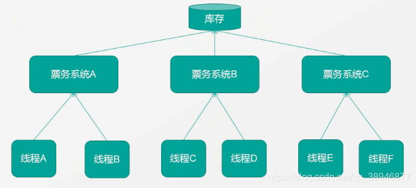
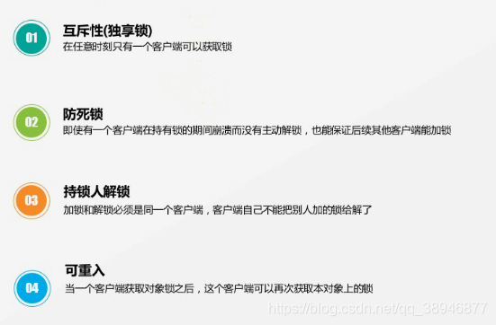

# 分布式锁

## 1. 分布式锁解决了什么问题
为了保证一个方法在高并发情况下的同一时间只能被同一个线程执行，在传统单体应用单机部署的情况下，可以使用Java并发处理相关的API(如ReentrantLcok或synchronized)进行互斥控制。但是，随着业务发展的需要，原单体单机部署的系统被演化成分布式系统后，由于分布式系统多线程、多进程并且分布在不同机器上，这将使原单机部署情况下的并发控制锁策略失效，为了解决这个问题就需要一种跨JVM的互斥机制来控制共享资源的访问，这就是分布式锁要解决的问题。

## 2. 技术选型
分布式锁的三种实现方式

在分析分布式锁的三种实现方式之前，先了解一下分布式锁应该具备哪些条件。

在分布式系统环境下，一个方法在同一时间只能被一个机器的一个线程执行；

高可用的获取锁与释放锁；

高性能的获取锁与释放锁；

具备可重入特性；

具备锁失效机制，防止死锁；

具备阻塞锁特性，即没有获取到锁将继续等待获取锁；

具备非阻塞锁特性，即没有获取到锁将直接返回获取锁失败。

1. **基于数据库的实现方式**

在数据库中创建一个表，表中包含方法名等字段，并在方法名字段上创建唯一索引，想要执行某个方法，就使用这个方法名向表中插入数据，成功插入则获取锁，执行完成后删除对应的行数据释放锁。

这种实现方式很简单，但是对于分布式锁应该具备的条件来说，它有一些问题需要解决及优化。

因为是基于数据库实现的，数据库的可用性和性能将直接影响分布式锁的可用性及性能，所以，数据库需要双机部署、数据同步、主备切换；

不具备可重入的特性，因为同一个线程在释放锁之前，行数据一直存在，无法再次成功插入数据，所以，需要在表中新增一列，用于记录当前获取到锁的机器和线程信息，在再次获取锁的时候，先查询表中机器和线程信息是否和当前机器和线程相同，若相同则直接获取锁；

没有锁失效机制，因为有可能出现成功插入数据后，服务器宕机了，对应的数据没有被删除，当服务恢复后一直获取不到锁，所以，需要在表中新增一列，用于记录失效时间，并且需要有定时任务清除这些失效的数据；

不具备阻塞锁特性，获取不到锁直接返回失败，所以需要优化获取逻辑，循环多次去获取。

优点：借助数据库，方案简单。

缺点：在实际实施的过程中会遇到各种不同的问题，为了解决这些问题，实现方式将会越来越复杂；依赖数据库需要一定的资源开销，性能问题需要考虑。

2. **基于Redis的实现方式**

[点击跳转另一篇博文redis及redisson的解决方案](https://blog.csdn.net/liu1390910/article/details/96965387)

上面这种方案最大的问题，就是如果你对某个redis master实例，写入了myLock这种锁key的value，此时会异步复制给对应的master slave实例。
但是这个过程中一旦发生redis master宕机，主备切换，redis slave变为了redis master。
接着就会导致，客户端2来尝试加锁的时候，在新的redis master上完成了加锁，而客户端1也以为自己成功加了锁。
此时就会导致多个客户端对一个分布式锁完成了加锁。
这时系统在业务语义上一定会出现问题，导致各种脏数据的产生。
所以这个就是redis cluster，或者是redis master-slave架构的主从异步复制导致的redis分布式锁的最大缺陷：在redis master实例宕机的时候，可能导致多个客户端同时完成加锁。

3. **基于ZooKeeper的实现方式**


优点：具备高可用、可重入、阻塞锁特性，可解决失效死锁问题。

缺点：因为需要频繁的创建和删除节点，性能上不如Redis方式。

总结

上面的三种实现方式，没有在所有场合都是完美的，所以，应根据不同的应用场景选择最适合的实现方式。

## 怎么实现

### 锁的性能优化有哪些


1，把同步方法改成同步代码块

2，

3，读锁，写锁分离


### 分布式锁

分布式锁的环境



分布式锁的注意事项：


步骤：
1，竞争锁，判断锁是否存在

如果存在：等待 或者 退出

如果不存在：创建锁，设置锁的有效期，获取锁的线程分配唯一标识

两个特殊情况:

按照上面代码:
```
if（setnx（key，1） == 1）{   //此处挂掉了.....
    expire（key，30）
    try {
        do something ......
    }catch(){
　　}　finally {
       del（key）
    }
}
```

1. **第一个问题:**

setnx和expire的非原子性
设想一个极端场景，当某线程执行setnx，成功得到了锁：
setnx刚执行成功，还未来得及执行expire指令，节点1 Duang的一声挂掉了。
这样一来，这把锁就没有设置过期时间，变得“长生不老”，别的线程再也无法获得锁了。

怎么解决呢？setnx指令本身是不支持传入超时时间的，Redis 2.6.12以上版本为set指令增加了可选参数，伪代码如下：set（key，1，30，NX）,这样就可以取代setnx指令。

setnx() 命令只能保证前两个步骤是原子操作。所以在加锁时还是使用set 命令

  2.  **第二个问题:** 出现在解锁步骤

解锁注意事项：超时后使用del 导致误删其他线程的锁

又是一个极端场景，假如某线程成功得到了锁，并且设置的超时时间是30秒。
如果某些原因导致线程B执行的很慢很慢，过了30秒都没执行完，这时候锁过期自动释放，线程B得到了锁。

随后，线程A执行完了任务，线程A接着执行del指令来释放锁。但这时候线程B还没执行完，线程A实际上删除的是线程B加的锁。

解决办法: 
可以在del释放锁之前做一个判断，验证当前的锁是不是自己加的锁。

至于具体的实现，可以在加锁的时候把当前的线程ID当做value，并在删除之前验证key对应的value是不是自己线程的ID。

代码如下:

```
加锁：
String threadId = Thread.currentThread().getId()
set（key，threadId ，30，NX）

doSomething.....
 
解锁：
if（threadId .equals(redisClient.get(key))）{
    del(key)
}

```

但是，这样做又隐含了一个新的问题，if判断和释放锁是两个独立操作，不是原子性。

因为删除没有原子命令，所以需要借助luau脚本来实现原子删除：

String luaScript = ‘if redis.call(‘get’, KEYS[1]) == ARGV[1] then return redis.call(‘del’, KEYS[1]) else return 0 end’;

redisClient.eval(luaScript , Collections.singletonList(key), Collections.singletonList(threadId));

这样一来，验证和删除过程就是原子操作了。

1. **第三个问题:**

Redis锁的过期时间小于业务的执行时间该如何续期
   
还是刚才第二点所描述的场景，虽然我们避免了线程A误删掉key的情况，但是同一时间有A，B两个线程在访问代码块，仍然是不完美的。

怎么办呢？我们可以让获得锁的线程开启一个守护线程，用来给快要过期的锁“续航”。

当过去了29秒，线程A还没执行完，这时候守护线程会执行expire指令，为这把锁“续命”20秒。守护线程从第29秒开始执行，每20秒执行一次。

当线程A执行完任务，会显式关掉守护线程。


同时推荐使用redisson这个客户端工具


**redisson底层会添加一个守护进程和使用lua脚本** 


