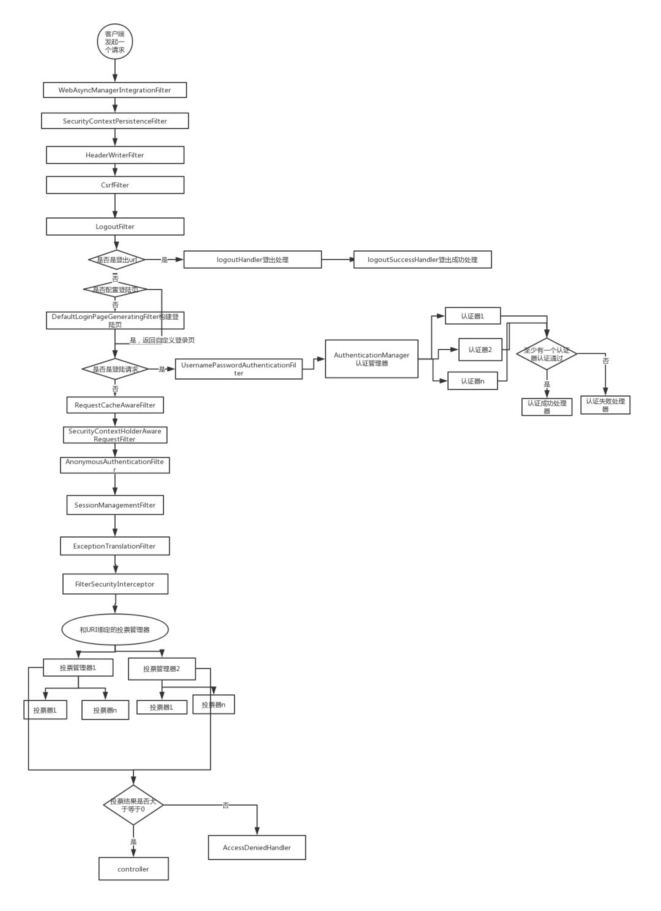
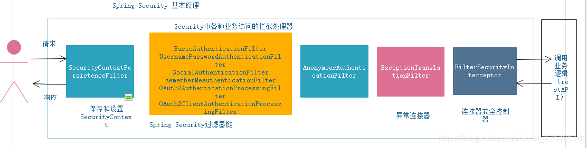

# spring security 原理

## 1.spring security流程图

## 2.底层技术
Spring Security的SecurityContextHolder就是通过ThreadLocal实现的。

## 3.技术选型

## 4.其他资料

网址学习:
https://blog.csdn.net/u012702547/article/details/89629415

分布式锁
https://www.jianshu.com/p/d72e8526bea1